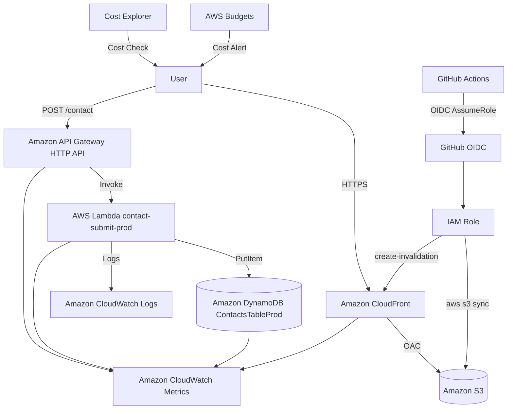

# AWS Cert Roadmap Lab

AWS資格学習をしながら、AWSサーバーレス構成を実装で学ぶためのポートフォリオWebアプリです。

AWS Cloud Practitioner / AWS Solutions Architect Associate の学習内容を、単なるメモではなく、AWS上で動く学習サイトとして形にすることを目的にしています。

---

## 概要

AWS Cert Roadmap Lab は、AWS資格学習者向けの学習サイトです。

主な機能は以下です。

- AWS Cloud Practitioner / SAA向け学習ロードマップ
- AWS主要サービスの用語集
- CLF-C02模擬問題
- AWSサービス比較記事
- AWS構成図解説
- AWS学習ブログ
- 問い合わせフォーム
- サーバーレス問い合わせAPI

MVPでは、学習コンテンツは静的ファイルとして管理し、問い合わせフォームのみ API Gateway + Lambda + DynamoDB で動的処理を行います。

---

## 制作背景

現在、AWS Cloud Practitioner の学習を進めており、その後 Solutions Architect Associate の受験を予定しています。

資格勉強だけで終わらせるのではなく、学んだ内容を実際のAWS構成として実装し、ポートフォリオとして説明できる形にするために開発しています。

このプロジェクトでは、以下を重視しています。

- AWS資格の知識を実装に落とし込むこと
- 低コストで運用できるAWS構成にすること
- セキュリティ、IAM、監視、CI/CDまで含めて設計すること
- 将来的にSEO・広告収益化できる学習メディアに拡張すること

---

## デモ

Production URL:

```text
https://xxxxxxxx.cloudfront.net
```

独自ドメインは、MVP公開後に導入を検討します。

---

## 主要機能

### 1. 学習ロードマップ

AWS Cloud Practitioner から Solutions Architect Associate までの学習順序を整理します。

対象内容：

- AWS学習の全体像
- Cloud Practitioner の試験範囲
- SAAにつながる基礎知識
- サービス別の学習優先度
- 実装で理解するAWS構成

### 2. AWS用語集

AWS主要サービスや重要概念を、初学者にも分かりやすく整理します。

初期収録対象：

- IAM
- S3
- EC2
- Lambda
- VPC
- RDS
- DynamoDB
- CloudFront
- Route 53
- CloudWatch
- CloudTrail
- API Gateway
- SQS
- SNS
- EventBridge
- EBS
- EFS
- ELB
- Auto Scaling
- ACM
- KMS
- WAF
- AWS Budgets
- Cost Explorer
- Organizations
- AWS Config
- Secrets Manager
- Systems Manager
- CloudFormation
- Cognito

MVPでは30件以上の用語登録を目標にしています。

### 3. CLF-C02模擬問題

AWS Cloud Practitioner向けの模擬問題を提供します。

MVPでは30問以上を作成します。

問題カテゴリ：

| カテゴリ | 内容 |
|---|---|
| Cloud Concepts | クラウドの基本概念 |
| Security and Compliance | セキュリティ・責任共有モデル |
| Cloud Technology and Services | AWS主要サービス |
| Billing, Pricing, and Support | 請求・料金・サポート |

各問題には以下を含めます。

- 問題文
- 4択選択肢
- 正解
- 解説
- 関連AWSサービス
- 関連用語

### 4. AWSサービス比較記事

試験でも実務でも混同しやすいAWSサービスを比較します。

初期記事例：

- S3 / EBS / EFS の違い
- EC2 / Lambda / ECS の違い
- RDS / DynamoDB の違い
- CloudWatch / CloudTrail / AWS Config の違い
- SQS / SNS / EventBridge の違い

### 5. AWS構成図解説

AWSサービスを単体で覚えるだけでなく、実際の構成として理解するための構成図解説を作成します。

初期構成例：

- S3 + CloudFront 静的サイト構成
- API Gateway + Lambda + DynamoDB サーバーレスAPI構成
- CloudFront OAC によるS3非公開配信
- AWS Budgets + CloudWatch による低コスト運用監視
- Cognito + API Gateway + Lambda による認証付きAPI構成

### 6. 問い合わせフォーム

問い合わせフォームから送信された内容を、API Gateway + Lambda + DynamoDB で保存します。

入力項目：

- 名前
- メールアドレス
- 件名
- 本文
- honeypot項目

スパム対策として、MVPでは honeypot と文字数制限を導入します。

---

## 画面一覧

| 画面 | URL | 内容 |
|---|---|---|
| トップページ | `/` | サイト概要、主要導線 |
| 学習ロードマップ | `/roadmap` | CLFからSAAまでの学習順序 |
| AWS用語集一覧 | `/terms` | AWSサービス一覧 |
| AWS用語詳細 | `/terms/[termId]` | サービス概要・試験ポイント |
| サービス比較一覧 | `/comparisons` | 比較記事一覧 |
| サービス比較詳細 | `/comparisons/[comparisonSlug]` | サービスの違いを比較 |
| 模擬問題トップ | `/questions` | 問題カテゴリ導線 |
| CLF問題一覧 | `/questions/clf` | CLF-C02問題一覧 |
| 模擬問題詳細 | `/questions/[questionId]` | 問題回答・解説 |
| 構成図一覧 | `/architectures` | AWS構成パターン一覧 |
| 構成図詳細 | `/architectures/[architectureSlug]` | 構成図と設計解説 |
| ブログ一覧 | `/blog` | AWS学習記事一覧 |
| ブログ詳細 | `/blog/[postSlug]` | SEO記事 |
| 問い合わせ | `/contact` | 問い合わせフォーム |
| 運営者情報 | `/about` | サイト運営者情報 |
| プライバシーポリシー | `/privacy` | 個人情報・Cookie方針 |
| 免責事項 | `/disclaimer` | 学習情報・資格情報の免責 |

---

## 技術スタック

### フロントエンド

| 技術 | 用途 |
|---|---|
| Next.js | Webアプリケーションフレームワーク |
| TypeScript | 型安全な開発 |
| Tailwind CSS | UIスタイリング |
| Markdown / MDX | 学習コンテンツ管理 |
| JSON | 用語・問題データ管理 |

### バックエンド

| 技術 | 用途 |
|---|---|
| Python | Lambda実装 |
| AWS Lambda | 問い合わせ処理 |
| API Gateway HTTP API | API公開 |
| DynamoDB | 問い合わせデータ保存 |

### AWS

| サービス | 用途 |
|---|---|
| Amazon S3 | 静的ファイル配置 |
| Amazon CloudFront | CDN配信・HTTPS配信 |
| CloudFront OAC | S3直接公開の防止 |
| Amazon API Gateway | 問い合わせAPI公開 |
| AWS Lambda | 問い合わせ保存処理 |
| Amazon DynamoDB | 問い合わせデータ保存 |
| Amazon CloudWatch Logs | Lambdaログ確認 |
| Amazon CloudWatch Metrics | API / Lambda / DynamoDB監視 |
| AWS Budgets | 課金監視 |
| Cost Explorer | サービス別費用確認 |
| IAM | 最小権限管理 |

### CI/CD

| 技術 | 用途 |
|---|---|
| GitHub Actions | CI/CD |
| GitHub OIDC | AWS認証情報の安全な連携 |
| AWS CLI | S3デプロイ・CloudFront Invalidation |

---

## アーキテクチャ

### MVP構成

```text
User
  ↓ HTTPS
CloudFront
  ↓ OAC
S3 Static Site

User
  ↓ POST /contact
API Gateway HTTP API
  ↓
Lambda contact-submit-function
  ↓ PutItem
DynamoDB ContactsTableProd
  ↓
CloudWatch Logs
```

### AWS構成図



---

## AWS設計方針

### 1. EC2ではなくS3 + CloudFrontを採用

本プロダクトは静的コンテンツが中心です。

そのため、常時起動サーバーであるEC2ではなく、S3 + CloudFrontによる静的配信を採用しています。

理由：

- 固定費を抑えやすい
- サーバー管理が不要
- 静的サイトと相性が良い
- CloudFrontで高速配信できる
- AWS資格学習の内容と直結する

### 2. RDSではなくDynamoDBを採用

MVPで保存するデータは、問い合わせフォームの送信内容のみです。

複雑なリレーションは不要なため、RDSではなくDynamoDBを採用しています。

理由：

- サーバーレス構成と相性が良い
- 小規模な問い合わせ保存に向いている
- 管理負荷が低い
- Lambdaから直接扱いやすい
- RDSより固定費を抑えやすい

### 3. S3は直接公開しない

S3バケットは直接公開せず、CloudFront Origin Access Control を使ってCloudFront経由でのみアクセスできるようにしています。

目的：

- S3の意図しない公開を防ぐ
- HTTPS配信をCloudFrontに集約する
- キャッシュ制御をしやすくする
- セキュリティ設計を明確にする

### 4. 動的APIは最小限にする

MVPでは、AWS用語・模擬問題・記事・構成図は静的ファイルとして管理します。

問い合わせフォームのみAPI化します。

理由：

- SEOに強い静的ページを作れる
- API呼び出しを減らせる
- AWS利用料を抑えられる
- 開発スコープを小さくできる
- まず公開することを優先できる

---

## バックエンド / Lambda

MVPでは、問い合わせフォーム用APIとして AWS Lambda を利用しています。

- API Gatewayで `POST /contact` を公開
- Lambda側で入力値検証を実施
- honeypot項目で簡易スパム対策
- 正常な問い合わせデータをDynamoDBに保存
- CloudWatch Logsで実行ログを確認
- IAM Roleは `ContactsTableProd` への `dynamodb:PutItem` のみに制限

メールアドレスや問い合わせ本文全文などの個人情報は、CloudWatch Logsに出力しない設計にしています。

### 問い合わせAPI

| 項目 | 内容 |
|---|---|
| Method | `POST` |
| Path | `/contact` |
| 認証 | なし |
| Runtime | Python |
| 保存先 | DynamoDB `ContactsTableProd` |

### リクエスト例

```json
{
  "name": "山田太郎",
  "email": "taro@example.com",
  "subject": "S3の記事について",
  "message": "S3とEBSの違いについて質問があります。",
  "sourcePage": "/contact",
  "honeypot": ""
}
```

### 成功レスポンス例

```json
{
  "success": true,
  "data": {
    "contactId": "contact-xxxxxxxx",
    "status": "new"
  },
  "message": "お問い合わせを受け付けました。",
  "requestId": "req-xxxxxxxx"
}
```

---

## CI/CD

### 方針

本リポジトリでは、`master` ブランチを本番反映用ブランチとして扱います。

MVPのCI/CDでは、フロントエンド静的サイトの自動デプロイを対象にしています。

### CI

Pull Requestまたはpush時に以下を実行します。

```text
checkout
  ↓
依存関係インストール
  ↓
lint
  ↓
typecheck
  ↓
build
```

確認内容：

- ESLintが通る
- TypeScript型チェックが通る
- Next.js buildが成功する
- 静的出力 `out/` が生成される

### CD

`master` ブランチへの反映時に、以下を実行します。

```text
checkout
  ↓
依存関係インストール
  ↓
lint / typecheck / build
  ↓
AWS OIDC認証
  ↓
S3 sync
  ↓
CloudFront Invalidation
  ↓
CloudFront URLで最新サイトを確認
```

### GitHub Actionsで利用する値

| 種別 | 名前 | 内容 |
|---|---|---|
| Secret or Variable | `AWS_ROLE_ARN` | AssumeRoleするIAM Role ARN |
| Variable | `AWS_REGION` | `ap-northeast-1` |
| Secret or Variable | `S3_BUCKET_NAME` | デプロイ先S3バケット名 |
| Secret or Variable | `CLOUDFRONT_DISTRIBUTION_ID` | CloudFront Distribution ID |
| Variable | `NEXT_PUBLIC_API_BASE_URL` | API Gateway URL |
| Variable | `NEXT_PUBLIC_SITE_URL` | サイトURL |

### GitHub Actions用IAM権限

GitHub Actionsには、フロントエンドデプロイに必要な権限のみ付与します。

許可する操作：

- `s3:ListBucket`
- `s3:PutObject`
- `s3:DeleteObject`
- `cloudfront:CreateInvalidation`

付与しない操作：

- `AdministratorAccess`
- `iam:*`
- `lambda:*`
- `dynamodb:*`
- `apigateway:*`
- `ec2:*`
- `rds:*`

---

## セキュリティ設計

### S3 / CloudFront

- S3 Public Access Blockを有効化
- S3を直接公開しない
- CloudFront OACを利用
- Bucket PolicyでCloudFront Distributionからのみ許可
- HTTPアクセスはHTTPSへリダイレクト

### IAM

- Lambda実行ロールはDynamoDB `PutItem` のみに制限
- GitHub Actions用ロールはS3デプロイとCloudFront Invalidationのみに制限
- rootユーザーのアクセスキーは作成しない
- 管理ユーザーにはMFAを設定
- `AdministratorAccess` の常用を避ける

### Lambda / API

- Lambda側で入力値検証を実施
- honeypotでスパム投稿を抑制
- 文字数制限で過大な入力を防止
- CORSは本番CloudFront Originに制限
- 内部エラーの詳細をレスポンスに出さない

### ログ

CloudWatch Logsに出してよい情報：

- requestId
- contactId
- status
- error code
- validation error field

CloudWatch Logsに出さない情報：

- メールアドレス全文
- 問い合わせ本文全文
- Authorizationヘッダー
- AWSアクセスキー
- APIキー
- JWT

---

## コスト最適化

MVPでは、固定費が発生しやすいサービスを使わない方針です。

### 使わないサービス

- EC2
- RDS
- NAT Gateway
- ALB
- ECS
- EKS
- OpenSearch
- SageMaker
- WAF
- SES

### 採用している低コスト方針

| 項目 | 方針 |
|---|---|
| フロントエンド | S3 + CloudFrontで静的配信 |
| API | `POST /contact` のみ |
| Lambda | 128MB〜256MB、3〜5秒タイムアウト |
| DynamoDB | `ContactsTableProd` のみ、On-demand |
| CloudWatch Logs | 14〜30日保存 |
| 画像 | 軽量化してS3転送量を抑制 |
| 監視 | AWS BudgetsとCost Explorerで確認 |

### 課金事故対策

- AWS Budgetsで月額予算アラートを設定
- Cost Explorerでサービス別費用を確認
- CloudWatch Logsの保存期間を無期限にしない
- NAT Gateway、RDS、ALBをMVPでは作成しない
- 不要なリソースを残さない

---

## 運用監視

MVPでは、大規模な監視基盤は作らず、以下を中心に確認します。

- AWS Budgets
- CloudWatch Logs
- CloudWatch Metrics
- Cost Explorer
- GitHub Actionsログ
- 手動死活確認

### 監視対象

| 対象 | 確認内容 |
|---|---|
| CloudFront | サイト表示、4xx / 5xx |
| S3 | ファイル存在、直接公開されていないか |
| API Gateway | 4xx / 5xx、リクエスト数 |
| Lambda | Errors、Duration、Logs |
| DynamoDB | 問い合わせ保存、ItemCount |
| CloudWatch Logs | 個人情報が出力されていないか |
| AWS Budgets | 月額費用、予測超過 |
| GitHub Actions | CI/CD成功・失敗 |

### 障害時の確認順序

```text
1. GitHub Actionsログ確認
2. CloudFront表示確認
3. S3オブジェクト確認
4. API Gateway Metrics確認
5. Lambda Metrics確認
6. CloudWatch Logs確認
7. DynamoDB保存確認
8. Cost Explorer / Budgets確認
```

---

## ローカル開発

### 前提

- Node.js LTS
- npm
- Git
- AWS CLI
- Python 3.11以上

### セットアップ

```bash
git clone <repository-url>
cd aws-cert-roadmap-lab
cd frontend
npm ci
```

### 開発サーバー起動

```bash
cd frontend
npm run dev
```

### Lint

```bash
cd frontend
npm run lint
```

### TypeScript型チェック

```bash
cd frontend
npm run typecheck
```

### Build

```bash
cd frontend
npm run build
```

静的出力の成果物は `frontend/out/` に生成されます。

---

## デプロイ

### 手動デプロイ

```bash
cd frontend
npm run build
aws s3 sync ./out s3://<S3_BUCKET_NAME> --delete
aws cloudfront create-invalidation \
  --distribution-id <CLOUDFRONT_DISTRIBUTION_ID> \
  --paths "/*"
```

### 自動デプロイ

`master` ブランチに反映されると、GitHub Actionsで以下が実行されます。

```text
npm ci
npm run lint
npm run typecheck
npm run build
aws s3 sync ./out s3://<S3_BUCKET_NAME> --delete
aws cloudfront create-invalidation --paths "/*"
```

---

## MVPスコープ

### 実装するもの

- トップページ
- 学習ロードマップ
- AWS用語集
- AWS用語詳細
- CLF-C02模擬問題
- 模擬問題回答UI
- AWSサービス比較記事
- AWS構成図解説
- ブログ記事
- 問い合わせフォーム
- 問い合わせAPI
- DynamoDB保存
- S3 + CloudFront公開
- CloudFront OAC
- AWS Budgets
- CloudWatch Logs
- GitHub Actions CI/CD
- README整備

### MVPでは実装しないもの

- ログイン機能
- Cognito
- ユーザー別学習履歴
- 正答率保存
- 復習問題機能
- 毎日1問メール通知
- SES
- WAF
- RDS
- EC2
- NAT Gateway
- ALB
- AI自動解説
- 決済機能
- 有料会員機能

---

## 今後の拡張予定

### Phase 4：収益化準備

- 独自ドメイン導入
- Google Search Console登録
- Google Analytics導入
- Google AdSense申請
- AWS用語50件以上
- CLF-C02問題50問以上
- SAA-C03問題追加
- 比較記事10本以上
- 構成図解説10本以上
- SEO内部リンク強化

### Phase 5：学習アプリ化

- Cognitoログイン
- マイページ
- 回答履歴保存
- 正答率表示
- 苦手カテゴリ分析
- 復習問題機能
- 今日の1問
- EventBridgeによる定期処理
- SESによる通知
- 有料教材・有料機能の検討

---

## 学習・実装で意識したAWS観点

このプロジェクトでは、AWS資格で学ぶ内容を実装に落とし込んでいます。

| AWS学習項目 | 実装での対応 |
|---|---|
| グローバルインフラ | CloudFrontによる配信 |
| ストレージ | S3による静的ファイル保存 |
| コンピューティング | Lambdaによるサーバーレス処理 |
| データベース | DynamoDBによる問い合わせ保存 |
| ネットワーク | CloudFront / API Gateway |
| セキュリティ | IAM最小権限 / OAC / CORS |
| 監視 | CloudWatch Logs / Metrics |
| コスト管理 | AWS Budgets / Cost Explorer |
| 自動化 | GitHub Actions CI/CD |

---

## ポートフォリオとしてのアピールポイント

### 1. AWS資格学習と実装を接続

資格勉強で学んだAWSサービスを、実際に動くWebアプリとして構成しました。

単なる学習メモではなく、AWS上に公開できる形にしています。

### 2. サーバーレス構成

API Gateway + Lambda + DynamoDB を使い、常時起動サーバーなしで問い合わせAPIを実装しています。

### 3. セキュリティ設計

S3を直接公開せず、CloudFront OACを利用しています。

また、IAM権限を最小化し、LambdaにはDynamoDB `PutItem` のみを付与しています。

### 4. コスト最適化

EC2、RDS、NAT Gateway、ALBを使わず、AWS BudgetsとCloudWatch Logs保存期間設定で課金事故を防ぐ設計にしています。

### 5. CI/CD

GitHub Actionsで、Pull Request時の検証と `master` ブランチへの自動デプロイを実装しています。

### 6. 将来の収益化設計

SEO記事、AWS用語集、模擬問題、構成図解説を増やし、AdSenseや有料教材への拡張を想定しています。

---

## 面接で説明できるポイント

### なぜS3 + CloudFrontなのか

静的コンテンツ中心の学習サイトなので、EC2を常時起動する必要がありません。

S3に静的ファイルを置き、CloudFrontでHTTPS配信することで、低コスト・高速・安全な公開構成にしています。

### なぜLambdaを使うのか

問い合わせ処理は常時稼働サーバーが不要です。

API Gateway + Lambdaにすることで、アクセスが少ない段階では低コストにでき、サーバー管理も不要になります。

### なぜDynamoDBなのか

MVPで保存するのは問い合わせデータのみです。

リレーショナルな複雑なデータ設計は不要なため、RDSではなくDynamoDBを採用しています。

### なぜGitHub OIDCなのか

AWSアクセスキーをGitHub Secretsに長期保存しないためです。

OIDCを使うことで、GitHub Actionsが一時認証でAWS IAM Roleを引き受け、漏えいリスクを下げられます。

### どうやって課金事故を防ぐのか

固定費が発生しやすいEC2、RDS、NAT Gateway、ALBをMVPでは使いません。

さらにAWS Budgets、Cost Explorer、CloudWatch Logs保存期間設定で、課金増加に気づける運用にしています。

---

## 開発ロードマップ

| Phase | 内容 | 状態 |
|---|---|---|
| Phase 0 | 開発準備・設計 | Done |
| Phase 1 | 静的サイトMVP | Done |
| Phase 2 | AWS公開・問い合わせAPI | Done |
| Phase 3 | CI/CD・運用監視 | In Progress |
| Phase 4 | 収益化準備 | Future |
| Phase 5 | 学習アプリ化 | Future |

---

## ライセンス

未定です。