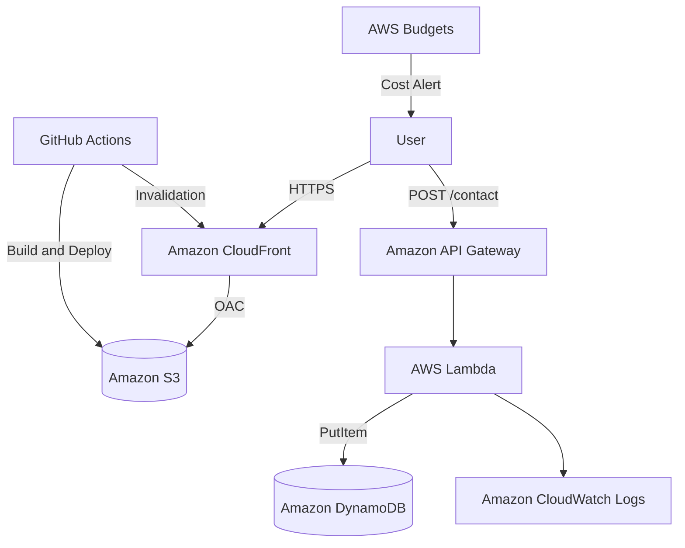

# AWS Cert Roadmap Lab

AWS資格学習をしながら、AWSサーバーレス構成を実装で学ぶためのポートフォリオWebアプリです。

AWS Cloud Practitioner / AWS Solutions Architect Associate の学習内容を、単なるメモではなく、実際にAWS上で動く学習サイトとして形にすることを目的にしています。

---

## 概要

AWS Cert Roadmap Lab は、AWS資格学習者向けのWeb学習サイトです。

AWS主要サービスの用語、サービス比較、模擬問題、AWS構成図、学習ロードマップを整理し、初学者がAWSの基礎と試験ポイントを理解できることを目指します。

MVPでは、学習コンテンツは静的ファイルとして管理し、問い合わせフォームのみ API Gateway + Lambda + DynamoDB で動的処理を行います。

---

## 制作背景

現在、AWS Cloud Practitioner の学習を進めており、その後 AWS Solutions Architect Associate の受験も予定しています。

資格勉強を暗記だけで終わらせるのではなく、学んだ内容を実際のAWS構成として実装し、ポートフォリオとして説明できる形にするために、このプロジェクトを作成します。

このプロジェクトでは、以下を重視します。

- AWS資格の知識を実装に落とし込むこと
- 低コストで運用できるAWS構成にすること
- サーバーレス構成を使うこと
- セキュリティ、IAM、監視、CI/CDまで含めて設計すること
- 将来的にSEO・広告収益化できる学習メディアに拡張すること

---

## 主な機能

### 1. 学習ロードマップ

AWS Cloud Practitioner から AWS Solutions Architect Associate までの学習順序を整理します。

対象内容：

- AWS学習の全体像
- Cloud Practitioner の試験範囲
- SAAにつながる基礎知識
- サービス別の学習優先度
- 実装で理解するAWS構成

---

### 2. AWS用語集

AWS主要サービスや重要概念を、初学者向けに整理します。

初期収録予定：

- IAM
- Amazon S3
- Amazon EC2
- AWS Lambda
- Amazon VPC
- Amazon RDS
- Amazon DynamoDB
- Amazon CloudFront
- Amazon Route 53
- Amazon CloudWatch
- AWS CloudTrail
- Amazon API Gateway
- Amazon SQS
- Amazon SNS
- Amazon EventBridge
- Amazon EBS
- Amazon EFS
- Elastic Load Balancing
- Auto Scaling
- AWS Certificate Manager
- AWS KMS
- AWS WAF
- AWS Budgets
- AWS Cost Explorer
- AWS Organizations
- AWS Config
- AWS Secrets Manager
- AWS Systems Manager
- AWS CloudFormation
- Amazon Cognito

MVPでは30件以上の用語登録を目標にします。

---

### 3. CLF-C02模擬問題

AWS Cloud Practitioner 向けの模擬問題を提供します。

MVPでは30問以上を作成します。

問題カテゴリ：

| カテゴリ | 内容 |
|---|---|
| Cloud Concepts | クラウドの基本概念 |
| Security and Compliance | セキュリティ・責任共有モデル |
| Cloud Technology and Services | AWS主要サービス |
| Billing, Pricing, and Support | 請求・料金・サポート |

各問題には以下を含めます。

- 問題文
- 4択選択肢
- 正解
- 解説
- 関連AWSサービス
- 関連用語

---

### 4. AWSサービス比較記事

試験でも実務でも混同しやすいAWSサービスを比較します。

初期記事例：

- S3 / EBS / EFS の違い
- RDS / DynamoDB の違い
- SNS / SQS / EventBridge の違い
- IAMユーザー / IAMロール / IAMポリシー の違い
- CloudWatch / CloudTrail / AWS Config の違い

---

### 5. AWS構成図解説

AWSサービスを単体で覚えるだけでなく、実際の構成として理解するための構成図解説を作成します。

初期構成例：

- S3 + CloudFront 静的サイト構成
- API Gateway + Lambda + DynamoDB サーバーレスAPI構成
- CloudFront OAC によるS3非公開配信
- AWS Budgets + CloudWatch による低コスト運用監視
- Cognito + API Gateway + Lambda による認証付きAPI構成

---

### 6. 問い合わせフォーム

問い合わせフォームから送信された内容を、API Gateway + Lambda + DynamoDB で保存します。

入力項目：

- 名前
- メールアドレス
- 件名
- 本文
- honeypot項目

スパム対策として、MVPでは honeypot と文字数制限を導入します。

---

## MVP範囲

### MVPで作るもの

- トップページ
- 学習ロードマップ
- AWS用語集
- CLF-C02模擬問題
- AWSサービス比較記事
- AWS構成図解説
- ブログ記事
- 問い合わせフォーム
- API Gateway + Lambda + DynamoDB による問い合わせAPI
- S3 + CloudFront + OAC による静的サイト公開
- GitHub Actions によるフロントエンドデプロイ
- AWS Budgets による課金監視
- CloudWatch Logs によるLambdaログ確認

### MVPで作らないもの

- ログイン機能
- ユーザー別学習履歴
- 正答率保存
- 復習機能
- 毎日1問通知
- Cognito認証
- SESメール通知
- WAF
- RDS
- EC2
- NAT Gateway
- ALB
- AI自動解説
- 有料会員機能

---

## 技術スタック

### フロントエンド

| 技術 | 用途 |
|---|---|
| Next.js | Webアプリケーションフレームワーク |
| TypeScript | 型安全な開発 |
| Tailwind CSS | UIスタイリング |
| Markdown / MDX | 学習コンテンツ管理 |
| JSON | 用語・問題データ管理 |

### バックエンド

| 技術 | 用途 |
|---|---|
| AWS Lambda | 問い合わせ保存処理 |
| Python | Lambda実装言語 |
| API Gateway | 問い合わせAPI公開 |
| DynamoDB | 問い合わせデータ保存 |

### AWS

| サービス | 用途 |
|---|---|
| Amazon S3 | 静的ファイル配置 |
| Amazon CloudFront | CDN配信・HTTPS配信 |
| CloudFront OAC | S3直接公開の防止 |
| Amazon API Gateway | 問い合わせAPI公開 |
| AWS Lambda | 問い合わせ保存処理 |
| Amazon DynamoDB | 問い合わせデータ保存 |
| Amazon CloudWatch Logs | Lambdaログ確認 |
| AWS Budgets | 課金監視 |
| IAM | 最小権限管理 |

### CI/CD

| 技術 | 用途 |
|---|---|
| GitHub Actions | CI/CD |
| GitHub OIDC | AWS認証情報の安全な連携 |
| AWS CLI | S3デプロイ・CloudFront Invalidation |

---

## アーキテクチャ

### MVP構成

```text
User
  ↓ HTTPS
CloudFront
  ↓ OAC
S3 Static Site

User
  ↓ POST /contact
API Gateway HTTP API
  ↓
Lambda contact-submit-function
  ↓ PutItem
DynamoDB ContactsTable
  ↓
CloudWatch Logs
```

### AWS構成図


## 設計方針
### 1. EC2ではなくS3 + CloudFrontを採用

本プロダクトは静的コンテンツが中心です。

そのため、常時起動サーバーであるEC2ではなく、S3 + CloudFrontによる静的配信を採用します。

理由：

固定費を抑えやすい
サーバー管理が不要
静的サイトと相性がよい
CloudFrontで高速配信できる
AWS資格学習の内容と直結する
### 2. RDSではなくDynamoDBを採用

MVPで保存するデータは、問い合わせフォームの送信内容のみです。

複雑なリレーションは不要なため、RDSではなくDynamoDBを採用します。

理由：

サーバーレス構成と相性がよい
小規模な問い合わせ保存に合う
管理負荷が低い
Lambdaから直接扱いやすい
RDSより固定費を抑えやすい
### 3. S3は直接公開しない

S3バケットは直接公開せず、CloudFront Origin Access Control を使ってCloudFront経由でのみアクセスできるようにします。

目的：

S3の意図しない公開を防ぐ
HTTPS配信をCloudFrontに集約する
キャッシュ制御をしやすくする
セキュリティ設計を明確にする
### 4. 動的APIは最小限にする

MVPでは、AWS用語・模擬問題・記事・構成図は静的ファイルとして管理します。

問い合わせフォームのみAPI化します。

理由：

- SEOに強い静的ページを作れる
- API呼び出しを減らせる
- AWS利用料を抑えられる
- 開発スコープを小さくできる
- まず公開することを優先できる

## セキュリティ方針
### S3 / CloudFront
- S3 Public Access Blockを有効化する
- S3を直接公開しない
- CloudFront OACを利用する
- Bucket PolicyでCloudFront Distributionからのみ許可する
- HTTPアクセスはHTTPSへリダイレクトする

### IAM
- Lambda実行ロールはDynamoDB PutItemのみに制限する
- GitHub Actions用ロールはS3デプロイとCloudFront Invalidationのみに制限する
- rootユーザーのアクセスキーは作成しない
- 管理ユーザーにはMFAを設定する
- AdministratorAccessの常用を避ける

### Lambda / API
- Lambda側で入力値検証を行う
- honeypotで簡易スパム対策を行う
- CORSは本番Originに限定する
- CloudWatch Logsにメールアドレス全文・問い合わせ本文全文を出力しない
- LambdaはVPCに接続しない
- タイムアウトは短く設定する
### GitHub
- .env はコミットしない
- GitHub Secretsで必要情報を管理する
- AWS認証はOIDC方式を推奨する
- GitHub Actionsには最小権限のみ付与する

## コスト最適化方針
| 項目     | 方針                                   |
| ------ | ------------------------------------ |
| Web配信  | S3 + CloudFront を使う                  |
| API    | API Gateway HTTP API + Lambda を使う    |
| DB     | DynamoDB On-Demand を使う               |
| サーバー   | EC2常時起動は使わない                         |
| RDB    | RDSはMVPでは使わない                        |
| ネットワーク | NAT Gatewayは使わない                     |
| 監視     | AWS Budgets と CloudWatch Logs を中心にする |
| ログ     | CloudWatch Logsの保存期間を設定する            |


## 開発フェーズ
| Phase   | 内容             | 状態   |
| ------- | -------------- | ---- |
| Phase 0 | 開発準備           | 進行中  |
| Phase 1 | 静的サイトMVP       | 未着手  |
| Phase 2 | AWS公開・問い合わせAPI | 未着手  |
| Phase 3 | CI/CD・運用監視     | 未着手  |
| Phase 4 | 収益化準備          | 未着手  |
| Phase 5 | 学習アプリ化         | 将来対応 |


## 現在の開発状況
- [x] P0-001 GitHubリポジトリ作成
- [x] P0-002 README初期作成
- [ ] P0-003 ディレクトリ構成作成
- [ ] P0-004 .gitignore作成
- [ ] P0-005 設計書格納ディレクトリ作成
- [ ] P0-006 技術スタック確定
- [ ] P0-007 ローカルNode.js環境確認
- [ ] P0-008 AWSアカウント確認
- [ ] P0-009 AWS root MFA設定
- [ ] P0-010 AWS Budgets初期設定

## ローカル開発

現時点では、まだアプリケーションコードは未作成です。

今後、以下の構成で開発します。
```
aws-cert-roadmap-lab/
├── frontend/
├── backend/
├── infra/
├── docs/
├── .github/
├── .gitignore
└── README.md
```

## デモ

現在準備中です。

```
Production URL: 未公開
```

MVP公開後、CloudFront URLを記載します。

独自ドメインはMVP公開後に検討します。

## 今後の予定
1. ディレクトリ構成作成
2. .gitignore作成
3. 設計書格納ディレクトリ作成
4. Next.jsプロジェクト作成
5. AWS用語JSON作成
6. 模擬問題JSON作成
7. 静的サイトビルド
8. S3 + CloudFront公開
9. 問い合わせAPI実装
10. GitHub Actionsデプロイ設定

## License

ライセンスは未定です。

ポートフォリオ公開前に、OSSライセンスを設定するかどうかを決定します。