# AWS資格学習サイト AWS構成図設計書

## 1. 文書情報

| 項目 | 内容 |
|---|---|
| 文書名 | AWS資格学習サイト AWS構成図設計書 |
| 対象プロダクト | AWS資格ロードマップラボ |
| 対象フェーズ | MVP開発 〜 SAA対策機能拡張 〜 収益化準備 〜 学習アプリ化 |
| 目的 | AWS上で低コスト・高可用・拡張可能な学習サイトを構築するためのクラウド構成を定義する |
| 想定利用者 | 開発者本人、採用担当者、面接官、将来の保守担当者 |

---

## 2. 本設計書の目的

本設計書では、AWS資格学習サイト「AWS資格ロードマップラボ」をAWS上で構築するためのアーキテクチャを定義する。

本プロダクトの主目的は、以下である。

1. AWS Cloud Practitioner / SAA の学習サイトを公開する
2. AWSサーバーレス構成を実践し、ポートフォリオとして提示できる状態にする
3. 運用コストを可能な限りゼロに近づける
4. 将来的にログイン、学習履歴、弱点分析、広告収益化、有料教材販売へ拡張できる構成にする

本設計書では、MVP段階の最小構成と、将来拡張時の構成を分けて定義する。

---

## 3. アーキテクチャ基本方針

## 3.1 基本方針

| 方針 | 内容 |
|---|---|
| サーバーレス優先 | EC2常時起動を避け、S3、CloudFront、Lambda、API Gateway、DynamoDBを中心に構成する |
| 低コスト運用 | 無料枠・従量課金サービスを活用し、アクセスが少ない段階では実質ゼロ円に近い運用を目指す |
| 静的コンテンツ優先 | 用語集、記事、比較ページ、構成図は静的生成を基本とする |
| APIは必要最小限 | MVPでは問い合わせフォームなど、必要な箇所のみAPI化する |
| セキュリティ重視 | S3は直接公開せず、CloudFront経由で配信する。IAMは最小権限にする |
| 拡張可能性確保 | 将来的にCognito、EventBridge、SES、学習履歴機能を追加できる構成にする |
| ポートフォリオ性重視 | AWSサービスの選定理由、構成図、コスト設計、セキュリティ設計を説明できるようにする |

---

## 4. 全体構成の段階定義

本プロダクトでは、AWS構成を以下の4段階で拡張する。

| Phase | 構成名 | 目的 | 主なAWSサービス |
|---|---|---|---|
| Phase 1 | 静的サイト公開構成 | まずサイトをAWS上に公開する | S3, CloudFront, IAM, AWS Budgets |
| Phase 2 | サーバーレスAPI構成 | 問い合わせ・問題取得などのAPIを追加する | API Gateway, Lambda, DynamoDB, CloudWatch |
| Phase 3 | SEO・収益化構成 | 独自ドメイン、HTTPS、アクセス解析、広告対応を行う | Route 53, ACM, CloudFront, S3 |
| Phase 4 | 学習アプリ構成 | ログイン、学習履歴、弱点分析、通知を追加する | Cognito, DynamoDB, EventBridge, SES, Lambda |

---

## 5. Phase 1：静的サイト公開構成

## 5.1 構成概要

Phase 1では、AWS上に最小コストでWebサイトを公開する。

対象コンテンツは以下である。

- トップページ
- AWS用語集
- サービス比較ページ
- 模擬問題ページ
- 構成図ページ
- ブログ記事
- 運営者情報
- プライバシーポリシー
- 免責事項

コンテンツはNext.jsの静的出力、またはAstroなどの静的サイトジェネレーターで生成し、S3に配置する。

---

## 5.2 構成図

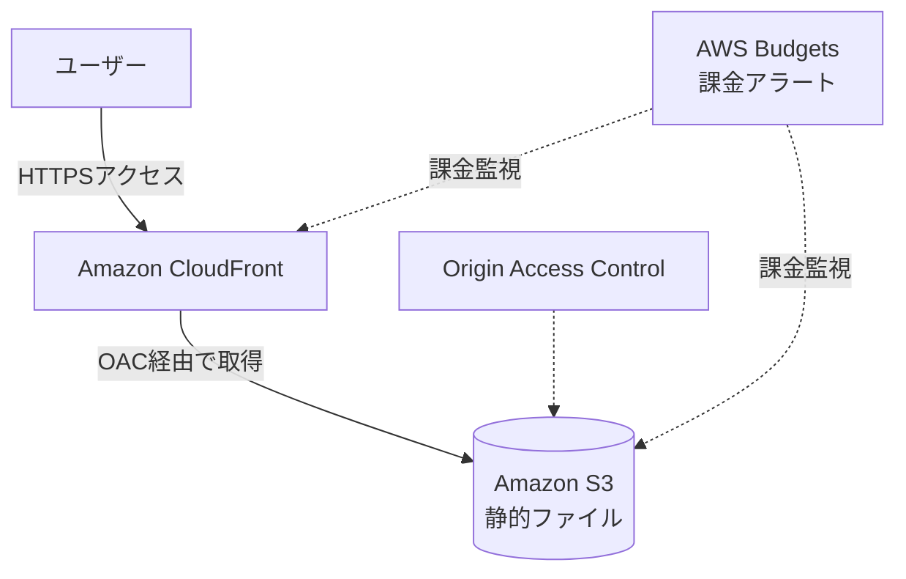

---

## 5.3 サービス構成

| AWSサービス | 用途 | 選定理由 |
|---|---|---|
| Amazon S3 | 静的ファイル配置 | HTML、CSS、JavaScript、画像、構成図を低コストで保存できる |
| Amazon CloudFront | CDN配信 | HTTPS配信、キャッシュ、高速表示、S3の直接公開防止ができる |
| Origin Access Control | CloudFrontからS3への安全なアクセス | S3バケットを非公開にし、CloudFront経由のみ許可できる |
| IAM | 権限管理 | S3更新、CloudFront操作、デプロイ権限を最小化する |
| AWS Budgets | 課金監視 | 想定外の課金を早期検知する |

---

## 5.4 処理フロー

```text
1. ユーザーがブラウザでサイトURLにアクセスする
2. CloudFrontがリクエストを受け取る
3. CloudFrontキャッシュにファイルがあれば、そのまま返却する
4. キャッシュがなければ、CloudFrontがS3からファイルを取得する
5. S3はCloudFrontからのアクセスのみ許可する
6. ユーザーにHTML、CSS、JavaScript、画像を返却する
```

---

## 5.5 この構成で実現できること

| 項目 | 内容 |
|---|---|
| 低コスト公開 | EC2を使わず、静的サイトとして低コスト公開できる |
| 高速配信 | CloudFrontのキャッシュにより表示速度を高められる |
| セキュリティ | S3を直接公開せず、CloudFront経由に限定できる |
| SEO対応 | 静的HTMLとして配信しやすく、SEOに向いている |
| ポートフォリオ性 | S3、CloudFront、IAM、OACの理解を示せる |

---

## 5.6 Phase 1の注意点

| 注意点 | 内容 |
|---|---|
| 動的処理はできない | 問い合わせ保存、ユーザー別学習履歴などは未対応 |
| 管理画面はない | 記事・問題はMarkdownやJSONを更新して再デプロイする |
| ログインはない | 全ユーザーが同じコンテンツを見る構成 |
| CloudFrontキャッシュ | 更新後すぐ反映したい場合はキャッシュ無効化が必要 |

---

## 6. Phase 2：サーバーレスAPI構成

## 6.1 構成概要

Phase 2では、静的サイトにAPI機能を追加する。

MVPでAPI化する対象は以下である。

- 問い合わせフォーム送信
- 模擬問題データ取得
- AWS用語データ取得
- 将来的な正誤記録の土台

ただし、初期段階ではすべてをAPI化する必要はない。問い合わせフォームのみAPI化し、用語・問題・記事は静的JSON/Markdown管理でもよい。

---

## 6.2 構成図

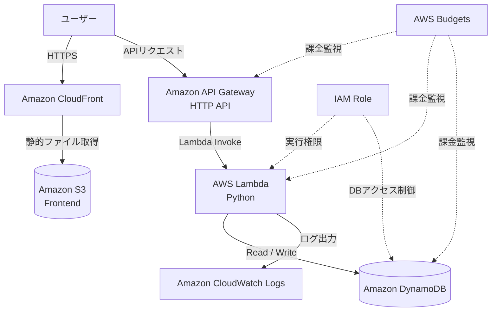

---

## 6.3 サービス構成

| AWSサービス | 用途 | 選定理由 |
|---|---|---|
| API Gateway | フロントエンドからAPIを呼び出す入口 | HTTP APIとして低コスト・シンプルにAPI公開できる |
| Lambda | 問い合わせ送信、データ取得処理 | 必要な時だけ実行されるため、常時起動コストが不要 |
| DynamoDB | 問い合わせ、問題、用語データ保存 | サーバーレスと相性が良く、小規模運用で低コストにしやすい |
| CloudWatch Logs | Lambdaログ確認 | エラー調査・運用監視に必要 |
| IAM Role | Lambda実行権限管理 | 最小権限を実装できる |

---

## 6.4 API処理フロー：問い合わせ送信

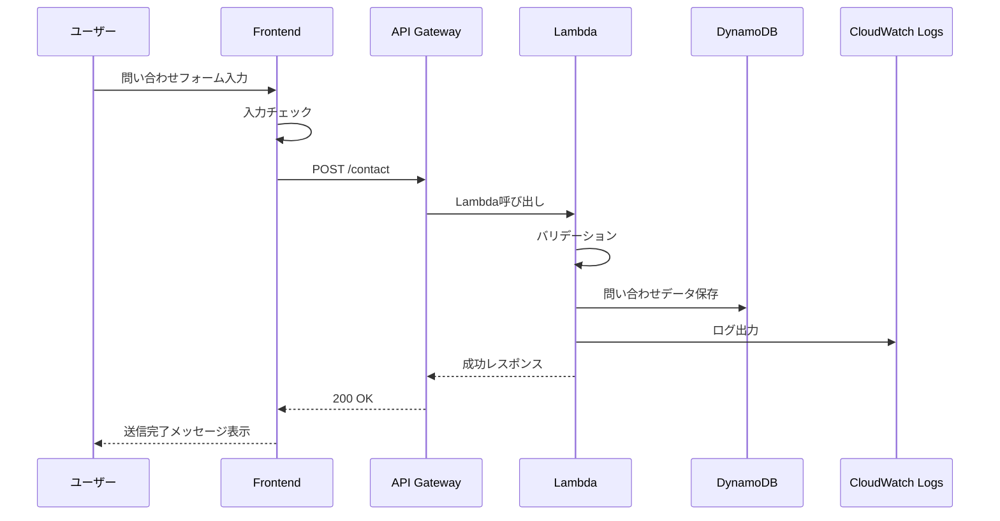

---

## 6.5 API処理フロー：模擬問題取得

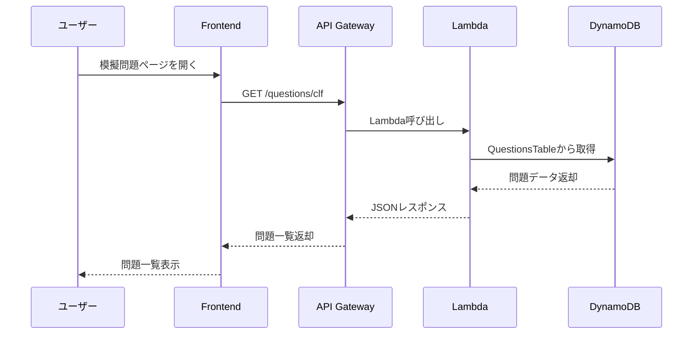

---

## 6.6 API設計概要

| メソッド | パス | 用途 | MVP |
|---|---|---|---|
| POST | /contact | 問い合わせ送信 | 対象 |
| GET | /terms | 用語一覧取得 | 任意 |
| GET | /terms/{termId} | 用語詳細取得 | 任意 |
| GET | /questions/clf | CLF問題一覧取得 | 任意 |
| GET | /questions/{questionId} | 問題詳細取得 | 任意 |
| GET | /architectures | 構成図一覧取得 | 将来 |
| POST | /answers | 回答履歴保存 | 将来 |

---

## 6.7 Phase 2で実現できること

| 項目 | 内容 |
|---|---|
| 問い合わせ保存 | ユーザーからの問い合わせをDynamoDBに保存できる |
| API実装経験 | API Gateway + Lambda + DynamoDBの実装経験を示せる |
| 運用監視 | CloudWatch Logsでエラー確認できる |
| 拡張性 | 将来の学習履歴保存やユーザー別機能に拡張しやすい |
| SAA対策 | サーバーレスAPI構成を自分の作品で説明できる |

---

## 7. Phase 3：独自ドメイン・収益化準備構成

## 7.1 構成概要

Phase 3では、SEO・広告収益化・信頼性向上のため、独自ドメイン、HTTPS、Google Search Console、Google Analytics、AdSense導入を想定した構成にする。

AWS側では、Route 53とACMを利用する。

---

## 7.2 構成図

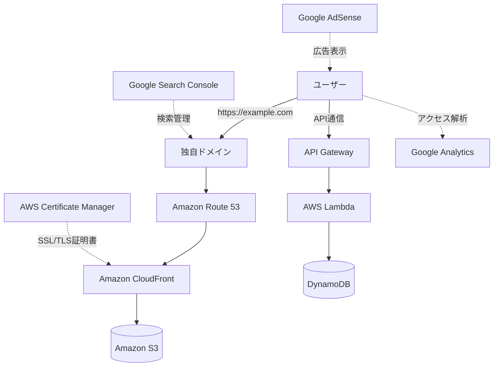

---

## 7.3 サービス構成

| サービス | 用途 | 補足 |
|---|---|---|
| Route 53 | 独自ドメインのDNS管理 | 独自ドメイン利用時に設定 |
| ACM | HTTPS証明書発行 | CloudFrontで使う場合、基本的にus-east-1で発行する |
| CloudFront | HTTPS配信 | 独自ドメインと証明書を紐付ける |
| Google Search Console | 検索パフォーマンス確認 | AWS外部サービス |
| Google Analytics | アクセス解析 | AWS外部サービス |
| Google AdSense | 広告収益化 | AWS外部サービス |

---

## 7.4 独自ドメイン設定フロー

```text
1. ドメインを取得する
2. Route 53にHosted Zoneを作成する
3. ACMでSSL/TLS証明書を発行する
4. CloudFrontに独自ドメインと証明書を設定する
5. Route 53でAレコードまたはAliasレコードをCloudFrontへ向ける
6. HTTPSでサイトへアクセスできることを確認する
7. Search Consoleに登録する
8. サイトマップを送信する
9. AnalyticsとAdSenseを設定する
```

---

## 7.5 Phase 3の注意点

| 注意点 | 内容 |
|---|---|
| ドメイン費用 | 独自ドメインはAWS無料枠とは別に費用が発生する可能性がある |
| Route 53費用 | Hosted Zoneには月額費用が発生する可能性があるため、完全ゼロ円にはならない可能性がある |
| AdSense審査 | 記事数、独自性、運営者情報、プライバシーポリシーが必要 |
| 証明書リージョン | CloudFront用ACM証明書はus-east-1で管理する点に注意する |

---

## 8. Phase 4：学習アプリ化構成

## 8.1 構成概要

Phase 4では、単なる情報サイトから学習管理アプリへ拡張する。

追加する機能は以下である。

- ユーザー登録
- ログイン
- 学習履歴保存
- 正答率表示
- 復習問題
- 弱点分析
- 毎日1問通知
- 有料機能の土台

---

## 8.2 構成図

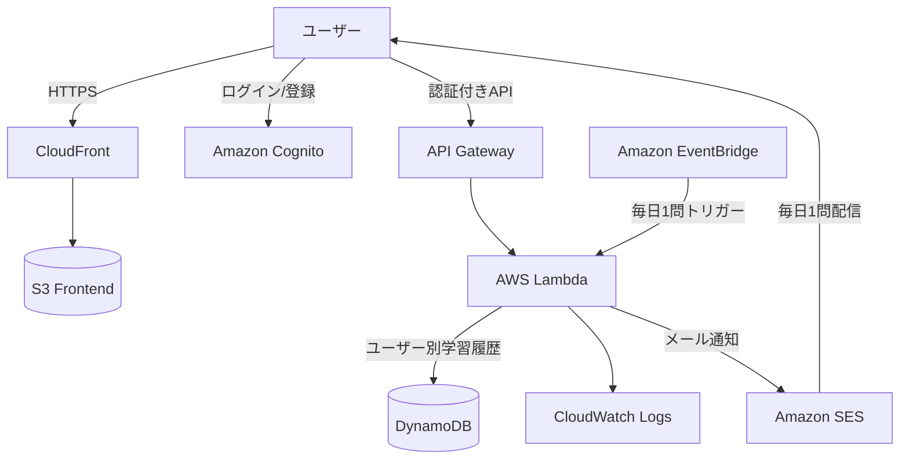

---

## 8.3 認証・認可フロー

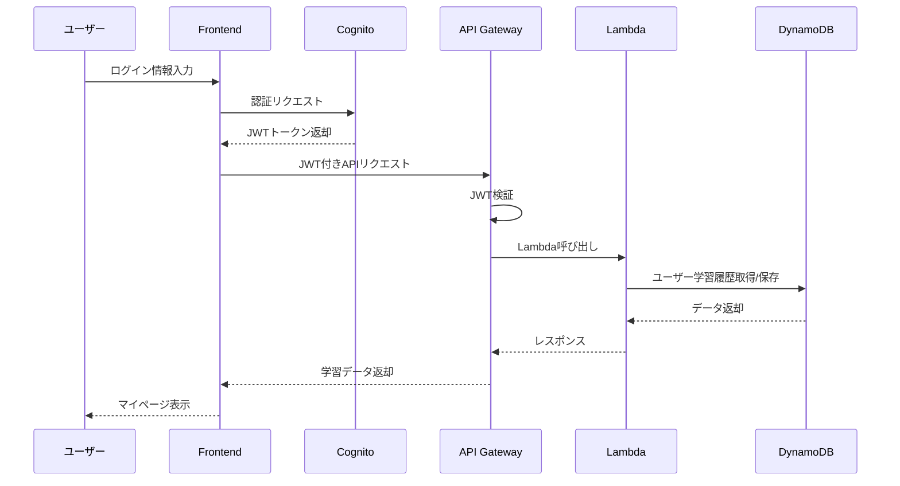

---

## 8.4 学習履歴データ保存フロー

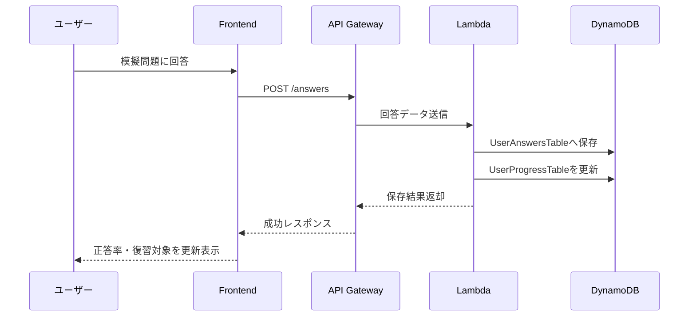

---

## 8.5 Phase 4追加サービス

| AWSサービス | 用途 | 選定理由 |
|---|---|---|
| Cognito | ユーザー認証 | ログイン、JWT認証、ユーザー管理をAWSマネージドで実装できる |
| EventBridge | 定期実行 | 毎日1問通知、定期集計、メンテナンス処理に使える |
| SES | メール送信 | 毎日1問配信、問い合わせ通知に利用できる |
| DynamoDB | 学習履歴保存 | ユーザーごとの回答履歴・正答率保存に向いている |

---

## 9. データストア設計概要

## 9.1 DynamoDBテーブル一覧

| テーブル名 | 用途 | Phase |
|---|---|---|
| TermsTable | AWS用語データ | Phase 2以降 |
| QuestionsTable | 模擬問題データ | Phase 2以降 |
| ContactsTable | 問い合わせデータ | Phase 2 |
| UserAnswersTable | ユーザー回答履歴 | Phase 4 |
| UserProgressTable | 学習進捗集計 | Phase 4 |
| DailyQuestionTable | 毎日1問配信用データ | Phase 4 |

---

## 9.2 ContactsTable

| 属性 | 型 | 内容 |
|---|---|---|
| contactId | String | 問い合わせID。UUID |
| createdAt | String | 送信日時 |
| name | String | 名前 |
| email | String | メールアドレス |
| subject | String | 件名 |
| message | String | 本文 |
| status | String | new / read / done |

### パーティションキー案

| キー | 値 |
|---|---|
| Partition Key | contactId |

---

## 9.3 QuestionsTable

| 属性 | 型 | 内容 |
|---|---|---|
| questionId | String | 問題ID。例：clf-001 |
| exam | String | CLF-C02 / SAA-C03 |
| category | String | 出題カテゴリ |
| difficulty | String | easy / normal / hard |
| question | String | 問題文 |
| choices | List | 選択肢 |
| answer | Number | 正解番号 |
| explanation | String | 解説 |
| relatedServices | List | 関連AWSサービス |
| updatedAt | String | 更新日時 |

### パーティションキー案

| キー | 値 |
|---|---|
| Partition Key | questionId |

### GSI案

| Index | Partition Key | 用途 |
|---|---|---|
| ExamCategoryIndex | exam | 試験区分別に問題取得 |
| CategoryIndex | category | カテゴリ別に問題取得 |

---

## 9.4 UserAnswersTable

| 属性 | 型 | 内容 |
|---|---|---|
| userId | String | CognitoユーザーID |
| answerId | String | 回答ID |
| questionId | String | 問題ID |
| selectedChoice | Number | 選択した回答 |
| isCorrect | Boolean | 正誤 |
| answeredAt | String | 回答日時 |

### キー設計案

| キー | 値 |
|---|---|
| Partition Key | userId |
| Sort Key | answeredAt#questionId |

---

## 9.5 UserProgressTable

| 属性 | 型 | 内容 |
|---|---|---|
| userId | String | CognitoユーザーID |
| exam | String | 試験区分 |
| totalAnswered | Number | 回答済み数 |
| correctCount | Number | 正解数 |
| accuracy | Number | 正答率 |
| weakCategories | List | 苦手カテゴリ |
| updatedAt | String | 更新日時 |

### キー設計案

| キー | 値 |
|---|---|
| Partition Key | userId |
| Sort Key | exam |

---

## 10. フロントエンド配置設計

## 10.1 ビルド成果物配置

```text
frontend/
├── app/
├── components/
├── contents/
│   ├── terms/
│   ├── comparisons/
│   ├── blog/
│   └── architectures/
├── public/
│   └── images/
└── out/ or dist/
```

ビルド後の静的ファイルをS3へアップロードする。

```text
S3 Bucket
├── index.html
├── terms/
├── comparisons/
├── questions/
├── architectures/
├── blog/
├── assets/
└── images/
```

---

## 10.2 CloudFront配信設計

| 項目 | 設定方針 |
|---|---|
| Origin | S3 Bucket |
| Viewer Protocol Policy | Redirect HTTP to HTTPS |
| Allowed HTTP Methods | GET, HEAD を基本とする |
| Cache Policy | 静的ファイルはキャッシュ有効 |
| Default Root Object | index.html |
| Error Pages | 404ページ、SPAルーティング対応が必要な場合は設定 |
| OAC | 有効化し、S3を直接公開しない |

---

## 11. バックエンド設計概要

## 11.1 Lambda設計方針

| 項目 | 方針 |
|---|---|
| 実装言語 | Python |
| 実行単位 | 機能ごとにLambdaを分ける |
| ログ | CloudWatch Logsへ出力 |
| 権限 | 必要なDynamoDBテーブルへの最小権限のみ付与 |
| 環境変数 | テーブル名、許可Originなどを設定 |
| タイムアウト | 短めに設定し、無駄な実行時間を防ぐ |

---

## 11.2 Lambda関数一覧

| Lambda名 | 用途 | Phase |
|---|---|---|
| contact-submit-function | 問い合わせ保存 | Phase 2 |
| get-terms-function | 用語一覧・詳細取得 | Phase 2以降 |
| get-questions-function | 問題一覧・詳細取得 | Phase 2以降 |
| submit-answer-function | 回答履歴保存 | Phase 4 |
| get-progress-function | 学習進捗取得 | Phase 4 |
| daily-question-function | 毎日1問配信 | Phase 4 |

---

## 11.3 API Gateway設計方針

| 項目 | 方針 |
|---|---|
| API種別 | HTTP APIを基本とする |
| CORS | フロントエンドドメインのみ許可 |
| 認証 | MVPではなし。Phase 4でCognito JWT Authorizerを利用 |
| レート制限 | 必要に応じて設定 |
| ログ | 必要最小限で有効化 |

---

## 12. CI/CD構成

## 12.1 MVPのデプロイ方針

MVPでは、最初は手動デプロイでもよい。

```text
1. ローカルでビルド
2. S3へアップロード
3. CloudFrontキャッシュ無効化
4. 動作確認
```

ただし、ポートフォリオ価値を高めるため、早い段階でGitHub Actionsによる自動デプロイに移行する。

---

## 12.2 自動デプロイ構成図

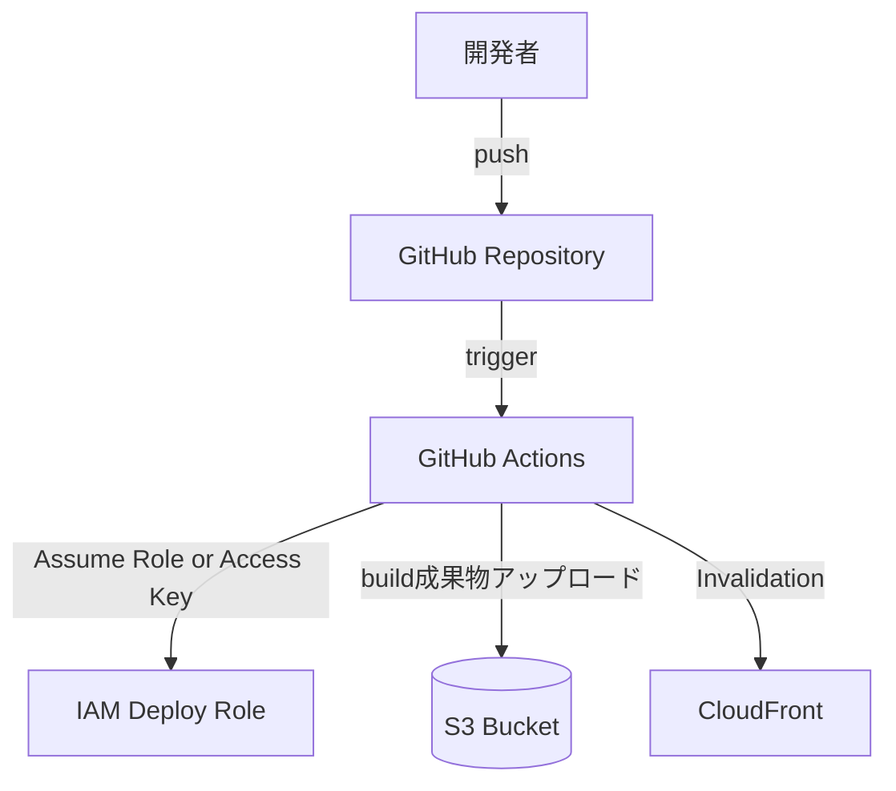

---

## 12.3 GitHub Actionsの処理

```text
1. mainブランチへpush
2. 依存関係インストール
3. Lint / Type Check
4. Build
5. S3へアップロード
6. CloudFront Invalidation実行
```

---

## 12.4 デプロイ権限

GitHub Actionsには、以下の権限のみ付与する。

| 権限 | 用途 |
|---|---|
| s3:PutObject | ファイルアップロード |
| s3:DeleteObject | 古いファイル削除 |
| s3:ListBucket | バケット確認 |
| cloudfront:CreateInvalidation | キャッシュ無効化 |

不要なAdministratorAccessは付与しない。

---

## 13. セキュリティ設計

## 13.1 S3セキュリティ

| 項目 | 方針 |
|---|---|
| Public Access | ブロックする |
| 配信経路 | CloudFront経由のみ |
| OAC | 有効化する |
| Bucket Policy | CloudFront Distributionからのアクセスのみ許可 |
| バージョニング | 任意。誤削除対策として有効化検討 |

---

## 13.2 APIセキュリティ

| 項目 | 方針 |
|---|---|
| CORS | 許可Originを本番ドメインに限定 |
| 入力チェック | Lambda側でも必ず実施 |
| 文字数制限 | 問い合わせ本文などに上限を設ける |
| レート制限 | スパム対策として検討 |
| 認証 | MVPは不要。学習履歴保存時にCognito導入 |

---

## 13.3 IAM設計

| 対象 | 権限方針 |
|---|---|
| Lambda実行ロール | 対象DynamoDBテーブルへの最小限のRead/Write権限 |
| GitHub Actions用ロール | S3デプロイとCloudFront Invalidationのみ |
| 開発者IAMユーザー | MFA有効化、AdministratorAccessの常用を避ける |
| CloudWatch Logs | Lambdaログ書き込みのみ許可 |

---

## 13.4 シークレット管理

| 情報 | 管理方法 |
|---|---|
| AWSアクセスキー | GitHub SecretsまたはOIDCで管理 |
| APIキー | GitHubにコミットしない |
| 環境変数 | Lambda環境変数に設定 |
| 将来の外部APIキー | Secrets ManagerまたはSSM Parameter Storeを検討 |

---

## 14. 監視・ログ設計

## 14.1 CloudWatch Logs

| 対象 | ログ内容 |
|---|---|
| contact-submit-function | 問い合わせ送信成功・失敗、バリデーションエラー |
| get-questions-function | 問題取得リクエスト、取得失敗 |
| submit-answer-function | 回答保存成功・失敗 |
| daily-question-function | 配信成功・失敗 |

---

## 14.2 CloudWatch Metrics

確認対象：

- Lambda Errors
- Lambda Duration
- Lambda Invocations
- API Gateway 4XX / 5XX
- DynamoDB Read / Write 使用量
- CloudFront Requests

---

## 14.3 アラート方針

MVPでは最低限、以下を設定する。

| アラート | 条件 |
|---|---|
| 課金アラート | 月額利用料が設定金額を超えた場合 |
| Lambdaエラー | 一定期間内にエラーが連続した場合 |
| API 5XX | API Gatewayで5XXが増えた場合 |

最初はAWS Budgetsを必須とし、CloudWatch AlarmはPhase 2以降に追加する。

---

## 15. コスト設計

## 15.1 コスト最小化方針

| 方針 | 内容 |
|---|---|
| EC2を使わない | 常時起動コストを避ける |
| RDSを使わない | 小規模MVPではDynamoDBを利用する |
| NAT Gatewayを使わない | 固定費が発生しやすいため避ける |
| ALBを使わない | サーバーレスAPIではAPI Gatewayを使う |
| 静的配信中心 | S3 + CloudFrontで低コスト配信する |
| ログ保存期間を制限 | CloudWatch Logsの肥大化を防ぐ |
| 画像を圧縮 | S3保存量・転送量を抑える |

---

## 15.2 課金リスクが高いサービスの扱い

| サービス | 方針 |
|---|---|
| NAT Gateway | 使用しない |
| RDS | MVPでは使用しない |
| EC2 | 常時起動しない |
| ALB | MVPでは使用しない |
| Elastic IP | 使用しない |
| CloudWatch Logs | 保存期間を設定する |
| Route 53 | 独自ドメイン利用時のみ使用する |

---

## 15.3 AWS Budgets設定方針

| 項目 | 設定方針 |
|---|---|
| 予算タイプ | Cost Budget |
| 期間 | Monthly |
| 通知 | メール通知 |
| 閾値 | 低めに設定する |
| 対象 | 全AWSサービス |

---

## 16. 可用性・耐障害性設計

## 16.1 静的サイト部分

| 項目 | 内容 |
|---|---|
| S3 | 高耐久なオブジェクトストレージとして静的ファイルを保持 |
| CloudFront | エッジキャッシュにより可用性と表示速度を向上 |
| 静的HTML | API障害時でも記事・用語ページは閲覧可能にする |

---

## 16.2 API部分

| 項目 | 内容 |
|---|---|
| Lambda | マネージド実行基盤によりサーバー管理不要 |
| API Gateway | マネージドAPI入口として利用 |
| DynamoDB | マネージドNoSQLとして利用 |
| エラー処理 | APIエラー時はユーザーに分かりやすいメッセージを表示 |

---

## 16.3 MVPでの割り切り

MVPでは、厳密なマルチリージョン構成や高度なDR設計は行わない。

理由：

- 個人開発ポートフォリオとしては過剰設計になるため
- コスト増加につながるため
- まず公開と学習価値を優先するため

ただし、SAA学習用コンテンツとして、マルチAZ、マルチリージョン、DR構成は別途記事・構成図で解説する。

---

## 17. バックアップ・復旧設計

## 17.1 S3

| 項目 | 方針 |
|---|---|
| ソース管理 | 元データはGitHubで管理する |
| 復旧方法 | GitHubから再ビルド・再デプロイする |
| バージョニング | 任意。重要度が上がれば有効化 |

---

## 17.2 DynamoDB

| 項目 | 方針 |
|---|---|
| 問い合わせデータ | 必要に応じてエクスポート |
| 問題・用語データ | GitHubのJSON/Markdownを原本とする |
| 学習履歴 | Phase 4以降、PITRの導入を検討 |

---

## 18. 環境分離設計

## 18.1 MVP方針

MVPでは、コスト削減のため本番環境のみで開始する。

ただし、ディレクトリや設定値は将来の環境分離を想定して設計する。

---

## 18.2 将来の環境構成

| 環境 | 用途 |
|---|---|
| local | ローカル開発 |
| dev | 検証環境 |
| prod | 本番環境 |

---

## 18.3 命名例

| リソース | dev | prod |
|---|---|---|
| S3 Bucket | aws-cert-lab-dev | aws-cert-lab-prod |
| Lambda | contact-submit-dev | contact-submit-prod |
| DynamoDB | QuestionsTableDev | QuestionsTableProd |
| API Gateway | aws-cert-api-dev | aws-cert-api-prod |

---

## 19. IaC方針

## 19.1 初期方針

Phase 1では、AWSマネジメントコンソールで手動構築してもよい。

理由：

- AWS初学者として各サービスの設定画面を理解するため
- CLF学習と相性が良いため
- まず公開まで到達することを優先するため

---

## 19.2 中期方針

Phase 2以降は、IaC化を検討する。

候補：

| ツール | 特徴 |
|---|---|
| AWS SAM | Lambda/API Gateway/DynamoDBなどサーバーレス構成と相性が良い |
| Terraform | AWS以外にも対応でき、ポートフォリオ価値が高い |
| AWS CDK | TypeScript/PythonでAWSリソースを定義できる |

---

## 19.3 推奨方針

本プロダクトでは、まずAWS SAMを推奨する。

理由：

- Lambda、API Gateway、DynamoDB構成と相性が良い
- サーバーレス学習に直結する
- SAAの学習内容と結びつけやすい
- 個人開発の規模に合っている

将来的にTerraformへ移行、または別ブランチでTerraform版を作ると、さらにポートフォリオ価値が高まる。

---

## 20. 推奨ディレクトリ構成

```text
aws-cert-roadmap-lab/
├── frontend/
│   ├── app/
│   ├── components/
│   ├── contents/
│   │   ├── terms/
│   │   ├── comparisons/
│   │   ├── questions/
│   │   ├── architectures/
│   │   └── blog/
│   ├── public/
│   └── package.json
│
├── backend/
│   ├── functions/
│   │   ├── contact_submit/
│   │   ├── get_terms/
│   │   ├── get_questions/
│   │   └── submit_answer/
│   ├── shared/
│   └── requirements.txt
│
├── infra/
│   ├── sam-template.yaml
│   └── README.md
│
├── docs/
│   ├── project-proposal.md
│   ├── requirements-definition.md
│   ├── screen-transition-design.md
│   ├── aws-architecture-design.md
│   └── diagrams/
│
├── .github/
│   └── workflows/
│       └── deploy.yml
│
└── README.md
```

---

## 21. READMEに掲載するAWS構成説明

GitHub READMEでは、以下のように説明する。

```text
本プロダクトは、AWS Cloud Practitioner / SAA学習者向けのWeb学習サイトです。
インフラはAWSのサーバーレス構成を採用し、S3 + CloudFrontで静的サイトを配信し、API Gateway + Lambda + DynamoDBで問い合わせや問題データを処理します。

常時起動サーバーを使わず、AWS無料枠と従量課金サービスを活用することで、小規模アクセス時の運用コストを最小化しています。

また、S3は直接公開せず、CloudFront Origin Access Controlを利用してCloudFront経由のみアクセス可能にしています。
```

---

## 22. 面接で説明するポイント

## 22.1 なぜS3 + CloudFrontを使うのか

- 静的サイト公開に適している
- EC2を使わずに低コストで公開できる
- CloudFrontでHTTPS配信とキャッシュができる
- S3を直接公開せず、安全に配信できる

## 22.2 なぜLambda + API Gatewayを使うのか

- 問い合わせやデータ取得など、必要な時だけ処理すればよいため
- 常時サーバーを起動する必要がない
- 個人開発の規模に合っている
- サーバーレス構成の実践経験を示せる

## 22.3 なぜDynamoDBを使うのか

- 用語、問題、問い合わせ、学習履歴のような構造化データを保存できる
- サーバーレスと相性が良い
- 小規模アクセスでは低コストにしやすい
- SAAで重要なNoSQL設計の説明材料になる

## 22.4 なぜRDSを使わないのか

- MVPではリレーショナルDBが必須ではない
- RDSは小規模個人開発では固定費になりやすい
- 問題・用語・学習履歴はDynamoDBで十分扱える
- コスト最適化を重視するため

## 22.5 なぜNAT Gatewayを使わないのか

- MVP構成ではVPC内のプライベートサブネットから外部通信する要件がない
- NAT Gatewayは固定費が発生しやすい
- Lambda、DynamoDB、API Gateway中心ならVPC構成を複雑にする必要がない

---

## 23. 採用する構成と採用しない構成

## 23.1 採用する構成

| 構成 | 理由 |
|---|---|
| S3 + CloudFront | 静的サイト公開に最適で低コスト |
| API Gateway + Lambda | 軽量APIに適し、サーバーレスで運用できる |
| Lambda + DynamoDB | 問い合わせ、問題、学習履歴の保存に適する |
| Cognito | 将来のログイン機能に適する |
| EventBridge | 将来の毎日1問配信に適する |
| CloudWatch Logs | 運用監視・障害調査に必要 |
| AWS Budgets | 課金事故防止に必須 |

---

## 23.2 採用しない構成

| 構成 | 採用しない理由 |
|---|---|
| EC2常時起動 | 固定費が発生しやすく、MVPには過剰 |
| RDS | MVPでは不要。固定費リスクがある |
| NAT Gateway | MVPでは不要。課金リスクが高い |
| ALB | サーバーレスAPIではAPI Gatewayで十分 |
| ECS/EKS | 個人開発MVPには過剰 |
| マルチリージョン構成 | MVPではコスト・運用負荷が高い |

---

## 24. 最終推奨構成

## 24.1 MVP推奨構成

MVPでは、以下の構成を推奨する。

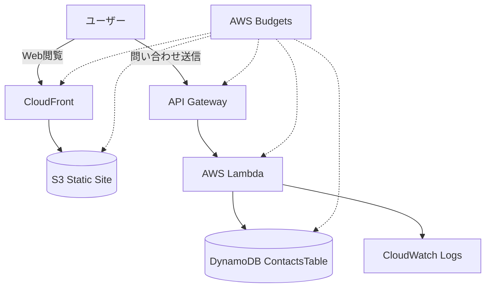

---

## 24.2 MVPでの役割分担

| 領域 | 担当サービス |
|---|---|
| Web配信 | S3 + CloudFront |
| API入口 | API Gateway |
| API処理 | Lambda |
| 問い合わせ保存 | DynamoDB |
| ログ | CloudWatch Logs |
| 権限管理 | IAM |
| 課金監視 | AWS Budgets |

---

## 24.3 将来完成形

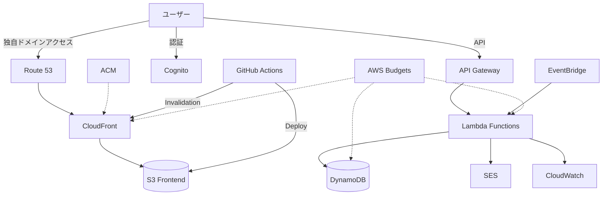

---

## 25. 実装順序

## 25.1 AWS構築順序

```text
1. AWS Budgets設定
2. S3バケット作成
3. 静的サイトビルド成果物をS3へ配置
4. CloudFront Distribution作成
5. OAC設定
6. S3 Bucket Policy設定
7. CloudFront経由で表示確認
8. API Gateway作成
9. Lambda作成
10. DynamoDB ContactsTable作成
11. 問い合わせAPI接続
12. CloudWatch Logs確認
13. GitHub Actionsデプロイ設定
14. CloudFront Invalidation自動化
15. 独自ドメイン導入
16. Search Console / Analytics / AdSense準備
```

---

## 25.2 先に必ずやること

最初に必ず実施する作業は以下である。

| 項目 | 理由 |
|---|---|
| AWS Budgets設定 | 課金事故を防ぐため |
| MFA設定 | AWSアカウント保護のため |
| IAMユーザー/ロール整理 | rootユーザー常用を避けるため |
| S3 Public Access Block確認 | 意図しない公開を防ぐため |
| CloudWatch Logs保存期間設定 | ログ肥大化による課金を防ぐため |

---

## 26. 受け入れ基準

## 26.1 Phase 1受け入れ基準

| ID | 基準 |
|---|---|
| AC-AWS-001 | S3に静的サイトファイルが配置されている |
| AC-AWS-002 | CloudFront経由でサイトを閲覧できる |
| AC-AWS-003 | S3バケットが直接公開されていない |
| AC-AWS-004 | AWS Budgetsが設定されている |
| AC-AWS-005 | GitHub READMEに構成図が掲載されている |

---

## 26.2 Phase 2受け入れ基準

| ID | 基準 |
|---|---|
| AC-AWS-006 | API GatewayからLambdaを呼び出せる |
| AC-AWS-007 | LambdaからDynamoDBへデータ保存できる |
| AC-AWS-008 | 問い合わせフォームからデータ送信できる |
| AC-AWS-009 | CloudWatch LogsでLambdaログを確認できる |
| AC-AWS-010 | Lambda IAM Roleが最小権限で設定されている |

---

## 26.3 Phase 3受け入れ基準

| ID | 基準 |
|---|---|
| AC-AWS-011 | 独自ドメインでサイトにアクセスできる |
| AC-AWS-012 | HTTPSで配信されている |
| AC-AWS-013 | Search Consoleに登録されている |
| AC-AWS-014 | サイトマップが送信されている |

---

## 26.4 Phase 4受け入れ基準

| ID | 基準 |
|---|---|
| AC-AWS-015 | Cognitoでユーザー登録・ログインできる |
| AC-AWS-016 | 認証付きAPIを呼び出せる |
| AC-AWS-017 | 学習履歴をDynamoDBに保存できる |
| AC-AWS-018 | マイページで正答率を表示できる |
| AC-AWS-019 | EventBridgeで定期処理を実行できる |

---

## 27. 結論

本プロダクトのAWS構成は、S3 + CloudFrontによる静的サイト配信を土台とし、必要に応じてAPI Gateway + Lambda + DynamoDBを追加するサーバーレス構成とする。

MVPでは、EC2、RDS、NAT Gateway、ALBなど固定費が発生しやすいサービスは使用しない。これにより、AWS無料枠を活用しながら、低コストで公開可能なポートフォリオを構築する。

最終的には、Cognitoによるログイン、DynamoDBによる学習履歴保存、EventBridgeによる毎日1問配信、SESによるメール通知、Route 53 + ACMによる独自ドメイン・HTTPS対応を追加し、学習メディアから学習アプリへ拡張する。

この構成により、以下を同時に実現できる。

- AWS資格学習の実践化
- サーバーレス構成のポートフォリオ化
- 低コスト運用
- SEOメディア化
- 将来的な広告収益化・教材販売・SaaS化

AWS資格学習サイトとしてだけでなく、