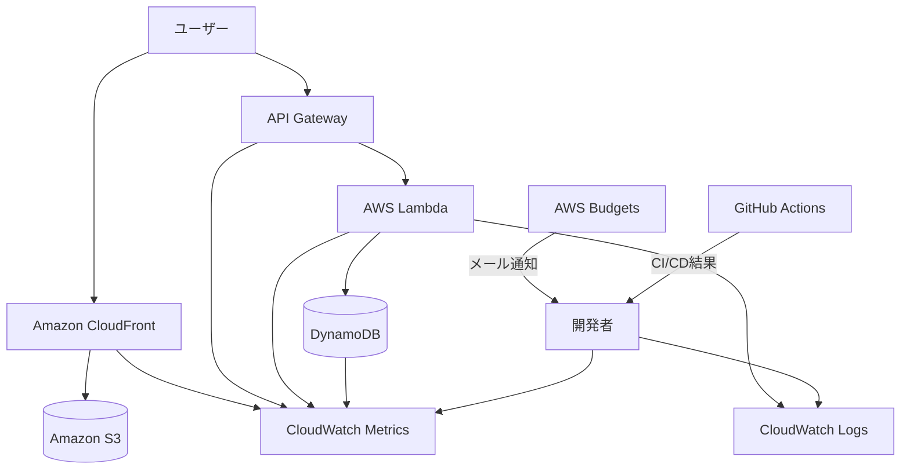

# CloudWatchで見るサーバーレス運用監視構成

## 概要

この構成は、S3 + CloudFrontで公開した静的サイトと、API Gateway + Lambda + DynamoDBの問い合わせAPIを運用監視するための基本構成です。

個人開発のMVPでは、大規模な監視基盤を最初から作る必要はありません。しかし、最低限「サイトが表示できるか」「APIが失敗していないか」「Lambdaログにエラーがないか」「課金が増えていないか」は確認できる状態にします。

このプロジェクトでは、CloudWatch Logs、CloudWatch Metrics、AWS Budgets、GitHub Actionsログを中心に監視します。

## 構成図

## この構成で実現できること

| 項目 | 内容 |
|---|---|
| サイト監視 | CloudFrontの4xx、5xx、リクエスト数を確認できる |
| API監視 | API Gatewayの4xx、5xx、Latencyを確認できる |
| Lambda監視 | Invocations、Errors、Duration、Throttlesを確認できる |
| DB監視 | DynamoDBの書き込み、スロットリング、ItemCountを確認できる |
| ログ調査 | CloudWatch LogsでLambdaの処理結果を確認できる |
| 課金監視 | AWS Budgetsで想定外の課金増加に気づける |
| デプロイ監視 | GitHub ActionsログでCI/CD失敗を確認できる |

## 使用AWSサービス

| サービス | 役割 |
|---|---|
| Amazon CloudWatch Logs | Lambdaログの保存と確認 |
| Amazon CloudWatch Metrics | CloudFront、API Gateway、Lambda、DynamoDBのメトリクス確認 |
| AWS Budgets | 月額費用と予測超過の通知 |
| Amazon CloudFront | 静的サイト配信の入口 |
| API Gateway | 問い合わせAPIの入口 |
| AWS Lambda | 問い合わせ保存処理 |
| Amazon DynamoDB | 問い合わせデータ保存 |
| GitHub Actions | CI/CD実行結果の確認 |

## 通信フロー

1. ユーザーがCloudFront経由でサイトへアクセスする
2. CloudFrontメトリクスにリクエスト数やエラー率が記録される
3. ユーザーが問い合わせフォームを送信する
4. API GatewayがLambdaを呼び出す
5. LambdaがDynamoDBへ問い合わせデータを保存する
6. LambdaがCloudWatch Logsへ最小限のログを出力する
7. CloudWatch MetricsでAPI、Lambda、DynamoDBの状態を確認する
8. AWS Budgetsが費用超過をメール通知する
9. GitHub Actionsでデプロイ失敗を確認する

## 設計ポイント

### 可用性

MVP段階ではCloudWatch Alarmを大量に作るのではなく、重要箇所を手動確認できる状態にします。

アクセスが増えたら、Lambda Errors、API Gateway 5xx、CloudFront 5xxにCloudWatch Alarmを追加します。

### セキュリティ

CloudWatch Logsにメールアドレス全文や問い合わせ本文全文を出力しません。

ログには、`requestId`、`status`、`errorCode`、`validationErrorFields` のような調査に必要な情報だけを出します。

### コスト

CloudWatch Logsは保存期間を設定します。

MVPではログを無期限保存にしません。例えば7日または14日に設定し、ログ肥大化による課金を避けます。

CloudWatch DashboardやSyntheticsは便利ですが、MVPでは必須にしません。

### パフォーマンス

Lambda DurationやAPI Gateway Latencyを見ることで、問い合わせAPIの遅延を検知できます。

DynamoDBのスロットリングが出ている場合は、アクセス急増や設計ミスを疑います。

## SAA試験で問われるポイント

- 運用監視にはCloudWatch LogsとCloudWatch Metricsを使う
- LambdaのErrors、Duration、Throttlesは重要な確認対象になる
- API Gatewayの4xxと5xxは原因が異なる
- DynamoDBのスロットリングはキャパシティやアクセスパターンを見直すサインになる
- 課金事故対策としてAWS Budgetsを設定する
- ログに個人情報や秘密情報を出さない設計が必要になる

## この構成の注意点

- CloudWatch Logsを無期限保存にしない
- 問い合わせ本文やメールアドレス全文をログ出力しない
- メトリクスを見るだけでは原因までは分からないため、ログと直近デプロイを合わせて確認する
- 4xxはユーザー入力ミスやCORS設定、5xxはLambdaやDynamoDB側の問題を疑う
- Budgets通知が来たら、Cost Explorerでサービス別費用を確認する

## 関連用語

- [Amazon CloudWatch](/terms/cloudwatch)
- [Amazon CloudFront](/terms/cloudfront)
- [API Gateway](/terms/api-gateway)
- [AWS Lambda](/terms/lambda)
- [Amazon DynamoDB](/terms/dynamodb)
- [AWS Budgets](/terms/aws-budgets)
- [Cost Explorer](/terms/cost-explorer)

## 関連比較

- [CloudWatch / CloudTrail / AWS Config の違い](/comparisons/cloudwatch-vs-cloudtrail-vs-config)

## まとめ

CloudWatchを中心にした運用監視構成は、AWS上で公開したポートフォリオを安全に運用するための最低ラインです。

SAAでは「ログ」「メトリクス」「アラーム」「課金監視」を分けて理解する必要があります。このプロジェクトでは、まずCloudWatch Logs、CloudWatch Metrics、AWS Budgetsを使って小さく運用監視を始めます。