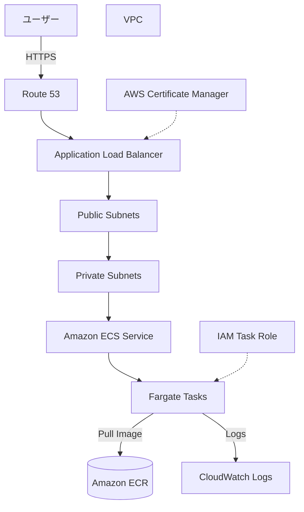

# ECS Fargate コンテナWebアプリ構成

## 概要

この構成は、コンテナ化したWebアプリケーションをAmazon ECS on AWS Fargateで実行し、Application Load Balancerで外部公開する基本パターンです。

EC2を自分で管理するECS構成と違い、Fargateではコンテナ実行基盤のサーバー管理をAWS側に任せられます。

「Docker化したWebアプリをAWSで動かしたいが、EC2のパッチ適用やキャパシティ管理は避けたい」というケースに向いています。

## 構成図

## この構成で実現できること

| 項目 | 内容 |
|---|---|
| コンテナ実行 | Docker化したWebアプリをAWS上で実行できる |
| サーバー管理削減 | EC2インスタンス管理を減らせる |
| HTTPS公開 | ALBとACMでHTTPSアクセスを受けられる |
| スケール | ECS ServiceのDesired Countでタスク数を調整できる |
| ログ確認 | コンテナログをCloudWatch Logsで確認できる |

## 使用AWSサービス

| サービス | 役割 |
|---|---|
| Amazon ECS | コンテナを管理・実行するオーケストレーションサービス |
| AWS Fargate | サーバー管理不要でコンテナを実行する基盤 |
| Amazon ECR | コンテナイメージの保存先 |
| Application Load Balancer | ユーザーからのHTTPSリクエストをECSタスクへ振り分ける |
| Amazon VPC | ECSタスクやALBを配置するネットワーク |
| AWS Certificate Manager | HTTPS証明書を管理する |
| Amazon CloudWatch Logs | コンテナログを保存・確認する |
| IAM | タスク実行ロールとタスクロールで権限を制御する |

## 通信フロー

1. ユーザーが独自ドメインへHTTPSアクセスする
2. Route 53がALBへ名前解決する
3. ALBがリクエストを受ける
4. ALBがターゲットグループ経由でECS Fargateタスクへ転送する
5. Fargateタスク上のコンテナがリクエストを処理する
6. コンテナログをCloudWatch Logsへ出力する
7. デプロイ時はECRからコンテナイメージを取得する

## 設計ポイント

### 可用性

ECSタスクを複数AZのプライベートサブネットに配置することで、1つのAZ障害への耐性を高められます。

ALBも複数AZにまたがって配置します。

### セキュリティ

ALBだけをパブリックサブネットに置き、ECSタスクはプライベートサブネットに配置します。

ECSタスクのSecurity Groupは、ALBからの通信だけを許可します。

タスクロールには、アプリケーションが必要とするAWSサービスへの権限だけを付与します。

### コスト

FargateはタスクのvCPU、メモリ、実行時間で課金されます。

個人開発MVPでは常時稼働コストが発生しやすいため、このAWS資格学習サイト本体にはS3 + CloudFrontを優先しています。

Fargateは、サーバーサイド処理が常時必要なWebアプリを作る段階で検討します。

### パフォーマンス

タスク数、CPU、メモリをアプリケーション負荷に合わせて設定します。

ALBのヘルスチェックに失敗したタスクは切り離されるため、ヘルスチェックパスをアプリ側で用意します。

## SAA試験で問われるポイント

- コンテナ実行基盤としてECSが選択肢になる
- サーバー管理を避けたい場合はFargateが候補になる
- 外部公開にはALBを組み合わせる
- タスクはプライベートサブネットに配置する設計が基本になる
- コンテナイメージ保存にはECRを使う
- タスク実行ロールとタスクロールの違いを理解する

## この構成の注意点

- 個人MVPではS3 + CloudFrontよりコストが高くなりやすい
- Fargateタスクを起動したままにすると継続課金される
- ALBにもコストが発生する
- プライベートサブネットからECRへアクセスする場合、NAT GatewayまたはVPC Endpoint設計が必要になる
- ヘルスチェック設定が誤っていると正常なタスクが切り離される

## 関連用語

- [Amazon ECS](/terms/ecs)
- [AWS Fargate](/terms/fargate)
- [Amazon ECR](/terms/ecr)
- [Elastic Load Balancing](/terms/elb)
- [Amazon VPC](/terms/vpc)
- [Amazon CloudWatch](/terms/cloudwatch)
- [IAM](/terms/iam)

## 関連比較

- [EC2 / Lambda / ECS の違い](/comparisons/ec2-vs-lambda-vs-ecs)
- [ALB / NLB / CloudFront の違い](/comparisons/alb-vs-nlb-vs-cloudfront)

## まとめ

ECS Fargateは、コンテナ化したWebアプリをサーバー管理なしで動かすための有力な選択肢です。

ただし、静的サイト中心の個人MVPでは固定費が増えやすいため、このプロジェクトでは学習用の構成図として扱い、本体公開はS3 + CloudFrontを優先します。