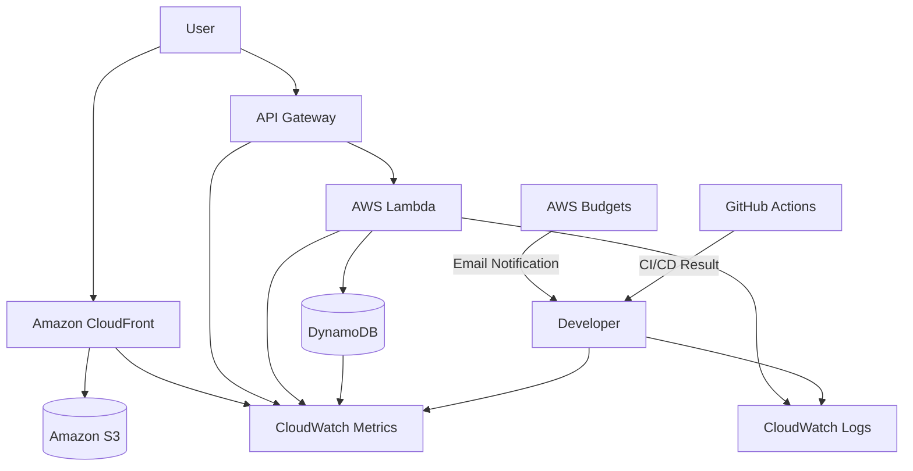

# Serverless Operational Monitoring with CloudWatch

## Overview

This architecture covers operational monitoring for a static site published with S3 + CloudFront and a contact API built on API Gateway + AWS Lambda + Amazon DynamoDB.

For an individual developer's MVP, you don't need to build a large-scale monitoring platform from day one. However, you should at least be able to check "is the site reachable", "is the API failing", "are there errors in Lambda logs", and "is the bill growing unexpectedly".

In this project, monitoring is centered on CloudWatch Logs, CloudWatch Metrics, AWS Budgets, and GitHub Actions logs.

## Architecture Diagram

## What This Architecture Enables

| Item | Description |
|---|---|
| Site monitoring | Check CloudFront 4xx, 5xx, and request counts |
| API monitoring | Check API Gateway 4xx, 5xx, and latency |
| Lambda monitoring | Check Invocations, Errors, Duration, and Throttles |
| DB monitoring | Check DynamoDB writes, throttling, and ItemCount |
| Log investigation | Inspect Lambda processing results via CloudWatch Logs |
| Billing monitoring | Catch unexpected cost increases via AWS Budgets |
| Deployment monitoring | Check CI/CD failures via GitHub Actions logs |

## AWS Services Used

| Service | Role |
|---|---|
| Amazon CloudWatch Logs | Store and inspect Lambda logs |
| Amazon CloudWatch Metrics | View metrics for CloudFront, API Gateway, Lambda, and DynamoDB |
| AWS Budgets | Notify on monthly cost and forecasted overage |
| Amazon CloudFront | Entry point for static site delivery |
| API Gateway | Entry point for the contact API |
| AWS Lambda | Saves contact submissions |
| Amazon DynamoDB | Stores contact data |
| GitHub Actions | View CI/CD execution results |

## Request Flow

1. The user accesses the site through Amazon CloudFront.
2. Request counts and error rates are recorded in CloudFront metrics.
3. The user submits the contact form.
4. API Gateway invokes AWS Lambda.
5. Lambda writes the contact data to Amazon DynamoDB.
6. Lambda emits minimal logs to Amazon CloudWatch Logs.
7. Use CloudWatch Metrics to check the state of the API, Lambda, and DynamoDB.
8. AWS Budgets sends an email notification when costs exceed thresholds.
9. Check GitHub Actions for deployment failures.

## Design Considerations

### Availability

At the MVP stage, instead of creating many CloudWatch Alarms upfront, keep the key signals in a state you can confirm manually.

As traffic grows, add CloudWatch Alarms for Lambda Errors, API Gateway 5xx, and CloudFront 5xx.

### Security

Do not write full email addresses or full contact bodies to CloudWatch Logs.

Logs should contain only what is needed for investigation, such as `requestId`, `status`, `errorCode`, and `validationErrorFields`.

### Cost

Configure retention for CloudWatch Logs.

For an MVP, don't keep logs indefinitely. Set retention to, for example, 7 or 14 days to avoid billing growth from log bloat.

CloudWatch Dashboards and Synthetics are useful, but not mandatory for an MVP.

### Performance

Watching Lambda Duration and API Gateway latency lets you detect slowdowns in the contact API.

If DynamoDB throttling appears, suspect a traffic spike or a design issue.

## SAA Exam Focus

- Operational monitoring uses CloudWatch Logs and CloudWatch Metrics.
- Lambda Errors, Duration, and Throttles are key metrics to watch.
- API Gateway 4xx and 5xx have different root causes.
- DynamoDB throttling is a signal to revisit capacity or access patterns.
- AWS Budgets is the standard guardrail against billing accidents.
- Logging design must avoid emitting personal or secret information.

## Caveats of This Architecture

- Do not keep CloudWatch Logs indefinitely.
- Do not log full contact bodies or full email addresses.
- Metrics alone don't reveal root causes; combine them with logs and the latest deploy.
- 4xx usually points to user input mistakes or CORS configuration; 5xx points to Lambda or DynamoDB issues.
- When a Budgets notification arrives, check per-service costs in Cost Explorer.

## Related Terms

- [Amazon CloudWatch](/en/terms/cloudwatch)
- [Amazon CloudFront](/en/terms/cloudfront)
- [API Gateway](/en/terms/api-gateway)
- [AWS Lambda](/en/terms/lambda)
- [Amazon DynamoDB](/en/terms/dynamodb)
- [AWS Budgets](/en/terms/aws-budgets)
- [Cost Explorer](/en/terms/cost-explorer)

## Related Comparisons

- [CloudWatch vs CloudTrail vs AWS Config](/en/comparisons/cloudwatch-vs-cloudtrail-vs-config)

## Summary

A CloudWatch-centered operational monitoring setup is the minimum bar for safely running a portfolio published on AWS.

For SAA, you need to clearly distinguish "logs", "metrics", "alarms", and "billing monitoring". In this project, we start small with CloudWatch Logs, CloudWatch Metrics, and AWS Budgets.
