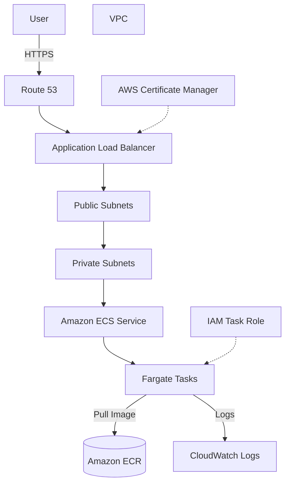

# ECS Fargate Containerized Web App Architecture

## Overview

This architecture runs a containerized web application on Amazon ECS on AWS Fargate and exposes it publicly through an Application Load Balancer (ALB).

Unlike the ECS-on-EC2 model where you manage the underlying EC2 instances yourself, Fargate offloads container runtime infrastructure management to AWS.

It is well suited for cases like "I want to run my Dockerized web app on AWS, but I want to avoid EC2 patching and capacity management."

## Architecture Diagram

## What This Architecture Provides

| Item | Description |
|---|---|
| Container execution | Run Dockerized web apps on AWS |
| Reduced server management | Eliminate EC2 instance management overhead |
| HTTPS exposure | Accept HTTPS traffic via ALB and ACM |
| Scaling | Adjust task count via the ECS Service's Desired Count |
| Log visibility | Inspect container logs through CloudWatch Logs |

## AWS Services Used

| Service | Role |
|---|---|
| Amazon ECS | Orchestration service that manages and runs containers |
| AWS Fargate | Serverless compute engine that runs containers without server management |
| Amazon ECR | Storage for container images |
| Application Load Balancer | Routes user HTTPS requests to ECS tasks |
| Amazon VPC | Network that hosts ECS tasks and the ALB |
| AWS Certificate Manager | Manages HTTPS certificates |
| Amazon CloudWatch Logs | Stores and inspects container logs |
| IAM | Controls permissions through task execution role and task role |

## Request Flow

1. The user accesses your custom domain over HTTPS.
2. Route 53 resolves the name to the ALB.
3. The ALB receives the request.
4. The ALB forwards the request to ECS Fargate tasks via the target group.
5. The container on the Fargate task processes the request.
6. Container logs are written to CloudWatch Logs.
7. On deployment, container images are pulled from ECR.

## Design Considerations

### Availability

Placing ECS tasks across multiple AZs in private subnets improves resilience against a single AZ failure.

The ALB is also deployed across multiple AZs.

### Security

Only the ALB sits in public subnets; ECS tasks are placed in private subnets.

The ECS task security group allows traffic only from the ALB.

The task role is granted only the permissions to AWS services that the application actually needs.

### Cost

Fargate is billed based on task vCPU, memory, and runtime.

For an individual developer MVP, always-on costs add up quickly, so this AWS certification study site itself prioritizes S3 + CloudFront.

Fargate becomes a reasonable choice once you build a web app that requires persistent server-side processing.

### Performance

Tune task count, CPU, and memory according to application load.

Tasks that fail the ALB health check are detached, so make sure the application exposes a proper health check path.

## SAA Exam Focus

- ECS is a viable choice as a container execution platform.
- Fargate is the candidate when you want to avoid server management.
- Combine with an ALB for public-facing exposure.
- Placing tasks in private subnets is the standard design.
- Use ECR to store container images.
- Understand the difference between the task execution role and the task role.

## Notes on This Architecture

- For an individual MVP, costs tend to exceed S3 + CloudFront.
- Leaving Fargate tasks running incurs ongoing charges.
- The ALB itself has a cost.
- Accessing ECR from private subnets requires either a NAT Gateway or VPC Endpoint design.
- Misconfigured health checks can detach healthy tasks.

## Related Terms

- [Amazon ECS](/en/terms/ecs)
- [AWS Fargate](/en/terms/fargate)
- [Amazon ECR](/en/terms/ecr)
- [Elastic Load Balancing](/en/terms/elb)
- [Amazon VPC](/en/terms/vpc)
- [Amazon CloudWatch](/en/terms/cloudwatch)
- [IAM](/en/terms/iam)

## Related Comparisons

- [EC2 vs. Lambda vs. ECS](/en/comparisons/ec2-vs-lambda-vs-ecs)
- [ALB vs. NLB vs. CloudFront](/en/comparisons/alb-vs-nlb-vs-cloudfront)

## Role in this Project

ECS Fargate is a strong option for running containerized web apps without managing servers.

However, for an individual MVP centered on a static site, fixed costs tend to grow, so this project treats this architecture as a study reference and prioritizes S3 + CloudFront for the main site.
