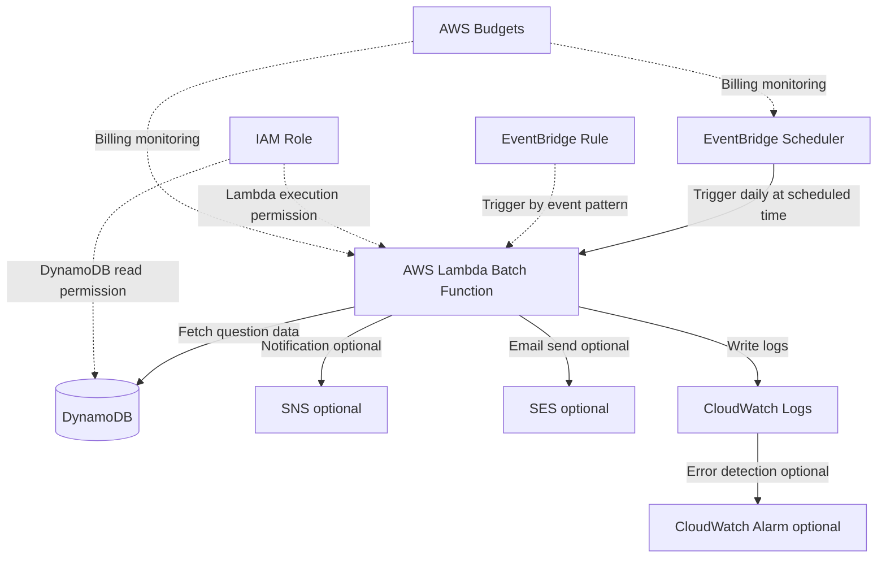

# EventBridge + Lambda Batch Processing Architecture

## Overview

This is a serverless batch processing architecture that triggers Lambda at scheduled times using EventBridge.

It is suitable for daily question delivery, periodic report generation, cleanup of old data, and aggregation processing.

In this project, it can be applied to future use cases such as "daily one question delivery" and "study reminders".

## Architecture Diagram

## What This Architecture Achieves

| Item | Details |
|---|---|
| Scheduled execution | Run processing at fixed times daily, weekly, or monthly |
| Serverless | No need to keep a batch server always running |
| Automation | Automate report generation, data cleanup, notifications, etc. |
| Notification integration | Combine with SNS or SES to send notifications |
| Operational monitoring | Check execution results with CloudWatch Logs and Alarm |

## AWS Services Used

| Service | Role |
|---|---|
| Amazon EventBridge Scheduler | Trigger Lambda at specified times or cron expressions |
| Amazon EventBridge Rule | Trigger based on event patterns |
| AWS Lambda | The batch processing itself |
| Amazon DynamoDB | Store question data, user settings, and processing state |
| Amazon SNS | Used as a notification destination |
| Amazon SES | Used when email delivery is required |
| Amazon CloudWatch Logs | Review Lambda execution logs |
| CloudWatch Alarm | Notify when batch processing fails |
| IAM | Control Lambda's access permissions to each service |
| AWS Budgets | Detect increases in execution count or billing incidents |

## Request Flow

1. EventBridge Scheduler emits an event at the specified time
2. EventBridge triggers Lambda
3. Lambda fetches the required data from DynamoDB
4. Lambda executes the scheduled processing
5. If notification is needed, it integrates with SNS or SES
6. Lambda writes execution results to CloudWatch Logs
7. If an error occurs, CloudWatch Alarm sends a notification
8. AWS Budgets monitors unexpected increases in execution or billing

## Design Considerations

### Availability

Since Lambda and EventBridge are managed services, you do not need to manage a batch server yourself.

However, if you do not design retries on failure, DLQ, and notification destinations, failures will be hard to notice.

### Security

Grant the Lambda execution role only the read access to the target DynamoDB table, the necessary notification services, and CloudWatch Logs write permission.

If you include personal information in emails or external notifications, minimize the content sent.

### Cost

EventBridge and Lambda are usage-based. They are well suited to low-frequency scheduled processing.

On the other hand, if you raise the execution frequency too much, Lambda invocation count, DynamoDB reads, and log storage will all increase.

In an MVP, it is safer to start at a low frequency such as "once per day".

### Operations

Record start time, end time, processing counts, and error types in CloudWatch Logs.

Do not log personal information such as full email addresses of users or body content.

## SAA Exam Focus

- Use EventBridge Scheduler or EventBridge Rule for scheduled execution
- EventBridge + Lambda is a candidate for serverless batch processing
- Understand Lambda's maximum execution time and timeout
- Design retries on failure, DLQ, and notifications
- Understand the difference between cron expressions and rate expressions
- For long-running or large-scale processing, Step Functions, ECS tasks, and AWS Batch are also candidates

## Notes on This Architecture

- Set Lambda's timeout to match the processing content
- Do not cram long-running or large-data processing into a single Lambda
- Do not retain CloudWatch Logs indefinitely
- Do not set the execution frequency too high
- For notifications like daily question delivery, user consent and an unsubscribe path are required
- When using SES, check sending limits and sender domain authentication

## Related Terms

- [Amazon EventBridge](/en/terms/eventbridge)
- [AWS Lambda](/en/terms/lambda)
- [Amazon DynamoDB](/en/terms/dynamodb)
- [Amazon CloudWatch](/en/terms/cloudwatch)
- [Amazon SNS](/en/terms/sns)
- [IAM](/en/terms/iam)

## Related Comparisons

- [SNS / SQS / EventBridge differences](/en/comparisons/sns-vs-sqs-vs-eventbridge)
- [EC2 / Lambda / ECS differences](/en/comparisons/ec2-vs-lambda-vs-ecs)

## Summary

EventBridge + Lambda is a representative architecture for implementing scheduled processing serverlessly.

In this project, it can be applied to future use cases such as daily question delivery or study reminders. However, in the MVP we keep cost and operations low and introduce it only when actually needed.
