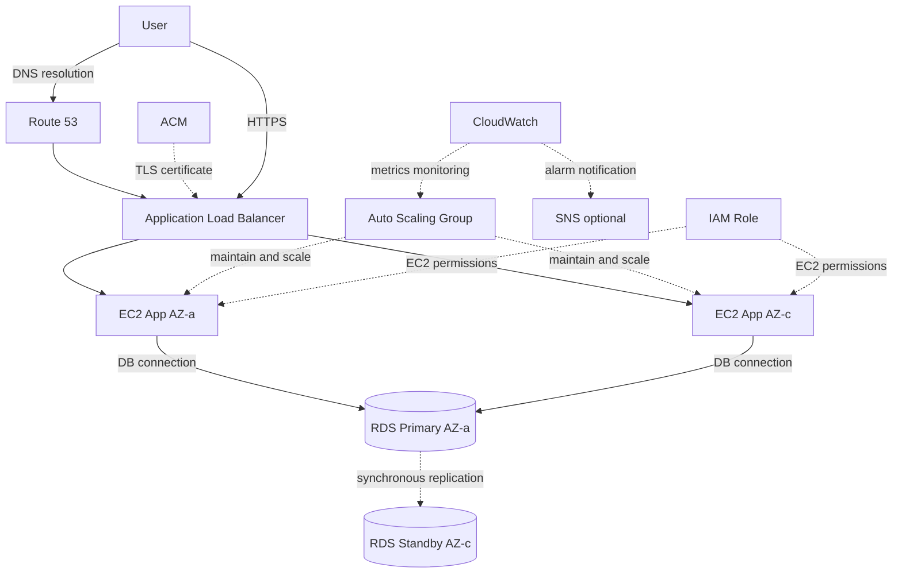

# ALB + Auto Scaling + RDS Multi-AZ High Availability Architecture

## Overview

This architecture deploys EC2 instances across multiple Availability Zones, distributes requests via an Application Load Balancer (ALB), adjusts instance counts with Auto Scaling, and prepares for database failure with RDS Multi-AZ.

It is a foundational pattern for production-grade web applications and appears frequently on the SAA exam.

The production MVP of this project prioritizes low cost and does not adopt this pattern, but it is a critical architecture for demonstrating AWS design skills in interviews.

## Architecture Diagram

## What This Architecture Achieves

| Item | Description |
|---|---|
| Load balancing | Distribute requests across multiple EC2 instances via ALB |
| Auto recovery | Replace unhealthy instances automatically via Auto Scaling Group |
| Scale-out | Increase EC2 instances based on load |
| DB high availability | Prepare for failover during DB failure with RDS Multi-AZ |
| Monitoring | Track metrics and send alarm notifications via CloudWatch |

## AWS Services Used

| Service | Role |
|---|---|
| Route 53 | DNS resolution for the custom domain |
| ACM | TLS certificate used by the ALB |
| Application Load Balancer | Distribute HTTP/HTTPS requests |
| Auto Scaling Group | Maintain and auto-adjust EC2 instance count |
| Amazon EC2 | Application servers |
| Amazon RDS Multi-AZ | Relational database with high availability |
| Amazon CloudWatch | Metrics monitoring and alarms |
| Amazon SNS | Alarm notification destination |
| IAM | Permission control for EC2 and operators |

## Request Flow

1. The user accesses the custom domain.
2. Route 53 resolves the name to the ALB.
3. The ALB receives the HTTPS request.
4. The ALB distributes the request to EC2 instances that pass health checks.
5. The EC2 application connects to RDS Primary.
6. RDS Primary synchronously replicates to Standby.
7. On EC2 failure, the Auto Scaling Group launches a new instance.
8. On DB failure, RDS fails over to Standby.
9. CloudWatch monitors metrics and notifies SNS on anomalies.

## Design Considerations

### Availability

Deploy ALB, EC2, and RDS across multiple Availability Zones.

In the Auto Scaling Group, configure minimum, desired, and maximum instance counts.

Enabling RDS Multi-AZ allows automatic failover to Standby during DB failure.

### Security

Make only the ALB public, and place EC2 and RDS in private subnets.

The EC2 security group should allow only the application port from the ALB.

The RDS security group should allow only the DB port from EC2.

### Cost

While this architecture provides high availability, it tends to be costly for an individual MVP.

ALB, multiple EC2 instances, RDS Multi-AZ, and NAT Gateway all incur ongoing charges.

It is important as a learning pattern, but the production MVP of this project prioritizes S3 + CloudFront.

### Operations

Use CloudWatch to monitor ALB 5xx, EC2 CPU, Auto Scaling events, RDS CPU, and DB connection counts.

During incidents, check in this order: ALB target health, Auto Scaling activity, RDS events, and CloudWatch Logs.

## SAA Exam Focus

- High availability requires deployment across multiple AZs.
- ALB does not forward traffic to targets that fail health checks.
- Auto Scaling Group maintains the desired instance count.
- RDS Multi-AZ aims to improve availability.
- RDS Read Replica aims to improve read performance.
- Stateless application design makes Auto Scaling easier.
- Consider externalizing session management to ElastiCache or DynamoDB.

## Caveats

- Do not confuse Multi-AZ with Read Replica.
- Provide a health check path on the application side for the ALB.
- EC2 instances with too much local state are hard to Auto Scale.
- RDS Multi-AZ Standby is not intended for direct read access.
- Costs tend to grow, so individual MVPs need a careful adoption decision.
- Setting the maximum instance count too high increases cost risk during traffic spikes.

## Related Terms

- [Elastic Load Balancing](/en/terms/elb)
- [AWS Auto Scaling](/en/terms/auto-scaling)
- [Amazon EC2](/en/terms/ec2)
- [Amazon RDS](/en/terms/rds)
- [Amazon CloudWatch](/en/terms/cloudwatch)
- [IAM](/en/terms/iam)

## Related Comparisons

- [Multi-AZ vs Read Replica](/en/comparisons/multi-az-vs-read-replica)
- [ALB vs NLB vs CloudFront](/en/comparisons/alb-vs-nlb-vs-cloudfront)
- [EC2 vs Lambda vs ECS](/en/comparisons/ec2-vs-lambda-vs-ecs)

## Summary

ALB + Auto Scaling + RDS Multi-AZ is the representative architecture for availability-focused web applications.

This project does not use it for the production MVP, but it is essential for SAA preparation and for explaining AWS design skills.
