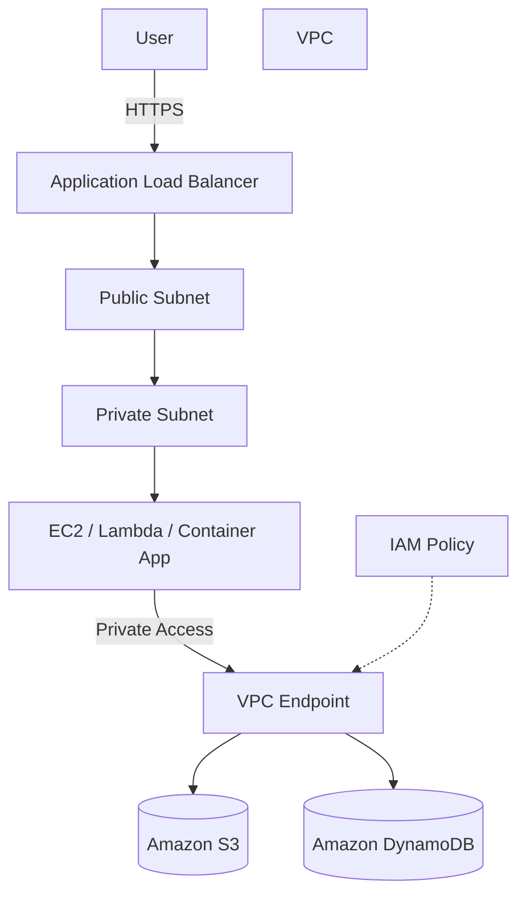

# Private Access to AWS Services via VPC Endpoints

## Overview

This architecture lets applications in a private subnet inside a VPC access AWS services such as Amazon S3 and Amazon DynamoDB without going through the internet.

Normally, a private subnet needs a NAT Gateway to reach AWS services on the public internet. However, for certain AWS services like Amazon S3 and Amazon DynamoDB, you can use a VPC Endpoint to keep the traffic inside the AWS network.

This pattern is frequently tested on SAA because it balances security and cost in a network design.

## Architecture Diagram

## What This Architecture Achieves

| Item | Description |
|---|---|
| Private communication | Resources inside the VPC can reach AWS services without going through the internet |
| Stronger security | Reduces reliance on public IPs and NAT Gateway traffic |
| Lower cost | Gateway Endpoints for Amazon S3 and Amazon DynamoDB avoid the fixed cost of NAT Gateway |
| Route control | Endpoint Policy can restrict which buckets or actions are reachable |

## AWS Services Used

| Service | Role |
|---|---|
| Amazon VPC | Network where the application runs |
| Private Subnet | Subnet for applications that should not be reachable directly from outside |
| VPC Endpoint | Entry point for private access from the VPC to AWS services |
| Amazon S3 | Storage for static files, logs, and backups |
| Amazon DynamoDB | Serverless NoSQL database |
| IAM | Access control for the VPC Endpoint and AWS services |

## Request Flow

1. A user sends an HTTPS request to the Application Load Balancer.
2. The ALB forwards the request to the application in the private subnet.
3. The application accesses Amazon S3 or Amazon DynamoDB.
4. The traffic flows through the VPC Endpoint.
5. AWS evaluates both the IAM Policy and the Endpoint Policy.
6. Only the allowed operations are executed.

## Design Considerations

### Availability

VPC Endpoint itself is a managed service. When using Interface Endpoints, deploy them across multiple Availability Zones to mitigate AZ-level failures.

Gateway Endpoints for Amazon S3 and Amazon DynamoDB are attached to route tables, so verify the route table design of the target subnets.

### Security

You can design private subnet resources without assigning public IP addresses.

With an Endpoint Policy, you can apply fine-grained restrictions such as "only allow GetObject against a specific Amazon S3 bucket".

Controlling access through both the IAM Role and the Endpoint Policy reduces the risk of accidental operations and over-permission.

### Cost

Gateway Endpoints for Amazon S3 and Amazon DynamoDB are typically cheaper than running a NAT Gateway.

On the other hand, Interface Endpoints incur an hourly charge plus a data-processing charge. Instead of creating an Interface Endpoint for every service, decide based on traffic volume and security requirements.

### Performance

Because the traffic stays inside the AWS network, the route is easier to control compared to going over the public internet.

Even so, you still need to design retry logic and timeout settings on the application side.

## SAA Exam Focus

- When accessing Amazon S3 from a private subnet, a Gateway Endpoint is a common answer choice.
- You can connect privately to AWS services without using a NAT Gateway.
- Understand the difference between Interface Endpoints and Gateway Endpoints.
- Endpoint Policies can restrict the scope of access.
- This pattern often appears as a way to satisfy both security and cost optimization at the same time.

## Things to Watch Out For

- Gateway Endpoints are used for Amazon S3 and Amazon DynamoDB.
- For Interface Endpoints, check service-by-service support.
- Interface Endpoints come with a cost, so do not create them without consideration.
- Missing route table associations will break connectivity.
- Even if the IAM Policy allows an action, the Endpoint Policy can still deny it.

## Related Terms

- [Amazon VPC](/en/terms/vpc)
- [Amazon S3](/en/terms/s3)
- [Amazon DynamoDB](/en/terms/dynamodb)
- [IAM](/en/terms/iam)

## Related Comparisons

- [Security Group vs. NACL](/en/comparisons/security-group-vs-nacl)
- [Amazon RDS vs. Amazon DynamoDB](/en/comparisons/rds-vs-dynamodb)

## Summary

VPC Endpoint is a key building block for secure access from private subnets to AWS services.

On the SAA exam, when you see conditions like "do not go through the internet", "do not use a NAT Gateway", or "needs to access Amazon S3 or Amazon DynamoDB", consider VPC Endpoint as a candidate answer.
