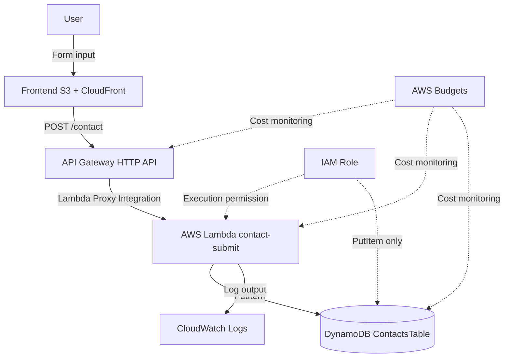

# API Gateway + Lambda + DynamoDB Serverless API Architecture

## Overview

This is an architecture that uses API Gateway as the API entry point, executes processing in Lambda, and stores data in DynamoDB.

In this project, it is used as the API that stores submissions from the contact form.

Because there is no always-on server, this architecture pairs well with small-scale web apps and individual MVPs.

## Architecture Diagram

## What this architecture achieves

| Item | Content |
|---|---|
| API exposure | HTTP API can be called from the frontend |
| Serverless processing | Lambda runs processing only when needed |
| Data storage | Contact submissions can be saved to DynamoDB |
| Low-cost operation | An API can be provided without an always-on server |
| Log review | Lambda execution results can be reviewed in CloudWatch Logs |
| Least privilege | Lambda can be granted only DynamoDB PutItem |

## AWS Services Used

| Service | Role |
|---|---|
| API Gateway | Entry point for the `/contact` API |
| AWS Lambda | Input validation, honeypot check, DynamoDB save |
| Amazon DynamoDB | Storage destination for contact data |
| Amazon CloudWatch Logs | Review of Lambda logs |
| IAM Role | Permission for Lambda to access DynamoDB and CloudWatch Logs |
| AWS Budgets | Detection of increased API usage or billing incidents |

## Request Flow

1. The user fills in the contact form
2. The frontend validates required fields and character counts
3. The frontend calls `POST /contact` on API Gateway
4. API Gateway invokes Lambda via Lambda Proxy Integration
5. Lambda parses the JSON
6. Lambda checks the honeypot
7. Lambda validates name, email, subject, and body
8. If there are no issues, Lambda performs PutItem on DynamoDB
9. Lambda writes minimal logs to CloudWatch Logs
10. The result is returned to the frontend via API Gateway

## Design Considerations

### Availability

API Gateway, Lambda, and DynamoDB are managed services, so an individual MVP can compose an API without managing any instances.

A serverless architecture is especially suited to low-frequency workloads such as a contact form API.

### Security

Do not trust only the frontend input checks; always validate again on the Lambda side.

Restrict CORS to the Origin of the production frontend.

Grant Lambda's IAM Role only `dynamodb:PutItem` on the target DynamoDB table and the ability to write to CloudWatch Logs.

### Cost

API Gateway, Lambda, and DynamoDB use pay-as-you-go pricing.

For a low-frequency contact API, this architecture keeps fixed costs low.

However, since spam submissions or bot access can increase request counts and therefore billing, consider a honeypot, character length limits, and future rate limiting.

### Operations

In CloudWatch Logs, output requestId, processing result, and error type.

Do not log the full email address or the full body of the contact submission.

## SAA Exam Focus

- API Gateway + Lambda is a representative combination for serverless APIs
- DynamoDB is a NoSQL database that pairs well with serverless architectures
- Use least privilege for the Lambda execution role
- Understand CORS configuration and authentication options
- Use CloudWatch Logs to review Lambda logs
- For Lambdas that do not require VPC connectivity, costs can be reduced by not creating a NAT Gateway

## Cautions for this Architecture

- Do not use `*` for CORS in production
- Do not store AWS access keys or secrets in Lambda environment variables
- Do not write contact body text to CloudWatch Logs
- Switch DynamoDB table names and allowed Origins via environment variables
- Do not rely on frontend-only validation
- When using the default API Gateway URL, document production URL management in the README

## Related Terms

- [API Gateway](/en/terms/api-gateway)
- [AWS Lambda](/en/terms/lambda)
- [Amazon DynamoDB](/en/terms/dynamodb)
- [Amazon CloudWatch](/en/terms/cloudwatch)
- [IAM](/en/terms/iam)

## Related Comparisons

- [RDS vs DynamoDB](/en/comparisons/rds-vs-dynamodb)
- [CloudWatch vs CloudTrail vs AWS Config](/en/comparisons/cloudwatch-vs-cloudtrail-vs-config)

## Summary

API Gateway + Lambda + DynamoDB is a foundational architecture for adding minimal dynamic processing to an individual MVP.

In this project, only the contact form is exposed as an API, while terms, questions, articles, and architecture diagrams are delivered as static files, keeping cost and implementation scope in check.
