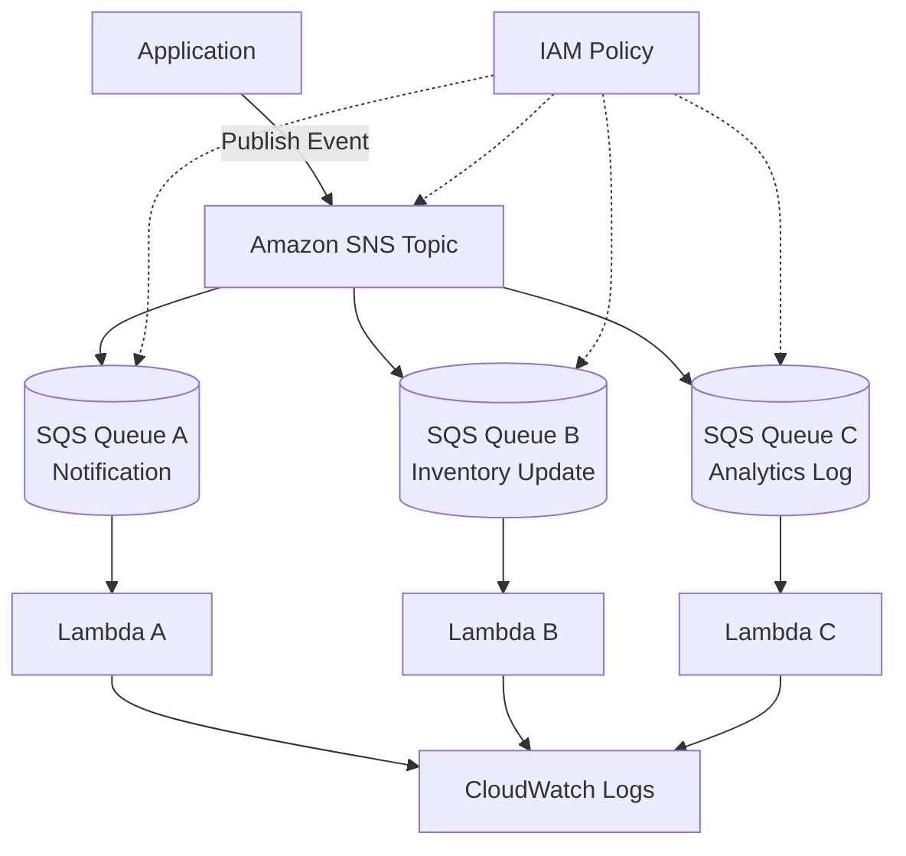

# SNS + SQS Fan-out Architecture

## Overview

This is an event-driven architecture that receives a single event through Amazon SNS and delivers it to multiple Amazon SQS queues simultaneously.

For example, when an order is created, you may want to trigger multiple processes at the same time, such as "send email notification," "update inventory," and "store analytics logs."

With the SNS + SQS fan-out architecture, the event publisher only needs to send a notification to SNS, and each downstream process can run independently through its own dedicated SQS queue.

## Diagram

## What This Architecture Enables

| Item | Description |
|---|---|
| Simultaneous delivery to multiple consumers | One event can branch out to multiple processes |
| Loose coupling | The publisher does not need to know the details of each consumer |
| Independent scaling | Each process has its own SQS queue and Lambda function |
| Fault isolation | A failure in one process is unlikely to affect the others |
| Extensibility | New subscribers can be added easily |

## AWS Services Used

| Service | Role |
|---|---|
| Amazon SNS | Pub/Sub service that delivers events to multiple subscribers |
| Amazon SQS | Queues that buffer messages for each process |
| AWS Lambda | Functions that process SQS messages |
| Amazon CloudWatch Logs | Inspection of logs from each Lambda |
| IAM | Permission control such as SNS Publish and SQS ReceiveMessage |

## Request Flow

1. The application publishes an event to the SNS Topic.
2. SNS delivers the message to multiple SQS queues based on the subscription configuration.
3. Each SQS queue holds pending messages.
4. Each Lambda function receives messages from its assigned queue.
5. Each Lambda performs its task such as notification, inventory update, or analytics log storage.
6. Each process writes its logs to CloudWatch Logs.

## Design Considerations

### Availability

Because each process has its own SQS queue, even if one process is stalled, the others can continue.

By configuring a DLQ for each queue, you can investigate failed messages per process.

### Security

Use IAM to restrict the principals that can publish to the SNS Topic.

Use an SQS queue policy to allow only messages from the designated SNS Topic.

### Cost Design

SNS, SQS, and Lambda are all usage-based. You can build event processing without provisioning always-on servers.

However, adding more subscribers also increases SQS request volume and Lambda invocations. Avoid creating unnecessary subscribers.

### Performance

By separating queues per process, you can tune the Lambda concurrency and batch size for each workload.

Even when notification processing is lightweight and analytics processing is heavy, you can design them independently.

## SAA Exam Focus

- When a single message needs to be delivered to multiple processes, SNS is a candidate.
- When the consumer side needs a buffer, combine SNS + SQS.
- This pattern is frequently tested as a loosely coupled, event-driven design.
- To isolate failures across processes, give each process its own queue.
- An SQS queue policy can allow delivery only from a specific SNS Topic.

## Considerations for This Architecture

- SNS alone does not act as a buffer on the consumer side.
- Inserting SQS makes the consumer resilient to temporary failures.
- Make Lambda processing idempotent because messages may be duplicated.
- The more subscribers you add, the more invocations and log volume you incur.
- Configure a DLQ per queue so that the cause of failures can be traced.

## Related Terms

- [Amazon SNS](/en/terms/sns)
- [Amazon SQS](/en/terms/sqs)
- [AWS Lambda](/en/terms/lambda)
- [Amazon CloudWatch](/en/terms/cloudwatch)
- [IAM](/en/terms/iam)

## Related Comparisons

- [Differences between SNS, SQS, and EventBridge](/en/comparisons/sns-vs-sqs-vs-eventbridge)

## Summary

The SNS + SQS fan-out architecture is a representative pattern for safely branching a single event into multiple processes.

In the SAA exam, when requirements include "deliver the same event to multiple systems" or "isolate failures per process," consider this architecture as a candidate.
