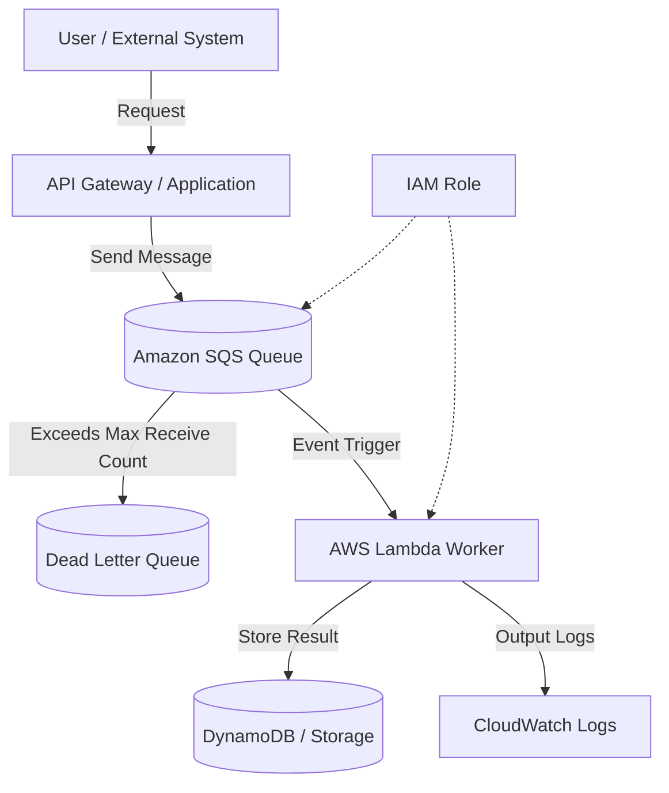

# SQS + Lambda Asynchronous Processing Architecture

## Overview

This architecture queues processing requests in Amazon SQS first, then processes them asynchronously in order using AWS Lambda.

If you complete heavy processing on the spot when receiving user actions or external system requests, responses become slow and the user experience degrades when processing fails.

By placing SQS in between, you can decouple the receiving process from the execution process. This is important from the perspectives of loose coupling, scalability, and fault tolerance.

## Architecture Diagram

## What This Architecture Achieves

| Item | Details |
|---|---|
| Asynchronous Processing | Separates user response from heavy processing |
| Loose Coupling | Receiving side and processing side are not directly dependent |
| Retry | SQS can redeliver messages when Lambda processing fails |
| Fault Isolation | Failed messages can be moved aside to a DLQ |
| Scaling | Lambda can process based on the amount queued |

## AWS Services Used

| Service | Role |
|---|---|
| Amazon SQS | Queue that stores messages awaiting processing |
| AWS Lambda | Execution platform that processes SQS messages |
| Dead Letter Queue | Destination for messages that have failed a defined number of times |
| Amazon DynamoDB | Storage destination for processing results and state |
| Amazon CloudWatch Logs | Reviewing Lambda processing logs |
| IAM | Permissions for Lambda to access SQS and DynamoDB |

## Request Flow

1. The user or external system sends a request to the API
2. The API or application sends a message to SQS
3. The message is stored in SQS
4. Lambda receives the SQS event and processes it
5. The processing result is saved to DynamoDB or similar
6. Processing logs are output to CloudWatch Logs
7. Messages that fail the defined number of times are sent to the DLQ

## Design Considerations

### Availability

Because SQS holds processing requests, messages are unlikely to be lost even if Lambda or downstream processing temporarily fails.

Setting up a DLQ allows you to investigate failed messages later.

### Security

The Lambda execution role permits only reading from the target SQS queue, writing to the target DynamoDB table, and outputting to CloudWatch Logs.

The entities allowed to send messages to SQS are also restricted via IAM.

### Cost

Because SQS and Lambda are pay-per-use, you can build a configuration without always-on servers.

However, if failed processing causes the same message to be retried many times, the number of Lambda executions increases. Configure the maximum receive count and DLQ to avoid near-infinite retries.

### Performance

Even if a large volume of processing requests arrive, you can queue them in SQS and process them in order.

By controlling Lambda concurrency, you can design the system so that downstream DynamoDB or external APIs are not overloaded.

## SAA Exam Focus

- SQS can be used to build loosely coupled architectures
- SQS + Lambda is an option for asynchronous processing
- Use a DLQ to move aside failed messages
- SQS can be used as a buffer to absorb sudden spikes in requests
- Consider FIFO queues when order guarantee is required

## Caveats for This Architecture

- Implement idempotency to prepare for duplicate message processing
- Do not set the visibility timeout shorter than the Lambda processing time
- Without a DLQ, investigating failed messages becomes difficult
- Setting Lambda concurrency to unlimited concentrates load on downstream services
- FIFO queues have different throughput characteristics than standard queues — use them only when order guarantee is required

## Related Terms

- [Amazon SQS](/en/terms/sqs)
- [AWS Lambda](/en/terms/lambda)
- [Amazon DynamoDB](/en/terms/dynamodb)
- [Amazon CloudWatch](/en/terms/cloudwatch)
- [IAM](/en/terms/iam)

## Related Comparisons

- [SNS vs. SQS vs. EventBridge](/en/comparisons/sns-vs-sqs-vs-eventbridge)

## Summary

SQS + Lambda is a representative pattern for implementing asynchronous processing in a serverless manner.

For SAA, when you see conditions like "defer processing," "absorb sudden increases in requests," or "loosely couple components," consider an architecture that uses SQS.
