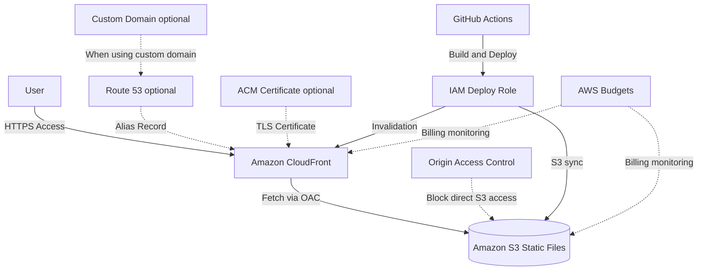

# S3 + CloudFront Static Website Architecture

## Overview

This architecture delivers HTML, CSS, JavaScript, and image files stored in Amazon S3 to users via Amazon CloudFront.

It is well suited for static content that does not require server-side processing on every request, such as blogs, learning sites, portfolio sites, and documentation sites.

In this project, it is used as the MVP publishing setup for the AWS certification learning site. The Next.js static export is placed in S3 and delivered over HTTPS through CloudFront.

## Architecture Diagram

## What This Architecture Enables

| Item | Description |
|---|---|
| Static site hosting | Publish HTML, CSS, JavaScript, and images as a website |
| HTTPS delivery | Provide HTTPS access through CloudFront |
| Fast delivery | Accelerate display with edge location caching |
| S3 not publicly exposed | Deliver without exposing S3 directly, using OAC |
| Low-cost operation | Avoid EC2 and RDS to keep fixed costs low |
| CI/CD integration | Run S3 sync and CloudFront Invalidation from GitHub Actions |

## AWS Services Used

| Service | Role |
|---|---|
| Amazon S3 | Storage for static files |
| Amazon CloudFront | CDN, HTTPS delivery, and cache delivery |
| Origin Access Control | Secure access control from CloudFront to S3 |
| AWS Certificate Manager | TLS certificate management for custom domains |
| Amazon Route 53 | DNS management for custom domains |
| IAM | Permission control for GitHub Actions and administrators |
| AWS Budgets | Budget notifications to prevent billing incidents |

## Request Flow

1. The user accesses the site URL
2. CloudFront receives the HTTPS request
3. If CloudFront has a cached response, it returns it directly to the user
4. If there is no cache, CloudFront fetches the file from S3 via OAC
5. S3 allows access only from the CloudFront Distribution
6. CloudFront returns the HTML, CSS, JavaScript, and images to the user
7. On deploy, GitHub Actions syncs to S3 and runs CloudFront Invalidation

## Design Considerations

### Availability

S3 and CloudFront are managed services, making it easy to achieve high availability for static site delivery.

Unlike EC2, you do not need to worry about instance failures or OS patch management.

### Security

Enable Public Access Block on the S3 bucket so it is not publicly exposed.

Use CloudFront OAC, and allow read access only from the CloudFront Distribution via the Bucket Policy.

Redirect HTTP access to HTTPS at the CloudFront layer.

### Cost

Because EC2, RDS, ALB, and NAT Gateway are not used, fixed costs are easy to keep low for an individual MVP.

However, watch CloudFront data transfer volume, request count, invalidation count, and S3 storage usage.

### Performance

By using the CloudFront cache, you can reduce requests to S3 and serve content from edge locations close to users.

Large images and JavaScript bundles increase data transfer, so reducing file size is also important.

## SAA Exam Focus

- S3 + CloudFront is the canonical architecture for static site delivery
- Do not expose S3 directly; restrict access with CloudFront OAC
- Use CloudFront for HTTPS delivery and cache delivery
- Combine Route 53 and ACM when using a custom domain
- ACM certificates used with CloudFront must be issued in us-east-1
- CloudFront Invalidation is relevant when reflecting updates

## Notes on This Architecture

- Use the standard S3 origin, not the S3 Static website hosting endpoint
- Do not disable S3 Public Access Block
- Set the correct CloudFront Distribution ID in the Bucket Policy's SourceArn
- Updates may not be reflected immediately due to CloudFront caching
- Frequent `/*` invalidations can drive up costs
- This architecture alone cannot handle API processing or per-user data storage

## Related Terms

- [Amazon S3](/en/terms/s3)
- [Amazon CloudFront](/en/terms/cloudfront)
- [AWS Certificate Manager](/en/terms/acm)
- [Amazon Route 53](/en/terms/route53)
- [IAM](/en/terms/iam)
- [AWS Budgets](/en/terms/aws-budgets)

## Related Comparisons

- [ALB / NLB / CloudFront Differences](/en/comparisons/alb-vs-nlb-vs-cloudfront)
- [S3 / EBS / EFS Differences](/en/comparisons/s3-vs-ebs-vs-efs)

## Role in this Project

S3 + CloudFront is the ideal baseline architecture for static-content-centric learning sites and portfolio sites.

In this project, it is adopted as the MVP publishing platform that simultaneously satisfies low cost, HTTPS delivery, S3 non-exposure, and CI/CD integration.
