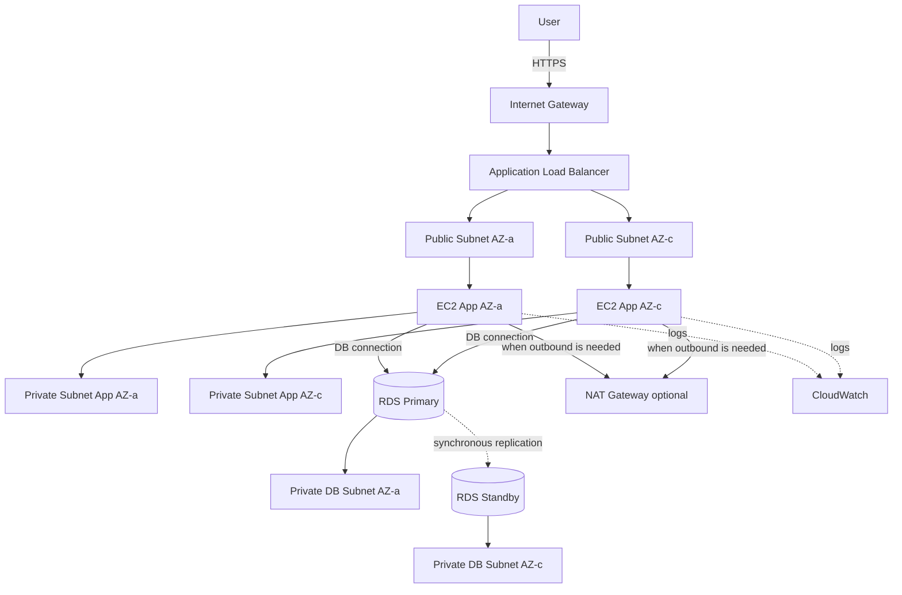

# Three-Tier Web Application Architecture in a VPC

## Overview

This architecture splits a web application into the following three tiers:

1. Presentation tier
2. Application tier
3. Database tier

On AWS, you implement it by combining VPC, Subnets, Route Tables, Security Groups, ALB, EC2, RDS, and more.

We do not use this pattern in this project's MVP, but it is a foundational architecture that is extremely important for the SAA exam.

## Architecture Diagram

## What You Can Achieve

| Item | Description |
|---|---|
| Tier separation | Cleanly separates the web entry point, application, and database at the network level |
| Improved security | Keeps the database out of public subnets, avoiding internet exposure |
| Higher availability | Deploys the application tier and DB tier across multiple AZs |
| Scalability | The application tier is easy to swap out for Auto Scaling or ECS |
| Real-world design literacy | Lets you learn the relationships between VPC, subnets, route tables, and Security Groups |

## AWS Services Used

| Service | Role |
|---|---|
| Amazon VPC | Network boundary for the entire application |
| Public Subnet | Placement for resources that need external connectivity such as ALB and NAT Gateway |
| Private Subnet | Placement for application servers |
| Database Subnet | Non-public subnet that hosts Amazon RDS |
| Application Load Balancer | Distributes HTTPS requests across the application tier |
| Amazon EC2 | Application servers |
| Amazon RDS | Relational database |
| Amazon CloudWatch | Metrics and log monitoring |
| AWS IAM | Access control for EC2 and operators |

## Request Flow

1. The user accesses the website over HTTPS
2. ALB receives the request through the Internet Gateway
3. ALB forwards the request to EC2 instances inside the Private Subnet
4. The EC2 application connects to RDS Primary
5. When RDS Multi-AZ is enabled, the primary synchronously replicates to the standby
6. EC2 and RDS metrics are observed through CloudWatch
7. Only when outbound traffic is needed (for example, fetching external packages), the Private Subnet egresses via NAT Gateway

## Design Considerations

### Availability

Create Public Subnets, Private Subnets, and Database Subnets across multiple Availability Zones.

The ALB spans multiple AZs to distribute requests.

Using RDS Multi-AZ allows automatic failover to the standby instance when the primary fails.

### Security

Expose only the ALB to the internet.

Place EC2 in the Private Subnet, and configure the Security Group to allow inbound traffic only from the ALB.

Place RDS in the Database Subnet, and configure the Security Group to allow only the DB port from the application-tier EC2 instances.

### Cost

ALB, EC2, RDS, and NAT Gateway tend to incur fixed or continuous charges.

This project's MVP prioritizes low cost and does not adopt this pattern. We treat it purely as a learning and SAA-preparation reference architecture.

### Operations

In CloudWatch, monitor EC2 CPU utilization, ALB 5xx counts, and RDS connection count and CPU utilization.

Using SSM Session Manager reduces the need for SSH bastion hosts.

## SAA Exam Focus

- Understand the roles of Public and Private Subnets
- Place the ALB in the Public Subnet, applications in the Private Subnet
- Place the database in a Private Subnet — never expose it directly to the internet
- Security Groups are stateful, NACLs are stateless
- RDS Multi-AZ improves availability; Read Replicas improve read performance
- A NAT Gateway is required when a Private Subnet needs outbound internet access
- Consider VPC Endpoints when you want private connectivity to S3 or DynamoDB

## Caveats

- NAT Gateway tends to be expensive on fixed costs — use it carefully in a personal MVP
- RDS keeps incurring charges through storage, backups, and forgotten running instances
- Never place a database in a Public Subnet
- Never open SSH (port 22) to 0.0.0.0/0 on EC2
- Misconfigured route table associations are a common cause of connectivity issues
- Do not confuse the purpose of Multi-AZ (availability) and Read Replica (read scalability)

## Related Terms

- [Amazon VPC](/en/terms/vpc)
- [Amazon EC2](/en/terms/ec2)
- [Elastic Load Balancing](/en/terms/elb)
- [Amazon RDS](/en/terms/rds)
- [Amazon CloudWatch](/en/terms/cloudwatch)
- [AWS IAM](/en/terms/iam)

## Related Comparisons

- [Security Group vs. NACL](/en/comparisons/security-group-vs-nacl)
- [Multi-AZ vs. Read Replica](/en/comparisons/multi-az-vs-read-replica)
- [ALB vs. NLB vs. CloudFront](/en/comparisons/alb-vs-nlb-vs-cloudfront)

## Role in this Project

The three-tier web app architecture inside a VPC is the canonical pattern for understanding AWS network design.

We do not adopt it in this project's main build because of cost, but it is an extremely important architecture for SAA preparation and for explaining your AWS skills in interviews.
