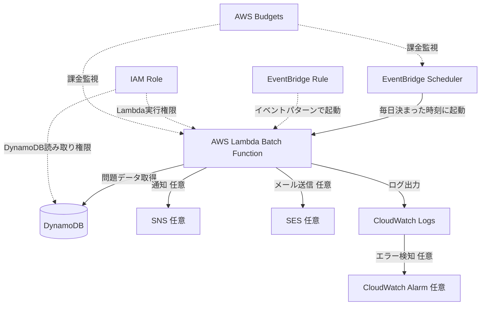

# EventBridge + Lambda バッチ処理構成

## 概要

EventBridgeで決まった時刻にイベントを発生させ、Lambdaを実行するサーバーレスなバッチ処理構成です。

毎日1問配信、定期レポート作成、古いデータの整理、集計処理などに使えます。

本プロジェクトでは、将来的な「毎日1問配信」や「学習リマインド」に応用できます。

## 構成図

## この構成で実現できること

| 項目 | 内容 |
|---|---|
| 定期実行 | 毎日、毎週、毎月など決まった時刻に処理を実行できる |
| サーバーレス | バッチサーバーを常時起動しなくてよい |
| 自動化 | レポート作成、データ整理、通知などを自動化できる |
| 通知連携 | SNSやSESと組み合わせて通知できる |
| 運用監視 | CloudWatch LogsとAlarmで実行結果を確認できる |

## 使用AWSサービス

| サービス | 役割 |
|---|---|
| Amazon EventBridge Scheduler | 指定時刻やcron式でLambdaを起動する |
| Amazon EventBridge Rule | イベントパターンに応じた起動に使う |
| AWS Lambda | バッチ処理本体 |
| Amazon DynamoDB | 問題データ、ユーザー設定、処理状態の保存先 |
| Amazon SNS | 通知先として利用 |
| Amazon SES | メール送信が必要な場合に利用 |
| Amazon CloudWatch Logs | Lambda実行ログの確認 |
| CloudWatch Alarm | バッチ失敗時の通知 |
| IAM | Lambdaが各サービスへアクセスする権限制御 |
| AWS Budgets | 実行回数増加や課金事故の検知 |

## 通信フロー

1. EventBridge Schedulerが指定時刻にイベントを発生させる
2. EventBridgeがLambdaを起動する
3. LambdaがDynamoDBから必要なデータを取得する
4. Lambdaが定期処理を実行する
5. 通知が必要な場合はSNSまたはSESへ連携する
6. LambdaがCloudWatch Logsへ実行結果を出力する
7. エラーが発生した場合はCloudWatch Alarmで通知する
8. AWS Budgetsで想定外の実行増加や課金を監視する

## 設計ポイント

### 可用性

LambdaとEventBridgeはマネージドサービスのため、バッチサーバーを自分で管理する必要がありません。

ただし、処理失敗時の再試行、DLQ、通知先を設計しないと、失敗に気づきにくくなります。

### セキュリティ

Lambda実行ロールには、対象DynamoDBテーブルの読み取り、必要な通知サービス、CloudWatch Logs出力だけを許可します。

メール送信や外部通知に個人情報を含める場合は、送信内容を最小化します。

### コスト

EventBridgeとLambdaは従量課金です。低頻度の定期処理には向いています。

一方、実行頻度を高くしすぎるとLambda実行回数、DynamoDB読み取り、ログ保存量が増えます。

MVPでは「毎日1回」など低頻度から始めるのが安全です。

### 運用

CloudWatch Logsには、開始時刻、終了時刻、処理件数、エラー種別を記録します。

ユーザーのメールアドレス全文や本文のような個人情報はログに出しません。

## SAA試験で問われるポイント

- 定期実行にはEventBridge SchedulerまたはEventBridge Ruleを使う
- サーバーレスなバッチ処理にはEventBridge + Lambdaが候補になる
- Lambdaの最大実行時間やタイムアウトを理解する
- 失敗時の再試行、DLQ、通知を設計する
- cron式とrate式の違いを理解する
- 長時間・大量処理ではStep Functions、ECSタスク、AWS Batchも候補になる

## この構成の注意点

- Lambdaのタイムアウトを処理内容に合わせて設定する
- 長時間処理や大量データ処理を1つのLambdaに詰め込まない
- CloudWatch Logsを無期限保存にしない
- 実行頻度を高くしすぎない
- 毎日1問配信のような通知では、ユーザーの同意や解除導線が必要になる
- SESを使う場合は送信制限や送信ドメイン認証を確認する

## 関連用語

- [Amazon EventBridge](/terms/eventbridge)
- [AWS Lambda](/terms/lambda)
- [Amazon DynamoDB](/terms/dynamodb)
- [Amazon CloudWatch](/terms/cloudwatch)
- [Amazon SNS](/terms/sns)
- [IAM](/terms/iam)

## 関連比較

- [SNS / SQS / EventBridge の違い](/comparisons/sns-vs-sqs-vs-eventbridge)
- [EC2 / Lambda / ECS の違い](/comparisons/ec2-vs-lambda-vs-ecs)

## まとめ

EventBridge + Lambdaは、サーバーレスで定期処理を実装する代表的な構成です。

このプロジェクトでは将来的な毎日1問配信や学習リマインドに応用できますが、MVPではコストと運用を抑えるため、必要になってから導入します。
