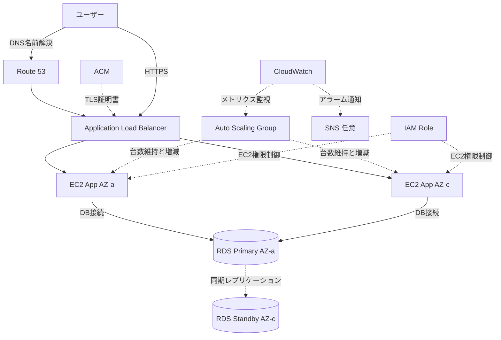

# ALB + Auto Scaling + RDS Multi-AZ 高可用性構成

## 概要

複数AZにEC2を配置し、ALBでリクエストを分散し、Auto Scalingで台数を調整し、RDS Multi-AZでDB障害に備える構成です。

本格的なWebアプリケーションの基本形であり、SAAで頻出する構成です。

本プロジェクトのMVPでは低コストを優先するため採用しませんが、面接でAWS設計力を説明するときに重要な構成です。

## 構成図

## この構成で実現できること

| 項目 | 内容 |
|---|---|
| 負荷分散 | ALBで複数EC2へリクエストを分散できる |
| 自動復旧 | Auto Scaling Groupで異常インスタンスを置き換えられる |
| スケールアウト | 負荷に応じてEC2台数を増やせる |
| DB高可用性 | RDS Multi-AZでDB障害時のフェイルオーバーに備えられる |
| 監視 | CloudWatchでメトリクス監視とアラーム通知ができる |

## 使用AWSサービス

| サービス | 役割 |
|---|---|
| Route 53 | 独自ドメインの名前解決 |
| ACM | ALBで利用するTLS証明書 |
| Application Load Balancer | HTTP/HTTPSリクエストの負荷分散 |
| Auto Scaling Group | EC2台数の維持と自動増減 |
| Amazon EC2 | アプリケーションサーバー |
| Amazon RDS Multi-AZ | 高可用性を持つリレーショナルDB |
| Amazon CloudWatch | メトリクス監視とアラーム |
| Amazon SNS | アラーム通知先 |
| IAM | EC2や運用担当者の権限制御 |

## 通信フロー

1. ユーザーが独自ドメインへアクセスする
2. Route 53がALBへ名前解決する
3. ALBがHTTPSリクエストを受け取る
4. ALBがヘルスチェックに合格しているEC2へリクエストを分散する
5. EC2アプリケーションがRDS Primaryへ接続する
6. RDS PrimaryはStandbyへ同期レプリケーションする
7. EC2障害時はAuto Scaling Groupが新しいインスタンスを起動する
8. DB障害時はRDSがStandbyへフェイルオーバーする
9. CloudWatchがメトリクスを監視し、異常時にSNSへ通知する

## 設計ポイント

### 可用性

ALB、EC2、RDSを複数AZにまたがって配置します。

Auto Scaling Groupでは最小台数、希望台数、最大台数を設定します。

RDS Multi-AZを有効化すると、DB障害時にStandbyへ自動フェイルオーバーできます。

### セキュリティ

ALBだけをパブリックにし、EC2とRDSはPrivate Subnetへ配置します。

EC2のSecurity GroupはALBからのアプリケーションポートだけを許可します。

RDSのSecurity GroupはEC2からのDBポートだけを許可します。

### コスト

この構成は可用性が高い一方で、個人MVPにはコストが重くなりやすいです。

ALB、複数EC2、RDS Multi-AZ、NAT Gatewayを使うと継続課金が発生します。

学習用としては重要ですが、このプロジェクトの本番MVPはS3 + CloudFrontを優先します。

### 運用

CloudWatchでALB 5xx、EC2 CPU、Auto Scalingイベント、RDS CPU、DB接続数を確認します。

障害時はALBターゲットヘルス、Auto Scaling Activity、RDSイベント、CloudWatch Logsの順に確認します。

## SAA試験で問われるポイント

- 高可用性には複数AZ配置が必要
- ALBはヘルスチェックに失敗したターゲットへ転送しない
- Auto Scaling Groupは希望台数を維持する
- RDS Multi-AZは可用性向上が目的
- RDS Read Replicaは読み取り性能向上が目的
- ステートレスなアプリケーション設計にするとAuto Scalingしやすい
- セッション管理はElastiCacheやDynamoDBなど外部化を検討する

## この構成の注意点

- Multi-AZとRead Replicaを混同しない
- ALBのヘルスチェックパスをアプリ側で用意する
- EC2に状態を持たせすぎるとAuto Scalingしづらい
- RDS Multi-AZはStandbyへ直接読み取りアクセスする目的ではない
- コストが高くなりやすいため、個人MVPでは採用判断が必要
- 最大台数を大きくしすぎるとアクセス急増時の課金リスクが上がる

## 関連用語

- [Elastic Load Balancing](/terms/elb)
- [AWS Auto Scaling](/terms/auto-scaling)
- [Amazon EC2](/terms/ec2)
- [Amazon RDS](/terms/rds)
- [Amazon CloudWatch](/terms/cloudwatch)
- [IAM](/terms/iam)

## 関連比較

- [Multi-AZ / Read Replica の違い](/comparisons/multi-az-vs-read-replica)
- [ALB / NLB / CloudFront の違い](/comparisons/alb-vs-nlb-vs-cloudfront)
- [EC2 / Lambda / ECS の違い](/comparisons/ec2-vs-lambda-vs-ecs)

## まとめ

ALB + Auto Scaling + RDS Multi-AZは、可用性を重視するWebアプリの代表的な構成です。

このプロジェクトでは本番MVPには使いませんが、SAA対策とAWS設計力の説明では必須級の構成です。
