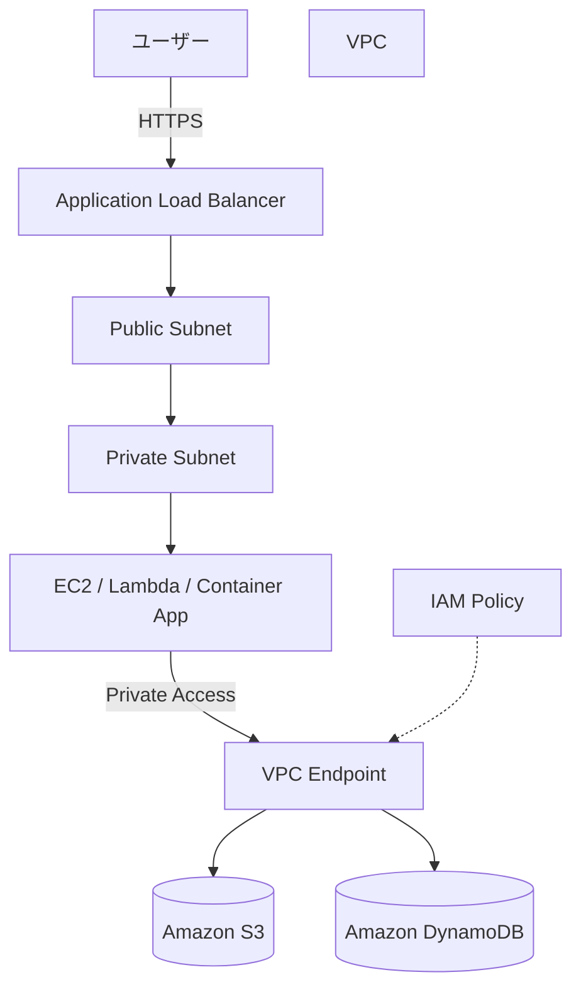

# VPC EndpointでAWSサービスへプライベート接続する構成

## 概要

この構成は、VPC内のプライベートサブネットにあるアプリケーションから、インターネットを経由せずにS3やDynamoDBなどのAWSサービスへアクセスするための設計です。

通常、プライベートサブネットからインターネット上のAWSサービスへ出るにはNAT Gatewayが必要になります。しかし、S3やDynamoDBなど一部のAWSサービスに対してはVPC Endpointを使うことで、AWSネットワーク内で通信を完結できます。

この構成は、セキュリティとコストの両方を意識したネットワーク設計としてSAAで問われやすいです。

## 構成図

## この構成で実現できること

| 項目 | 内容 |
|---|---|
| プライベート通信 | VPC内リソースからAWSサービスへインターネットを経由せずアクセスできる |
| セキュリティ向上 | パブリックIPやNAT Gateway経由の通信を減らせる |
| コスト削減 | S3やDynamoDB向けのGateway EndpointではNAT Gatewayの固定費を避けられる |
| 通信経路制御 | Endpoint Policyでアクセス先バケットや操作を制限できる |

## 使用AWSサービス

| サービス | 役割 |
|---|---|
| Amazon VPC | アプリケーションを配置するネットワーク |
| Private Subnet | 外部から直接アクセスさせないアプリケーション配置先 |
| VPC Endpoint | VPC内からAWSサービスへプライベート接続する入口 |
| Amazon S3 | 静的ファイル、ログ、バックアップなどの保存先 |
| Amazon DynamoDB | サーバーレスなNoSQLデータベース |
| IAM | VPC EndpointやAWSサービスへのアクセス権限制御 |

## 通信フロー

1. ユーザーがApplication Load BalancerへHTTPSアクセスする
2. ALBがプライベートサブネット内のアプリケーションへリクエストを転送する
3. アプリケーションがS3またはDynamoDBへアクセスする
4. 通信はVPC Endpointを通る
5. AWSサービス側でIAM PolicyとEndpoint Policyが評価される
6. 許可された操作だけが実行される

## 設計ポイント

### 可用性

VPC Endpoint自体はマネージドサービスです。Interface Endpointを使う場合は、複数AZに作成することでAZ障害時の影響を抑えられます。

S3やDynamoDBのGateway Endpointはルートテーブルに紐づけるため、対象サブネットのルートテーブル設計を確認します。

### セキュリティ

プライベートサブネットのリソースにパブリックIPを付与しない設計にできます。

Endpoint Policyを使うと、例えば「特定のS3バケットへのGetObjectだけ許可する」といった制限ができます。

IAM Role側の権限とEndpoint Policyの両方で制御することで、誤操作や過剰権限のリスクを下げられます。

### コスト

S3とDynamoDBのGateway Endpointは、NAT Gatewayを使う構成よりコストを抑えやすいです。

一方、Interface Endpointは時間課金とデータ処理課金が発生します。そのため、すべてのサービスにInterface Endpointを作るのではなく、通信量とセキュリティ要件を見て判断します。

### パフォーマンス

AWSネットワーク内で通信できるため、インターネット経由の通信より経路を制御しやすくなります。

ただし、アプリケーション側のリトライ設計やタイムアウト設定は別途必要です。

## SAA試験で問われるポイント

- プライベートサブネットからS3へアクセスする場合、Gateway Endpointが選択肢になる
- NAT Gatewayを使わずにAWSサービスへプライベート接続できる
- Interface EndpointとGateway Endpointの違いを理解する
- Endpoint Policyでアクセス範囲を制限できる
- セキュリティとコスト最適化を同時に満たす選択肢として出やすい

## この構成の注意点

- Gateway EndpointはS3とDynamoDB向けに使う
- Interface Endpointはサービスごとに対応状況を確認する
- Interface Endpointはコストが発生するため、無制限に作らない
- ルートテーブルへの関連付け漏れがあると通信できない
- IAM Policyで許可していても、Endpoint Policyで拒否されるとアクセスできない

## 関連用語

- [Amazon VPC](/terms/vpc)
- [Amazon S3](/terms/s3)
- [Amazon DynamoDB](/terms/dynamodb)
- [IAM](/terms/iam)

## 関連比較

- [Security Group / NACL の違い](/comparisons/security-group-vs-nacl)
- [RDS / DynamoDB の違い](/comparisons/rds-vs-dynamodb)

## まとめ

VPC Endpointは、プライベートサブネットからAWSサービスへ安全にアクセスするための重要な構成です。

SAAでは「インターネットを経由しない」「NAT Gatewayを使わない」「S3やDynamoDBへアクセスしたい」という条件が出たら、VPC Endpointを候補に入れます。