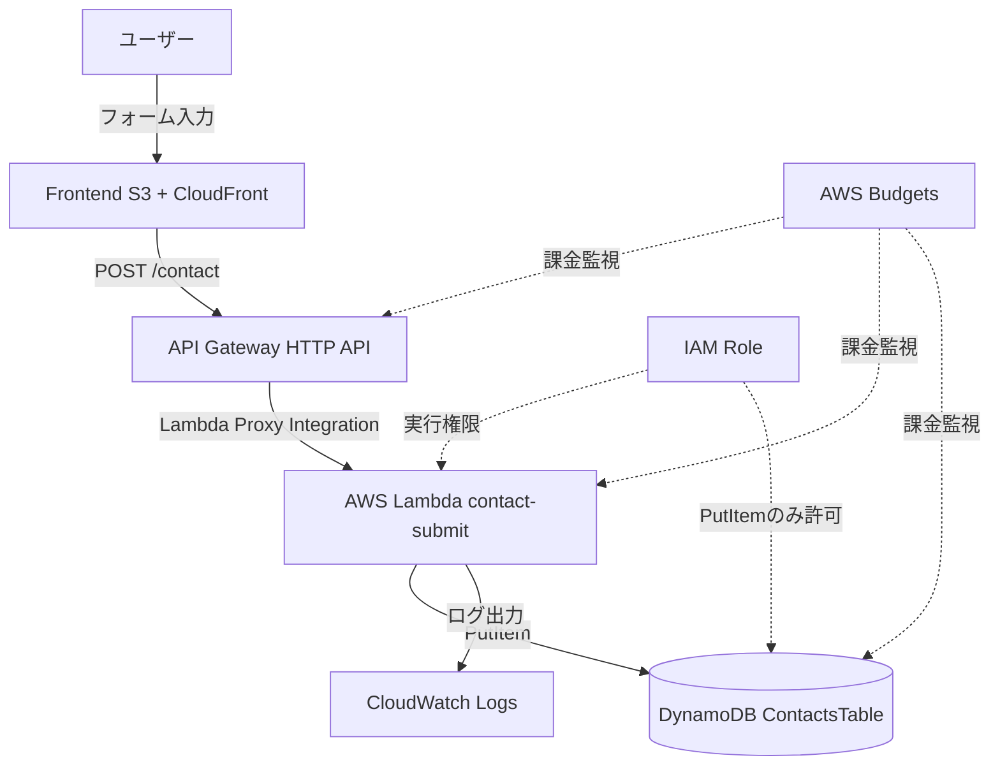

# API Gateway + Lambda + DynamoDB サーバーレスAPI構成

## 概要

API GatewayをAPIの入口にし、Lambdaで処理を実行し、DynamoDBにデータを保存する構成です。

本プロジェクトでは、問い合わせフォームの送信内容を保存するAPIとして利用します。

常時起動サーバーを持たないため、小規模なWebアプリや個人開発のMVPと相性が良い構成です。

## 構成図

## この構成で実現できること

| 項目 | 内容 |
|---|---|
| API公開 | フロントエンドからHTTP APIを呼び出せる |
| サーバーレス処理 | Lambdaで必要な時だけ処理を実行できる |
| データ保存 | DynamoDBに問い合わせ内容を保存できる |
| 低コスト運用 | 常時起動サーバーなしでAPIを持てる |
| ログ確認 | CloudWatch LogsでLambdaの実行結果を確認できる |
| 最小権限 | LambdaにはDynamoDB PutItemだけを許可できる |

## 使用AWSサービス

| サービス | 役割 |
|---|---|
| API Gateway | `/contact` APIの入口 |
| AWS Lambda | 入力値検証、honeypot判定、DynamoDB保存 |
| Amazon DynamoDB | 問い合わせデータの保存先 |
| Amazon CloudWatch Logs | Lambdaログの確認 |
| IAM Role | LambdaからDynamoDBやCloudWatch Logsへアクセスする権限 |
| AWS Budgets | API利用増加や課金事故の検知 |

## 通信フロー

1. ユーザーが問い合わせフォームへ入力する
2. フロントエンドで必須項目や文字数を検証する
3. フロントエンドがAPI Gatewayの `POST /contact` を呼び出す
4. API GatewayがLambdaをLambda Proxy Integrationで呼び出す
5. LambdaがJSONをパースする
6. Lambdaがhoneypotを確認する
7. Lambdaが名前、メールアドレス、件名、本文を検証する
8. 問題がなければDynamoDBへPutItemする
9. LambdaがCloudWatch Logsへ最小限のログを出す
10. API Gateway経由でフロントエンドへ結果を返す

## 設計ポイント

### 可用性

API Gateway、Lambda、DynamoDBはマネージドサービスであり、個人MVPではインスタンス管理なしでAPIを構成できます。

問い合わせAPIのような低頻度処理では、サーバーレス構成が特に向いています。

### セキュリティ

フロントエンドの入力チェックだけを信用せず、Lambda側でも必ず検証します。

CORSは本番フロントエンドのOriginに限定します。

LambdaのIAM Roleには、対象DynamoDBテーブルへの `dynamodb:PutItem` とCloudWatch Logs出力だけを許可します。

### コスト

API Gateway、Lambda、DynamoDBは従量課金です。

低頻度の問い合わせAPIであれば、固定費を抑えやすい構成です。

ただし、スパム投稿やBotアクセスでリクエスト数が増えると課金が増えるため、honeypot、文字数制限、将来的なレート制限を検討します。

### 運用

CloudWatch Logsでは、requestId、処理結果、エラー種別を出力します。

メールアドレス全文や問い合わせ本文全文はログに出しません。

## SAA試験で問われるポイント

- API Gateway + LambdaはサーバーレスAPIの代表的な組み合わせ
- DynamoDBはサーバーレス構成と相性が良いNoSQLデータベース
- Lambda実行ロールは最小権限にする
- CORS設定と認証方式を理解する
- CloudWatch LogsでLambdaのログを確認する
- VPC接続が不要なLambdaでは、NAT Gatewayを作らないことでコストを抑えられる

## この構成の注意点

- 本番CORSで `*` を使わない
- Lambda環境変数にAWSアクセスキーや秘密情報を入れない
- 問い合わせ本文をCloudWatch Logsへ出さない
- DynamoDBのテーブル名や許可Originは環境変数で切り替える
- フロントエンドだけのバリデーションで済ませない
- API GatewayのデフォルトURLを使う場合、本番URL管理をREADMEに明記する

## 関連用語

- [API Gateway](/terms/api-gateway)
- [AWS Lambda](/terms/lambda)
- [Amazon DynamoDB](/terms/dynamodb)
- [Amazon CloudWatch](/terms/cloudwatch)
- [IAM](/terms/iam)

## 関連比較

- [RDS / DynamoDB の違い](/comparisons/rds-vs-dynamodb)
- [CloudWatch / CloudTrail / AWS Config の違い](/comparisons/cloudwatch-vs-cloudtrail-vs-config)

## まとめ

API Gateway + Lambda + DynamoDBは、個人開発MVPで動的処理を最小限追加するための基本構成です。

このプロジェクトでは、問い合わせフォームだけをAPI化し、用語・問題・記事・構成図は静的ファイルとして配信することで、コストと実装範囲を抑えます。
