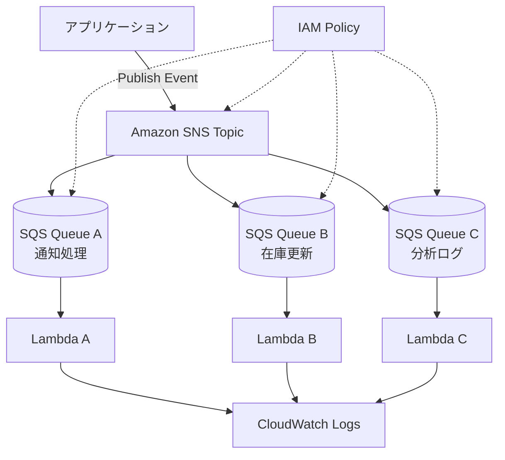

# SNS + SQS ファンアウト構成

## 概要

この構成は、1つのイベントをAmazon SNSで受け取り、複数のAmazon SQSキューへ同時に配信するイベント駆動アーキテクチャです。

例えば、注文が作成されたときに「メール通知」「在庫更新」「分析用ログ保存」など、複数の処理を同時に開始したいケースがあります。

SNS + SQSのファンアウト構成にすると、イベント発行側はSNSへ通知するだけでよく、各処理は独立したSQSキューを通じて実行できます。

## 構成図

## この構成で実現できること

| 項目 | 内容 |
|---|---|
| 複数処理への同時配信 | 1つのイベントを複数の処理へ分岐できる |
| 疎結合 | 発行側が各処理の詳細を知らなくてよい |
| 独立スケール | 処理ごとにSQSキューとLambdaを分けられる |
| 障害分離 | 1つの処理が失敗しても他の処理へ影響しにくい |
| 拡張性 | 新しい購読先を追加しやすい |

## 使用AWSサービス

| サービス | 役割 |
|---|---|
| Amazon SNS | イベントを複数の購読先へ配信するPub/Subサービス |
| Amazon SQS | 各処理のバッファとなるキュー |
| AWS Lambda | SQSメッセージを処理する関数 |
| Amazon CloudWatch Logs | 各Lambdaのログ確認 |
| IAM | SNS Publish、SQS ReceiveMessageなどの権限制御 |

## 通信フロー

1. アプリケーションがSNS TopicへイベントをPublishする
2. SNSが購読設定に基づいて複数のSQSキューへメッセージを配信する
3. 各SQSキューが処理待ちメッセージを保持する
4. 各Lambdaが自分の担当キューからメッセージを受け取る
5. Lambdaごとに通知、在庫更新、分析ログ保存などを実行する
6. 各処理のログをCloudWatch Logsへ出力する

## 設計ポイント

### 可用性

処理ごとにSQSキューを分けるため、1つの処理が詰まっても他の処理は継続できます。

各キューにDLQを設定すれば、失敗メッセージを処理単位で調査できます。

### セキュリティ

SNS TopicへPublishできる主体をIAMで制限します。

SQS Queue Policyで、指定したSNS Topicからのメッセージだけを受け付けるよう制限します。

### コスト

SNS、SQS、Lambdaはいずれも従量課金です。常時起動サーバーを用意しなくてもイベント処理を構成できます。

ただし、購読先を増やすとSQSリクエスト数やLambda実行回数も増えます。不要な購読先は作らない設計にします。

### パフォーマンス

処理ごとにキューを分けることで、Lambdaの同時実行数やバッチサイズを処理単位で調整できます。

通知処理は軽く、分析処理は重い、といった違いがある場合でも個別に設計できます。

## SAA試験で問われるポイント

- 1つのメッセージを複数処理へ配信する場合はSNSが候補になる
- 処理側にバッファを持たせたい場合はSNS + SQSを組み合わせる
- 疎結合なイベント駆動設計として出題されやすい
- 各処理の失敗を分離したい場合は処理ごとにキューを分ける
- SQS Queue PolicyでSNS Topicからの配信だけを許可できる

## この構成の注意点

- SNSだけでは処理側のバッファにならない
- SQSを挟むことで処理側の一時的な失敗に強くなる
- メッセージ重複を考慮してLambda処理を冪等にする
- 購読先が増えるほど実行回数とログ量が増える
- キューごとにDLQを設定して失敗原因を追跡できるようにする

## 関連用語

- [Amazon SNS](/terms/sns)
- [Amazon SQS](/terms/sqs)
- [AWS Lambda](/terms/lambda)
- [Amazon CloudWatch](/terms/cloudwatch)
- [IAM](/terms/iam)

## 関連比較

- [SNS / SQS / EventBridge の違い](/comparisons/sns-vs-sqs-vs-eventbridge)

## まとめ

SNS + SQSのファンアウト構成は、1つのイベントから複数の処理を安全に分岐させる代表的なパターンです。

SAAでは「複数のシステムへ同じイベントを配信したい」「処理ごとに失敗を分離したい」という条件が出たら、この構成を候補にします。