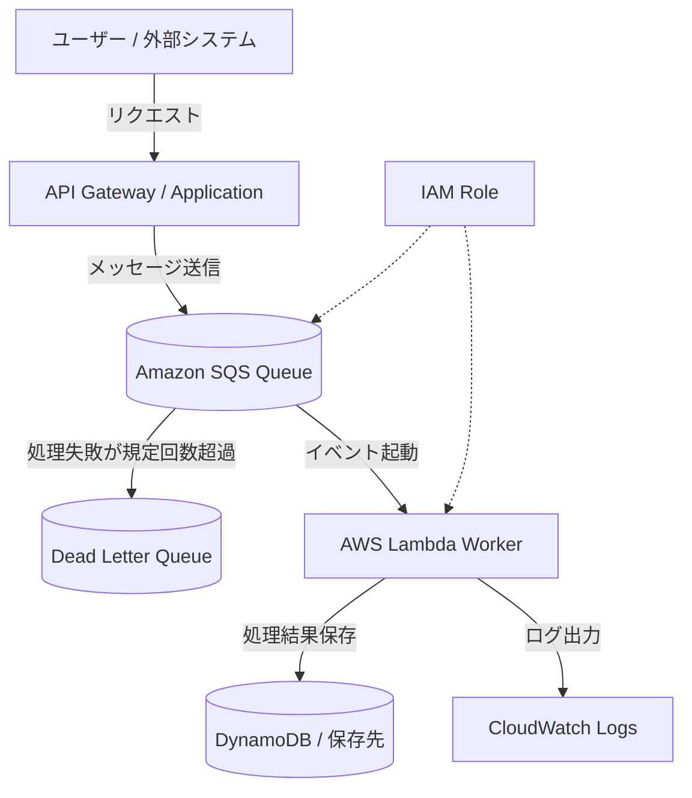

# SQS + Lambda 非同期処理構成

## 概要

この構成は、処理依頼をAmazon SQSに一度ためてから、AWS Lambdaで順番に処理する非同期アーキテクチャです。

ユーザー操作や外部システムからのリクエストをその場で重い処理まで完了させると、レスポンスが遅くなったり、処理失敗時にユーザー体験が悪くなったりします。

SQSを挟むことで、受付処理と実行処理を分離できます。これは疎結合、スケーラビリティ、耐障害性の観点で重要です。

## 構成図

## この構成で実現できること

| 項目 | 内容 |
|---|---|
| 非同期処理 | ユーザーへの応答と重い処理を分離できる |
| 疎結合 | 受付側と処理側を直接依存させない |
| 再試行 | Lambda処理失敗時にSQSが再配信できる |
| 障害隔離 | 処理失敗したメッセージをDLQへ退避できる |
| スケール | キューに溜まった量に応じてLambdaが処理できる |

## 使用AWSサービス

| サービス | 役割 |
|---|---|
| Amazon SQS | 処理待ちメッセージを保存するキュー |
| AWS Lambda | SQSメッセージを処理する実行基盤 |
| Dead Letter Queue | 規定回数失敗したメッセージの退避先 |
| Amazon DynamoDB | 処理結果や状態の保存先 |
| Amazon CloudWatch Logs | Lambdaの処理ログ確認 |
| IAM | LambdaがSQSやDynamoDBへアクセスするための権限 |

## 通信フロー

1. ユーザーまたは外部システムがAPIへリクエストする
2. APIまたはアプリケーションがSQSへメッセージを送信する
3. SQSにメッセージが保存される
4. LambdaがSQSイベントを受け取って処理する
5. 処理結果をDynamoDBなどへ保存する
6. 処理ログをCloudWatch Logsへ出力する
7. 規定回数失敗したメッセージはDLQへ送られる

## 設計ポイント

### 可用性

SQSが処理依頼を保持するため、Lambdaや後続処理が一時的に失敗してもメッセージを失いにくくなります。

DLQを設定することで、失敗メッセージを後から調査できます。

### セキュリティ

Lambda実行ロールには、対象SQSキューの読み取り、対象DynamoDBテーブルへの書き込み、CloudWatch Logsへの出力だけを許可します。

SQSへメッセージを送信できる主体もIAMで制限します。

### コスト

SQSとLambdaは従量課金のため、常時起動サーバーを使わない構成にできます。

ただし、失敗処理で同じメッセージが何度も再試行されるとLambda実行回数が増えます。最大受信回数とDLQを設定して、無限に近い再試行を避けます。

### パフォーマンス

大量の処理依頼が来ても、SQSに一度ためて順番に処理できます。

Lambdaの同時実行数を制御すれば、後続のDynamoDBや外部APIを過負荷にしない設計にできます。

## SAA試験で問われるポイント

- 疎結合な構成にはSQSが使える
- 非同期処理ではSQS + Lambdaが選択肢になる
- 失敗メッセージの退避にはDLQを使う
- リクエストの急増を吸収するバッファとしてSQSを使える
- 順序保証が必要な場合はFIFOキューを検討する

## この構成の注意点

- メッセージ重複処理に備えて冪等性を実装する
- 可視性タイムアウトをLambdaの処理時間より短くしない
- DLQを設定しないと失敗メッセージの調査が難しい
- Lambda同時実行数を無制限にすると後続サービスへ負荷が集中する
- FIFOキューは標準キューよりスループット特性が異なるため、順序保証が必要な場合だけ使う

## 関連用語

- [Amazon SQS](/terms/sqs)
- [AWS Lambda](/terms/lambda)
- [Amazon DynamoDB](/terms/dynamodb)
- [Amazon CloudWatch](/terms/cloudwatch)
- [IAM](/terms/iam)

## 関連比較

- [SNS / SQS / EventBridge の違い](/comparisons/sns-vs-sqs-vs-eventbridge)

## まとめ

SQS + Lambdaは、サーバーレスで非同期処理を実装する代表的な構成です。

SAAでは「処理を後回しにしたい」「急なリクエスト増加を吸収したい」「コンポーネント間を疎結合にしたい」という条件があれば、SQSを使う構成を考えます。