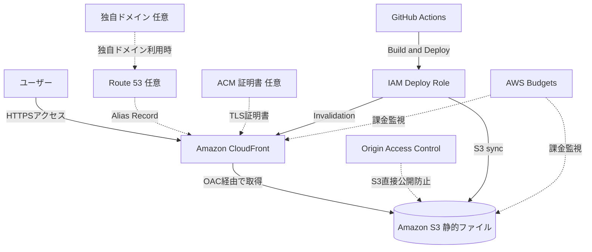

# S3 + CloudFront 静的Webサイト構成

## 概要

S3に保存したHTML、CSS、JavaScript、画像ファイルを、CloudFront経由でユーザーに配信する構成です。

この構成は、ブログ、学習サイト、ポートフォリオサイト、ドキュメントサイトなど、サーバー側で毎回処理を行わない静的コンテンツに向いています。

本プロジェクトでは、AWS資格学習サイトのMVP公開構成として使います。Next.jsの静的出力をS3へ配置し、CloudFrontでHTTPS配信します。

## 構成図

## この構成で実現できること

| 項目 | 内容 |
|---|---|
| 静的サイト公開 | HTML、CSS、JavaScript、画像をWebサイトとして公開できる |
| HTTPS配信 | CloudFront経由でHTTPSアクセスを提供できる |
| 高速配信 | エッジロケーションのキャッシュで表示を高速化できる |
| S3非公開化 | OACによりS3を直接公開せずに配信できる |
| 低コスト運用 | EC2やRDSを使わず、固定費を抑えやすい |
| CI/CD連携 | GitHub ActionsからS3同期とCloudFront Invalidationを実行できる |

## 使用AWSサービス

| サービス | 役割 |
|---|---|
| Amazon S3 | 静的ファイルの保存先 |
| Amazon CloudFront | CDN、HTTPS配信、キャッシュ配信 |
| Origin Access Control | CloudFrontからS3への安全なアクセス制御 |
| AWS Certificate Manager | 独自ドメイン利用時のTLS証明書管理 |
| Amazon Route 53 | 独自ドメインのDNS管理 |
| IAM | GitHub Actionsや管理者の権限制御 |
| AWS Budgets | 課金事故防止のための予算通知 |

## 通信フロー

1. ユーザーがサイトURLへアクセスする
2. CloudFrontがHTTPSリクエストを受け取る
3. CloudFrontにキャッシュがあれば、そのままユーザーへ返す
4. キャッシュがなければ、CloudFrontがOAC経由でS3からファイルを取得する
5. S3はCloudFront Distributionからのアクセスだけを許可する
6. CloudFrontがHTML、CSS、JavaScript、画像をユーザーへ返す
7. デプロイ時はGitHub ActionsがS3へ同期し、CloudFront Invalidationを実行する

## 設計ポイント

### 可用性

S3とCloudFrontはマネージドサービスであり、静的サイト配信では高い可用性を確保しやすい構成です。

EC2のようにインスタンス障害やOSパッチ管理を考える必要がありません。

### セキュリティ

S3バケットはPublic Access Blockを有効化し、直接公開しません。

CloudFront OACを使い、CloudFront Distributionからの読み取りだけをBucket Policyで許可します。

HTTPアクセスはCloudFront側でHTTPSへリダイレクトします。

### コスト

EC2、RDS、ALB、NAT Gatewayを使わないため、個人開発MVPでは固定費を抑えやすいです。

ただし、CloudFrontのデータ転送量、リクエスト数、Invalidation回数、S3の保存容量には注意します。

### パフォーマンス

CloudFrontのキャッシュを利用することで、S3へのリクエストを減らし、ユーザーに近いエッジから配信できます。

画像やJavaScriptが大きいと転送量が増えるため、ファイルサイズの軽量化も重要です。

## SAA試験で問われるポイント

- 静的サイト配信ではS3 + CloudFrontが代表的な構成になる
- S3を直接公開せず、CloudFront OACでアクセスを制限する
- CloudFrontでHTTPS配信とキャッシュ配信を行う
- 独自ドメインを使う場合はRoute 53とACMを組み合わせる
- CloudFrontで使うACM証明書はus-east-1で発行する
- 更新反映にはCloudFront Invalidationが関係する

## この構成の注意点

- S3のStatic website hostingエンドポイントではなく、通常のS3オリジンを使う
- S3 Public Access Blockを無効化しない
- Bucket PolicyのSourceArnにCloudFront Distribution IDを正しく入れる
- CloudFrontキャッシュにより、更新がすぐ反映されない場合がある
- 毎回 `/*` のInvalidationを大量実行するとコスト増につながる
- API処理やユーザー別データ保存はこの構成だけでは実現できない

## 関連用語

- [Amazon S3](/terms/s3)
- [Amazon CloudFront](/terms/cloudfront)
- [AWS Certificate Manager](/terms/acm)
- [Amazon Route 53](/terms/route53)
- [IAM](/terms/iam)
- [AWS Budgets](/terms/aws-budgets)

## 関連比較

- [ALB / NLB / CloudFront の違い](/comparisons/alb-vs-nlb-vs-cloudfront)
- [S3 / EBS / EFS の違い](/comparisons/s3-vs-ebs-vs-efs)

## まとめ

S3 + CloudFrontは、静的コンテンツ中心の学習サイトやポートフォリオサイトに最適な基本構成です。

このプロジェクトでは、低コスト、HTTPS配信、S3非公開化、CI/CD連携を同時に満たすMVP公開基盤として採用します。
