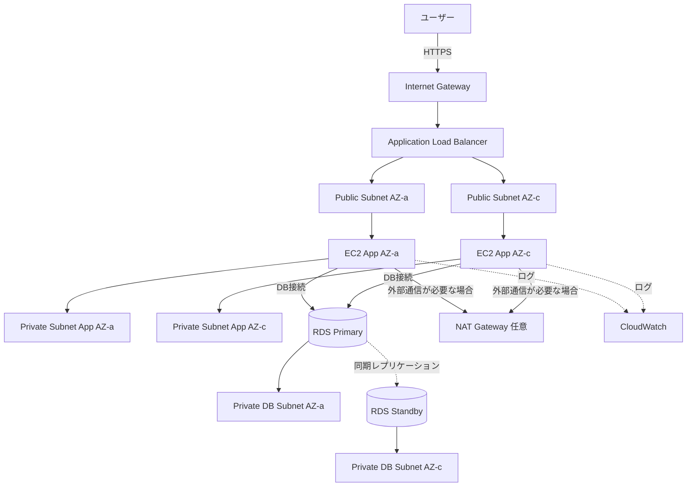

# VPC内3層Webアプリ構成

## 概要

Webアプリを以下の3層に分けて配置する構成です。

1. プレゼンテーション層
2. アプリケーション層
3. データベース層

AWSでは、VPC、Subnet、Route Table、Security Group、ALB、EC2、RDSなどを組み合わせて実現します。

本プロジェクトのMVPでは使いませんが、SAAでは非常に重要な基本構成です。

## 構成図

## この構成で実現できること

| 項目 | 内容 |
|---|---|
| 層の分離 | Web入口、アプリ、DBをネットワーク上で分離できる |
| セキュリティ向上 | DBをパブリックサブネットに置かず、外部公開を避けられる |
| 可用性向上 | 複数AZにアプリ層とDB層を配置できる |
| 拡張性 | アプリ層をAuto ScalingやECSへ置き換えやすい |
| 実務設計理解 | VPC、サブネット、ルートテーブル、Security Groupの関係を学べる |

## 使用AWSサービス

| サービス | 役割 |
|---|---|
| Amazon VPC | アプリケーション全体のネットワーク境界 |
| Public Subnet | ALBやNAT Gatewayなど外部接続が必要なリソースの配置先 |
| Private Subnet | アプリケーションサーバーの配置先 |
| Database Subnet | RDSを配置する非公開サブネット |
| Application Load Balancer | HTTPSリクエストをアプリ層へ分散 |
| Amazon EC2 | アプリケーションサーバー |
| Amazon RDS | リレーショナルデータベース |
| Amazon CloudWatch | メトリクスとログの監視 |
| IAM | EC2や運用担当者のアクセス権限制御 |

## 通信フロー

1. ユーザーがWebサイトへHTTPSアクセスする
2. Internet Gateway経由でALBがリクエストを受け取る
3. ALBがPrivate Subnet内のEC2へリクエストを転送する
4. EC2アプリケーションがRDS PrimaryへDB接続する
5. RDS Multi-AZ構成の場合、PrimaryからStandbyへ同期レプリケーションされる
6. EC2やRDSのメトリクスをCloudWatchで確認する
7. 外部パッケージ取得などが必要な場合のみ、Private SubnetからNAT Gateway経由で外部通信する

## 設計ポイント

### 可用性

Public Subnet、Private Subnet、Database Subnetを複数AZに作成します。

ALBは複数AZにまたがってリクエストを分散します。

RDSはMulti-AZ構成にすることで、DB障害時にStandbyへフェイルオーバーできます。

### セキュリティ

ALBだけをインターネットからアクセス可能にします。

EC2はPrivate Subnetに配置し、Security GroupではALBからの通信だけを許可します。

RDSはDatabase Subnetに配置し、Security Groupではアプリ層EC2からのDBポートだけを許可します。

### コスト

ALB、EC2、RDS、NAT Gatewayは固定費や継続課金が発生しやすいです。

このプロジェクトのMVPでは、低コストを優先するため採用しません。学習用・SAA対策用の構成として扱います。

### 運用

CloudWatchでEC2のCPU使用率、ALBの5xx、RDSの接続数やCPU使用率を確認します。

SSM Session Managerを使うと、SSH用の踏み台サーバーを減らせます。

## SAA試験で問われるポイント

- Public SubnetとPrivate Subnetの役割を理解する
- ALBはPublic Subnet、アプリケーションはPrivate Subnetに配置する
- DBはPrivate Subnetに配置し、直接インターネット公開しない
- Security Groupはステートフル、NACLはステートレス
- RDS Multi-AZは可用性向上、Read Replicaは読み取り性能向上
- Private Subnetからインターネットへ出る場合はNAT Gatewayが必要になる
- S3やDynamoDBへ閉域接続したい場合はVPC Endpointも候補になる

## この構成の注意点

- NAT Gatewayは固定費が高くなりやすいため、個人MVPでは慎重に使う
- RDSは停止忘れやストレージ、バックアップで課金が続く
- DBをPublic Subnetに置かない
- EC2へSSHを0.0.0.0/0で開けない
- ルートテーブルの関連付けミスで通信できないケースが多い
- Multi-AZとRead Replicaの目的を混同しない

## 関連用語

- [Amazon VPC](/terms/vpc)
- [Amazon EC2](/terms/ec2)
- [Elastic Load Balancing](/terms/elb)
- [Amazon RDS](/terms/rds)
- [Amazon CloudWatch](/terms/cloudwatch)
- [IAM](/terms/iam)

## 関連比較

- [Security Group / NACL の違い](/comparisons/security-group-vs-nacl)
- [Multi-AZ / Read Replica の違い](/comparisons/multi-az-vs-read-replica)
- [ALB / NLB / CloudFront の違い](/comparisons/alb-vs-nlb-vs-cloudfront)

## まとめ

VPC内3層Webアプリ構成は、AWSのネットワーク設計を理解するための基本形です。

このプロジェクト本体では低コストのため採用しませんが、SAA対策と面接説明では非常に重要な構成です。
