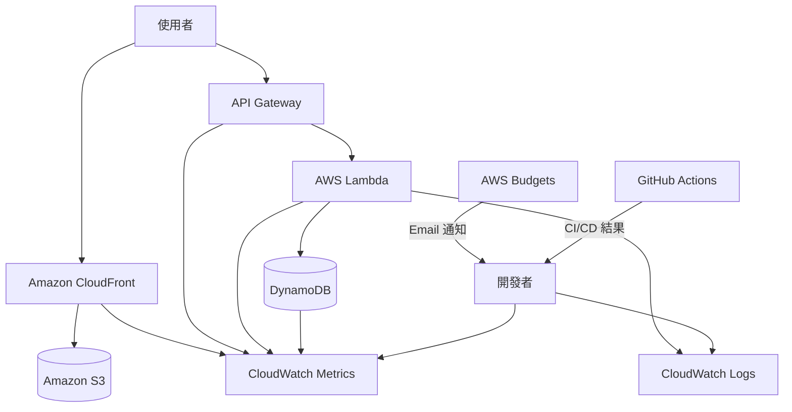

# 透過 CloudWatch 觀察的 Serverless 維運監控架構

## 概要

此架構是針對由 S3 + CloudFront 發布的靜態網站,以及由 API Gateway + AWS Lambda + Amazon DynamoDB 組成的詢問 API,進行維運監控的基本架構。

在個人開發的 MVP 階段,並不需要從一開始就建立大規模的監控基盤。但至少要能確認「網站是否能顯示」「API 是否失敗」「Lambda 日誌中是否有錯誤」「費用是否異常增加」這些項目。

在本專案中,監控以 CloudWatch Logs、CloudWatch Metrics、AWS Budgets 以及 GitHub Actions 日誌為中心。

## 架構圖

## 此架構可實現的事項

| 項目 | 內容 |
|---|---|
| 網站監控 | 可確認 CloudFront 的 4xx、5xx、請求數 |
| API 監控 | 可確認 API Gateway 的 4xx、5xx、Latency |
| Lambda 監控 | 可確認 Invocations、Errors、Duration、Throttles |
| 資料庫監控 | 可確認 DynamoDB 的寫入、Throttling、ItemCount |
| 日誌調查 | 透過 CloudWatch Logs 確認 Lambda 的處理結果 |
| 費用監控 | 透過 AWS Budgets 察覺意料之外的費用增加 |
| 部署監控 | 透過 GitHub Actions 日誌確認 CI/CD 失敗 |

## 使用的 AWS 服務

| 服務 | 角色 |
|---|---|
| Amazon CloudWatch Logs | 儲存與檢視 Lambda 日誌 |
| Amazon CloudWatch Metrics | 確認 CloudFront、API Gateway、Lambda、DynamoDB 的指標 |
| AWS Budgets | 通知月度費用與預測超支 |
| Amazon CloudFront | 靜態網站發布的入口 |
| API Gateway | 詢問 API 的入口 |
| AWS Lambda | 處理詢問內容的儲存 |
| Amazon DynamoDB | 儲存詢問資料 |
| GitHub Actions | 確認 CI/CD 執行結果 |

## 通訊流程

1. 使用者透過 CloudFront 連線至網站。
2. 請求數與錯誤率被記錄至 CloudFront 指標。
3. 使用者送出詢問表單。
4. API Gateway 呼叫 AWS Lambda。
5. Lambda 將詢問資料寫入 Amazon DynamoDB。
6. Lambda 將最小化的日誌輸出至 CloudWatch Logs。
7. 透過 CloudWatch Metrics 確認 API、Lambda、DynamoDB 的狀態。
8. AWS Budgets 透過 Email 通知費用超支。
9. 透過 GitHub Actions 確認部署是否失敗。

## 設計重點

### 可用性

在 MVP 階段,不要一次建立大量 CloudWatch Alarm,而是讓重要的指標處於可手動確認的狀態。

當流量增加後,再為 Lambda Errors、API Gateway 5xx、CloudFront 5xx 加上 CloudWatch Alarm。

### 安全性

不要將完整的電子郵件地址或詢問本文寫入 CloudWatch Logs。

日誌中只輸出調查所需的資訊,例如 `requestId`、`status`、`errorCode`、`validationErrorFields`。

### 成本設計

為 CloudWatch Logs 設定保留期間。

在 MVP 階段不要無期限保留日誌。例如設定為 7 天或 14 天,避免日誌肥大導致的費用增加。

CloudWatch Dashboard 與 Synthetics 雖然好用,但在 MVP 階段並非必要。

### 效能

透過觀察 Lambda Duration 與 API Gateway Latency,可以偵測詢問 API 的延遲。

當出現 DynamoDB throttling 時,應懷疑流量暴增或設計上的問題。

## SAA 考試重點

- 維運監控使用 CloudWatch Logs 與 CloudWatch Metrics。
- Lambda 的 Errors、Duration、Throttles 是重要的觀察對象。
- API Gateway 的 4xx 與 5xx 成因不同。
- DynamoDB 的 throttling 是重新檢視容量或存取模式的信號。
- 應設定 AWS Budgets 以防止費用事故。
- 設計上應避免將個人資訊或機密資訊寫入日誌。

## 此架構的注意事項

- 不要將 CloudWatch Logs 設為無期限保留。
- 不要將詢問本文與完整的電子郵件地址輸出至日誌。
- 僅憑指標無法看出真正原因,需結合日誌與最近一次部署一同確認。
- 4xx 應懷疑使用者輸入錯誤或 CORS 設定;5xx 應懷疑 Lambda 或 DynamoDB 端的問題。
- 收到 Budgets 通知時,使用 Cost Explorer 確認各服務的費用。

## 相關用語

- [Amazon CloudWatch](/zh/terms/cloudwatch)
- [Amazon CloudFront](/zh/terms/cloudfront)
- [API Gateway](/zh/terms/api-gateway)
- [AWS Lambda](/zh/terms/lambda)
- [Amazon DynamoDB](/zh/terms/dynamodb)
- [AWS Budgets](/zh/terms/aws-budgets)
- [Cost Explorer](/zh/terms/cost-explorer)

## 相關比較

- [CloudWatch / CloudTrail / AWS Config 的差異](/zh/comparisons/cloudwatch-vs-cloudtrail-vs-config)

## 在本專案中的角色

以 CloudWatch 為核心的維運監控架構,是在 AWS 上安全運行作品集的最低基準線。

在 SAA 考試中,必須將「日誌」「指標」「告警」「費用監控」分別理解。在本專案中,先從 CloudWatch Logs、CloudWatch Metrics、AWS Budgets 著手,以小規模開始進行維運監控。
