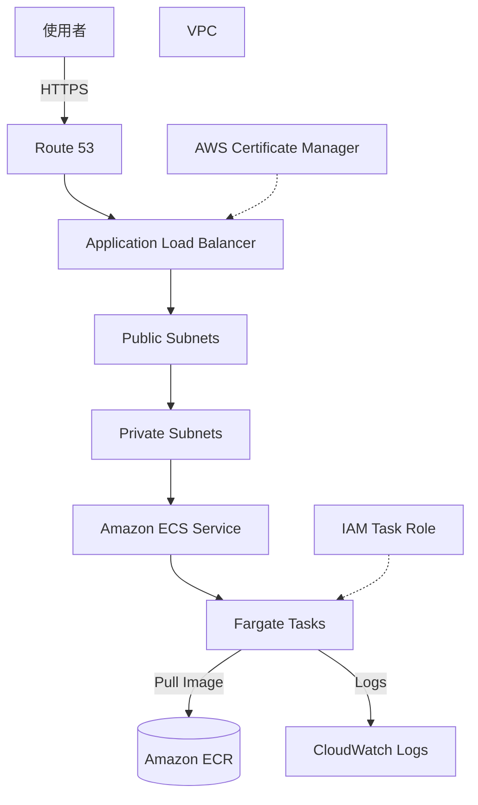

# ECS Fargate 容器化 Web 應用架構

## 概要

此架構在 Amazon ECS on AWS Fargate 上執行容器化的 Web 應用程式,並透過 Application Load Balancer(ALB)對外公開。

與自行管理 EC2 的 ECS 構成不同,Fargate 將容器執行基礎設施的伺服器管理交由 AWS 負責。

適用於「想將 Docker 化的 Web 應用程式部署到 AWS,但希望避免 EC2 修補與容量管理」的情境。

## 架構圖

## 此架構可達成的事項

| 項目 | 內容 |
|---|---|
| 容器執行 | 在 AWS 上執行 Docker 化的 Web 應用程式 |
| 減少伺服器管理 | 減少 EC2 執行個體的管理負擔 |
| HTTPS 公開 | 透過 ALB 與 ACM 接收 HTTPS 存取 |
| 擴展 | 透過 ECS Service 的 Desired Count 調整任務數量 |
| 日誌確認 | 透過 CloudWatch Logs 確認容器日誌 |

## 使用的 AWS 服務

| 服務 | 角色 |
|---|---|
| Amazon ECS | 管理並執行容器的編排服務 |
| AWS Fargate | 無需伺服器管理即可執行容器的基礎設施 |
| Amazon ECR | 容器映像檔的存放位置 |
| Application Load Balancer | 將使用者的 HTTPS 請求分派至 ECS 任務 |
| Amazon VPC | 用以放置 ECS 任務與 ALB 的網路 |
| AWS Certificate Manager | 管理 HTTPS 憑證 |
| Amazon CloudWatch Logs | 儲存並檢視容器日誌 |
| IAM | 透過任務執行角色與任務角色控制權限 |

## 通訊流程

1. 使用者透過 HTTPS 存取自訂網域。
2. Route 53 將名稱解析至 ALB。
3. ALB 接收請求。
4. ALB 透過目標群組將請求轉發至 ECS Fargate 任務。
5. Fargate 任務上的容器處理請求。
6. 將容器日誌輸出至 CloudWatch Logs。
7. 部署時自 ECR 取得容器映像檔。

## 設計重點

### 可用性

將 ECS 任務部署到多個 AZ 的 Private Subnet,可提升對單一 AZ 故障的耐受度。

ALB 也應跨越多個 AZ 部署。

### 安全性

僅將 ALB 放置於 Public Subnet,ECS 任務置於 Private Subnet。

ECS 任務的 Security Group 僅允許來自 ALB 的通訊。

任務角色僅授予應用程式真正需要的 AWS 服務權限。

### 成本

Fargate 依據任務的 vCPU、記憶體與執行時間計費。

個人開發 MVP 容易產生常時運作成本,因此本 AWS 證照學習網站本體優先採用 S3 + CloudFront。

Fargate 適合在需要常時伺服器端處理的 Web 應用程式階段才開始評估採用。

### 效能

依據應用程式負載調整任務數、CPU 與記憶體。

ALB 健康檢查失敗的任務會被切離,因此應在應用程式端準備適當的健康檢查路徑。

## SAA 考試重點

- ECS 是容器執行基礎設施的選項之一。
- 想避免伺服器管理時,Fargate 為候選方案。
- 對外公開時搭配 ALB 使用。
- 將任務部署到 Private Subnet 為基本設計。
- 容器映像檔的儲存使用 ECR。
- 理解任務執行角色(Task Execution Role)與任務角色(Task Role)的差異。

## 此架構的注意事項

- 對個人 MVP 而言,成本容易高於 S3 + CloudFront。
- Fargate 任務若持續運作則會持續計費。
- ALB 本身也會產生費用。
- 從 Private Subnet 存取 ECR 時,需設計 NAT Gateway 或 VPC Endpoint。
- 健康檢查設定錯誤可能導致正常任務被切離。

## 相關用語

- [Amazon ECS](/zh/terms/ecs)
- [AWS Fargate](/zh/terms/fargate)
- [Amazon ECR](/zh/terms/ecr)
- [Elastic Load Balancing](/zh/terms/elb)
- [Amazon VPC](/zh/terms/vpc)
- [Amazon CloudWatch](/zh/terms/cloudwatch)
- [IAM](/zh/terms/iam)

## 相關比較

- [EC2 / Lambda / ECS 的差異](/zh/comparisons/ec2-vs-lambda-vs-ecs)
- [ALB / NLB / CloudFront 的差異](/zh/comparisons/alb-vs-nlb-vs-cloudfront)

## 在本專案中的角色

ECS Fargate 是無需伺服器管理即可執行容器化 Web 應用程式的有力選項。

不過,以靜態網站為主的個人 MVP 容易產生較高的固定成本,因此本專案將其視為學習用的架構參考,本體公開仍優先採用 S3 + CloudFront。
