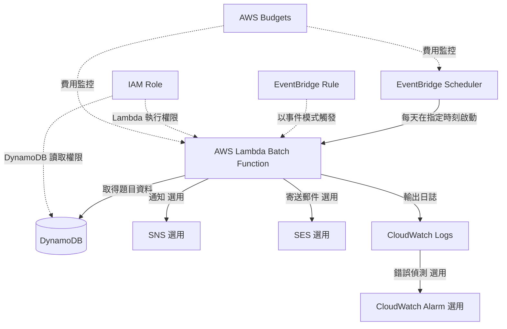

# EventBridge + Lambda 批次處理架構

## 概要

這是利用 EventBridge 在指定時刻發出事件、觸發 Lambda 執行的無伺服器批次處理架構。

適用於每日一題配送、定期報表產生、舊資料整理、彙總處理等情境。

在本專案中,可應用於未來的「每日一題配送」或「學習提醒」等場景。

## 架構圖

## 此架構可實現的功能

| 項目 | 內容 |
|---|---|
| 定期執行 | 可在每天、每週、每月等指定時刻執行處理 |
| 無伺服器 | 不需要常時啟動批次伺服器 |
| 自動化 | 可自動化報表產生、資料整理、通知等作業 |
| 通知整合 | 結合 SNS 與 SES 進行通知 |
| 維運監控 | 透過 CloudWatch Logs 與 Alarm 確認執行結果 |

## 使用的 AWS 服務

| 服務 | 角色 |
|---|---|
| Amazon EventBridge Scheduler | 以指定時刻或 cron 運算式觸發 Lambda |
| Amazon EventBridge Rule | 依事件模式觸發處理 |
| AWS Lambda | 批次處理本體 |
| Amazon DynamoDB | 題目資料、使用者設定、處理狀態的儲存位置 |
| Amazon SNS | 作為通知目的地使用 |
| Amazon SES | 需要寄送電子郵件時使用 |
| Amazon CloudWatch Logs | 確認 Lambda 執行日誌 |
| CloudWatch Alarm | 批次失敗時的通知 |
| IAM | 控制 Lambda 存取各服務的權限 |
| AWS Budgets | 偵測執行次數異常增加或費用事故 |

## 通訊流程

1. EventBridge Scheduler 在指定時刻發出事件
2. EventBridge 觸發 Lambda
3. Lambda 從 DynamoDB 取得所需資料
4. Lambda 執行定期處理
5. 如需通知,則整合 SNS 或 SES 寄送
6. Lambda 將執行結果輸出至 CloudWatch Logs
7. 發生錯誤時由 CloudWatch Alarm 發出通知
8. 透過 AWS Budgets 監控預期外的執行次數增加與費用

## 設計重點

### 可用性

Lambda 與 EventBridge 都是受管服務,因此不需要自行管理批次伺服器。

但若未設計處理失敗時的重試、DLQ 與通知對象,就不容易察覺到失敗。

### 安全性

Lambda 執行角色僅允許目標 DynamoDB 資料表的讀取、必要的通知服務,以及 CloudWatch Logs 的輸出權限。

若郵件寄送或外部通知中包含個人資料,應將傳送內容降到最小限度。

### 成本

EventBridge 與 Lambda 採從量計費,適合低頻率的定期處理。

但若將執行頻率設得太高,Lambda 執行次數、DynamoDB 讀取量與日誌儲存量都會增加。

在 MVP 階段,建議從「每天一次」這種低頻率開始較為安全。

### 維運

在 CloudWatch Logs 中記錄開始時刻、結束時刻、處理筆數與錯誤種類。

不要把使用者完整的電子郵件地址或郵件內文等個人資料寫入日誌。

## SAA 考試重點

- 定期執行使用 EventBridge Scheduler 或 EventBridge Rule
- 無伺服器批次處理常以 EventBridge + Lambda 作為候選方案
- 理解 Lambda 的最大執行時間與逾時設定
- 設計失敗時的重試、DLQ 與通知
- 理解 cron 運算式與 rate 運算式的差異
- 長時間或大量處理可考慮 Step Functions、ECS Task 或 AWS Batch

## 本架構的注意事項

- 將 Lambda 的逾時設定配合處理內容調整
- 不要將長時間處理或大量資料處理塞進單一 Lambda
- 不要把 CloudWatch Logs 設為永久保存
- 不要把執行頻率設得過高
- 像每日一題配送這類通知,需要使用者同意與取消訂閱機制
- 使用 SES 時,確認寄送限制與寄件網域驗證

## 相關用語

- [Amazon EventBridge](/zh/terms/eventbridge)
- [AWS Lambda](/zh/terms/lambda)
- [Amazon DynamoDB](/zh/terms/dynamodb)
- [Amazon CloudWatch](/zh/terms/cloudwatch)
- [Amazon SNS](/zh/terms/sns)
- [IAM](/zh/terms/iam)

## 相關比較

- [SNS / SQS / EventBridge 的差異](/zh/comparisons/sns-vs-sqs-vs-eventbridge)
- [EC2 / Lambda / ECS 的差異](/zh/comparisons/ec2-vs-lambda-vs-ecs)

## 在本專案中的角色

EventBridge + Lambda 是以無伺服器方式實作定期處理的代表性架構。

在本專案中,可應用於未來的每日一題配送或學習提醒。不過 MVP 階段為了抑制成本與維運負擔,只在實際需要時才導入。
