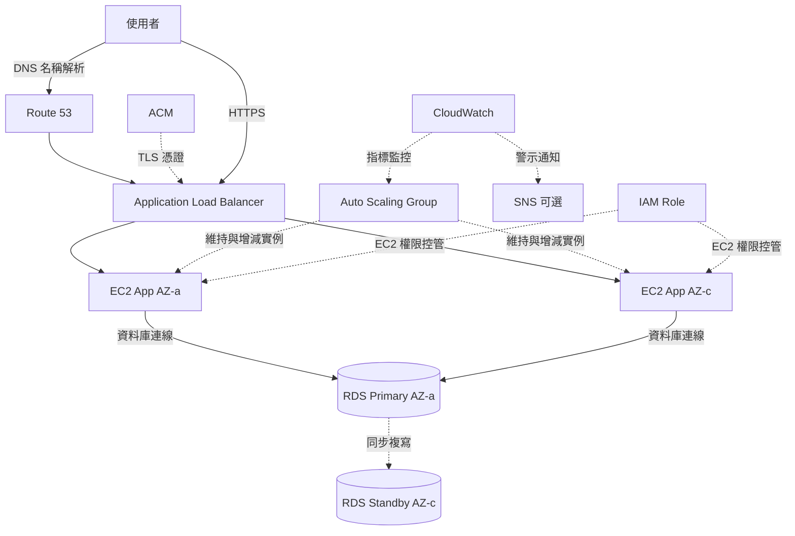

# ALB + Auto Scaling + RDS Multi-AZ 高可用性架構

## 概要

此架構將 EC2 部署於多個可用區域 (AZ)、透過 ALB 分散請求、以 Auto Scaling 調整實例數量,並使用 RDS Multi-AZ 預防資料庫故障。

它是正式 Web 應用程式的基本型態,也是 SAA 考試常見的架構。

本專案的 MVP 為了優先壓低成本並未採用此架構,但在面試中說明 AWS 設計能力時是相當重要的構成。

## 架構圖

## 此架構可達成的事項

| 項目 | 內容 |
|---|---|
| 負載分散 | 透過 ALB 將請求分散至多台 EC2 |
| 自動復原 | 由 Auto Scaling Group 自動替換異常實例 |
| 水平擴展 | 依負載自動增加 EC2 實例數量 |
| 資料庫高可用 | 透過 RDS Multi-AZ 預防資料庫故障的容錯切換 |
| 監控 | 透過 CloudWatch 進行指標監控與警示通知 |

## 使用的 AWS 服務

| 服務 | 角色 |
|---|---|
| Route 53 | 自訂網域的名稱解析 |
| ACM | 提供給 ALB 使用的 TLS 憑證 |
| Application Load Balancer | HTTP/HTTPS 請求的負載分散 |
| Auto Scaling Group | 維持與自動調整 EC2 實例數量 |
| Amazon EC2 | 應用程式伺服器 |
| Amazon RDS Multi-AZ | 具備高可用性的關聯式資料庫 |
| Amazon CloudWatch | 指標監控與警示 |
| Amazon SNS | 警示通知的傳送目的地 |
| IAM | EC2 與維運人員的權限控管 |

## 通訊流程

1. 使用者存取自訂網域。
2. Route 53 將名稱解析至 ALB。
3. ALB 接收 HTTPS 請求。
4. ALB 將請求分發至通過健康檢查的 EC2。
5. EC2 應用程式連線至 RDS Primary。
6. RDS Primary 同步複寫至 Standby。
7. 發生 EC2 故障時,Auto Scaling Group 啟動新的實例。
8. 發生資料庫故障時,RDS 切換至 Standby。
9. CloudWatch 監控指標,於異常時通知 SNS。

## 設計重點

### 可用性

將 ALB、EC2、RDS 跨多個可用區域部署。

在 Auto Scaling Group 設定最小、期望、最大實例數。

啟用 RDS Multi-AZ 後,資料庫故障時可自動切換至 Standby。

### 安全性

只將 ALB 公開,EC2 與 RDS 部署於私有子網路。

EC2 的安全群組僅允許來自 ALB 的應用程式埠。

RDS 的安全群組僅允許來自 EC2 的資料庫埠。

### 成本

此架構雖具備高可用性,但對個人 MVP 而言成本容易偏重。

使用 ALB、多台 EC2、RDS Multi-AZ、NAT Gateway 都會產生持續性的費用。

雖然作為學習用途相當重要,但本專案的正式 MVP 仍優先採用 S3 + CloudFront。

### 維運

使用 CloudWatch 確認 ALB 5xx、EC2 CPU、Auto Scaling 事件、RDS CPU、資料庫連線數。

故障發生時依序確認 ALB 目標健康、Auto Scaling Activity、RDS 事件、CloudWatch Logs。

## SAA 考試重點

- 高可用性需跨多個可用區域部署。
- ALB 不會轉送流量至健康檢查失敗的目標。
- Auto Scaling Group 會維持期望的實例數量。
- RDS Multi-AZ 的目的是提升可用性。
- RDS Read Replica 的目的是提升讀取效能。
- 設計成無狀態的應用程式較易進行 Auto Scaling。
- 階段管理 (Session) 可考慮外部化至 ElastiCache 或 DynamoDB。

## 此架構的注意事項

- 不要將 Multi-AZ 與 Read Replica 混淆。
- 需在應用程式側提供 ALB 的健康檢查路徑。
- 若 EC2 內部狀態過多,將不易進行 Auto Scaling。
- RDS Multi-AZ 的 Standby 並非用於直接讀取存取。
- 成本容易偏高,個人 MVP 需審慎判斷是否採用。
- 最大實例數設得過大,流量暴增時的費用風險也會增加。

## 相關用語

- [Elastic Load Balancing](/zh/terms/elb)
- [AWS Auto Scaling](/zh/terms/auto-scaling)
- [Amazon EC2](/zh/terms/ec2)
- [Amazon RDS](/zh/terms/rds)
- [Amazon CloudWatch](/zh/terms/cloudwatch)
- [IAM](/zh/terms/iam)

## 相關比較

- [Multi-AZ 與 Read Replica 的差異](/zh/comparisons/multi-az-vs-read-replica)
- [ALB、NLB、CloudFront 的差異](/zh/comparisons/alb-vs-nlb-vs-cloudfront)
- [EC2、Lambda、ECS 的差異](/zh/comparisons/ec2-vs-lambda-vs-ecs)

## 總結

ALB + Auto Scaling + RDS Multi-AZ 是重視可用性的 Web 應用程式代表性架構。

本專案的正式 MVP 雖未使用此架構,但在 SAA 對策與說明 AWS 設計能力時,是必備等級的構成。
