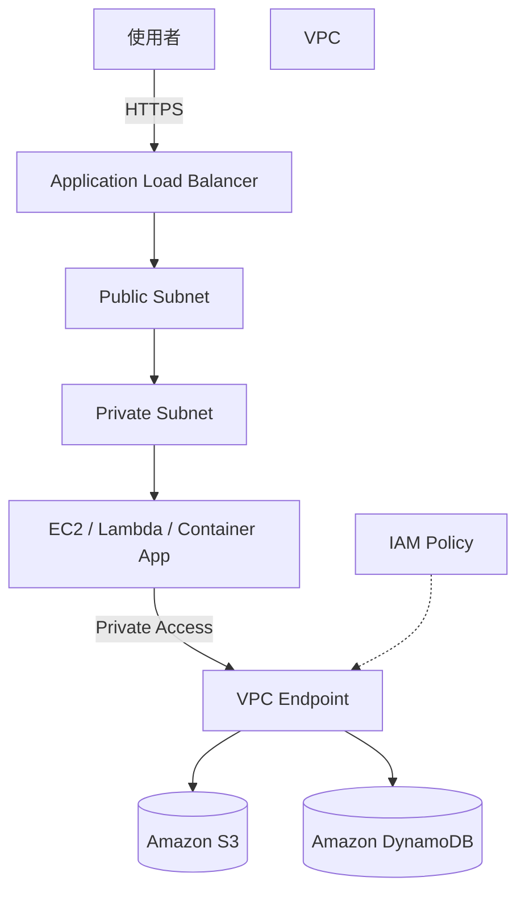

# 透過 VPC Endpoint 對 AWS 服務進行私有連線的架構

## 概要

此架構讓位於 VPC 內私有子網路的應用程式,可以不經由網際網路存取 Amazon S3 與 Amazon DynamoDB 等 AWS 服務。

一般情況下,私有子網路若要連線到網際網路上的 AWS 服務,需要 NAT Gateway。但對於 Amazon S3、Amazon DynamoDB 等部分 AWS 服務,可以透過 VPC Endpoint,讓通訊全程在 AWS 網路內完成。

此架構兼顧安全性與成本,是 SAA 考試中常被詢問的網路設計題型。

## 架構圖

## 此架構可以實現的事項

| 項目 | 內容 |
|---|---|
| 私有通訊 | VPC 內資源可以不經由網際網路存取 AWS 服務 |
| 提升安全性 | 減少透過公有 IP 或 NAT Gateway 進行的通訊 |
| 降低成本 | 針對 Amazon S3 與 Amazon DynamoDB 使用 Gateway Endpoint,可避免 NAT Gateway 的固定費用 |
| 通訊路徑控制 | 透過 Endpoint Policy 限制可存取的儲存貯體或操作 |

## 使用的 AWS 服務

| 服務 | 角色 |
|---|---|
| Amazon VPC | 部署應用程式的網路 |
| Private Subnet | 部署不開放外部直接存取的應用程式 |
| VPC Endpoint | 從 VPC 內對 AWS 服務進行私有連線的入口 |
| Amazon S3 | 儲存靜態檔案、記錄、備份等資料 |
| Amazon DynamoDB | 無伺服器的 NoSQL 資料庫 |
| IAM | 對 VPC Endpoint 與 AWS 服務的存取權限控制 |

## 通訊流程

1. 使用者透過 HTTPS 連線到 Application Load Balancer
2. ALB 將請求轉送到私有子網路中的應用程式
3. 應用程式對 Amazon S3 或 Amazon DynamoDB 進行存取
4. 通訊經由 VPC Endpoint 傳遞
5. AWS 服務端會評估 IAM Policy 與 Endpoint Policy
6. 只有被允許的操作會被執行

## 設計重點

### 可用性

VPC Endpoint 本身是受管理的服務。使用 Interface Endpoint 時,可以在多個可用區建立,以降低 AZ 故障的影響。

針對 Amazon S3 與 Amazon DynamoDB 的 Gateway Endpoint 是綁定在路由表上,因此需確認目標子網路的路由表設計。

### 安全性

可以讓私有子網路內的資源不需指派公有 IP。

利用 Endpoint Policy,例如可以做到「只允許對特定 S3 儲存貯體的 GetObject 操作」這類限制。

同時透過 IAM Role 端的權限與 Endpoint Policy 進行控管,能降低誤操作與過度授權的風險。

### 成本

針對 Amazon S3 與 Amazon DynamoDB 的 Gateway Endpoint,比起使用 NAT Gateway 的架構通常成本較低。

另一方面,Interface Endpoint 會產生按時間計費與資料處理費用。因此不必為所有服務都建立 Interface Endpoint,而是根據通訊量與安全需求來判斷。

### 效能

因為通訊全程在 AWS 網路內,相較於經由網際網路,路徑更容易控制。

不過,應用程式端的重試設計與逾時設定仍需另行規劃。

## SAA 考試重點

- 從私有子網路存取 Amazon S3 時,Gateway Endpoint 是常見選項
- 可以在不使用 NAT Gateway 的情況下對 AWS 服務進行私有連線
- 需理解 Interface Endpoint 與 Gateway Endpoint 的差異
- 透過 Endpoint Policy 可以限制存取範圍
- 經常作為同時滿足安全性與成本最佳化的選項出現

## 此架構的注意事項

- Gateway Endpoint 用於 Amazon S3 與 Amazon DynamoDB
- Interface Endpoint 需確認各服務的支援狀況
- Interface Endpoint 會產生費用,不應無限制地建立
- 若漏掉與路由表的關聯設定,將無法通訊
- 即使 IAM Policy 允許,Endpoint Policy 若拒絕,仍無法存取

## 相關用語

- [Amazon VPC](/zh/terms/vpc)
- [Amazon S3](/zh/terms/s3)
- [Amazon DynamoDB](/zh/terms/dynamodb)
- [IAM](/zh/terms/iam)

## 相關比較

- [Security Group 與 NACL 的差異](/zh/comparisons/security-group-vs-nacl)
- [Amazon RDS 與 Amazon DynamoDB 的差異](/zh/comparisons/rds-vs-dynamodb)

## 總結

VPC Endpoint 是從私有子網路安全地存取 AWS 服務的重要架構。

在 SAA 考試中,當題目出現「不經由網際網路」「不使用 NAT Gateway」「想存取 Amazon S3 或 Amazon DynamoDB」等條件時,VPC Endpoint 就是候選答案。
