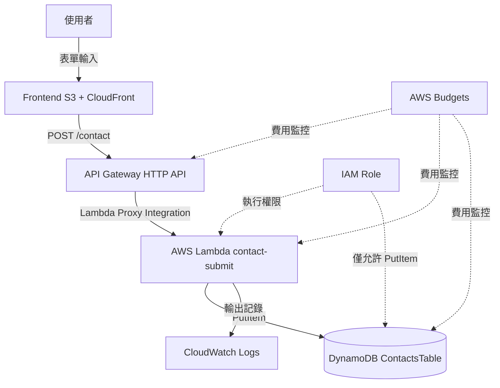

# API Gateway + Lambda + DynamoDB Serverless API 架構

## 概要

此架構以 API Gateway 作為 API 的入口、由 Lambda 執行處理、並將資料儲存於 DynamoDB。

在本專案中,此架構被用作儲存聯絡表單送出內容的 API。

由於不需要常駐伺服器,因此非常適合小型 Web 應用程式或個人開發的 MVP。

## 架構圖

## 此架構可達成的功能

| 項目 | 內容 |
|---|---|
| API 公開 | 前端可呼叫 HTTP API |
| Serverless 處理 | Lambda 僅在必要時執行處理 |
| 資料儲存 | 可將聯絡內容儲存至 DynamoDB |
| 低成本運作 | 無須常駐伺服器即可提供 API |
| 記錄確認 | 可透過 CloudWatch Logs 確認 Lambda 執行結果 |
| 最小權限 | 可僅授予 Lambda 對 DynamoDB PutItem 的權限 |

## 使用的 AWS 服務

| 服務 | 角色 |
|---|---|
| API Gateway | `/contact` API 的入口 |
| AWS Lambda | 輸入值驗證、honeypot 判定、DynamoDB 儲存 |
| Amazon DynamoDB | 聯絡資料的儲存位置 |
| Amazon CloudWatch Logs | 確認 Lambda 記錄 |
| IAM Role | Lambda 存取 DynamoDB 與 CloudWatch Logs 的權限 |
| AWS Budgets | 偵測 API 使用量增加或計費事故 |

## 通訊流程

1. 使用者填寫聯絡表單
2. 前端驗證必填欄位與字數
3. 前端呼叫 API Gateway 的 `POST /contact`
4. API Gateway 透過 Lambda Proxy Integration 呼叫 Lambda
5. Lambda 解析 JSON
6. Lambda 確認 honeypot
7. Lambda 驗證姓名、電子郵件、主旨、內文
8. 若無問題,則對 DynamoDB 執行 PutItem
9. Lambda 將最小限度的記錄輸出至 CloudWatch Logs
10. 透過 API Gateway 將結果回傳至前端

## 設計重點

### 可用性

API Gateway、Lambda、DynamoDB 皆為託管服務,因此個人 MVP 無須管理執行個體即可構成 API。

像聯絡表單 API 這類低頻率的處理,特別適合 Serverless 架構。

### 安全性

不可只信任前端的輸入檢查,Lambda 端也必須再次進行驗證。

CORS 限制為正式環境前端的 Origin。

Lambda 的 IAM Role 僅授予目標 DynamoDB 資料表的 `dynamodb:PutItem` 與 CloudWatch Logs 輸出權限。

### 成本

API Gateway、Lambda、DynamoDB 採用按用量計費。

若為低頻率的聯絡 API,此架構容易壓低固定費用。

但是,垃圾投稿或 Bot 存取會導致請求數增加而提高費用,因此需要考量 honeypot、字數限制以及未來導入速率限制。

### 運作

在 CloudWatch Logs 中,輸出 requestId、處理結果與錯誤類型。

不可將電子郵件全文或聯絡本文全文寫入記錄。

## SAA 考試重點

- API Gateway + Lambda 是 Serverless API 的代表性組合
- DynamoDB 是與 Serverless 架構相容性高的 NoSQL 資料庫
- Lambda 執行角色採用最小權限
- 理解 CORS 設定與驗證方式
- 透過 CloudWatch Logs 確認 Lambda 的記錄
- 不需 VPC 連線的 Lambda 可透過不建立 NAT Gateway 來降低成本

## 此架構的注意事項

- 正式環境的 CORS 不可使用 `*`
- 不可將 AWS 存取金鑰或機密資訊放入 Lambda 環境變數
- 不可將聯絡本文輸出至 CloudWatch Logs
- DynamoDB 資料表名稱與允許 Origin 應透過環境變數切換
- 不可僅以前端的驗證為依據
- 若使用 API Gateway 的預設 URL,應在 README 明確記載正式環境 URL 的管理方式

## 相關用語

- [API Gateway](/zh/terms/api-gateway)
- [AWS Lambda](/zh/terms/lambda)
- [Amazon DynamoDB](/zh/terms/dynamodb)
- [Amazon CloudWatch](/zh/terms/cloudwatch)
- [IAM](/zh/terms/iam)

## 相關比較

- [RDS 與 DynamoDB 的差異](/zh/comparisons/rds-vs-dynamodb)
- [CloudWatch、CloudTrail 與 AWS Config 的差異](/zh/comparisons/cloudwatch-vs-cloudtrail-vs-config)

## 在本專案中的角色

API Gateway + Lambda + DynamoDB 是在個人開發 MVP 中,以最小幅度新增動態處理的基本架構。

在本專案中,僅將聯絡表單 API 化,而用語、題目、文章與架構圖則以靜態檔案方式提供,藉此壓低成本與實作範圍。
