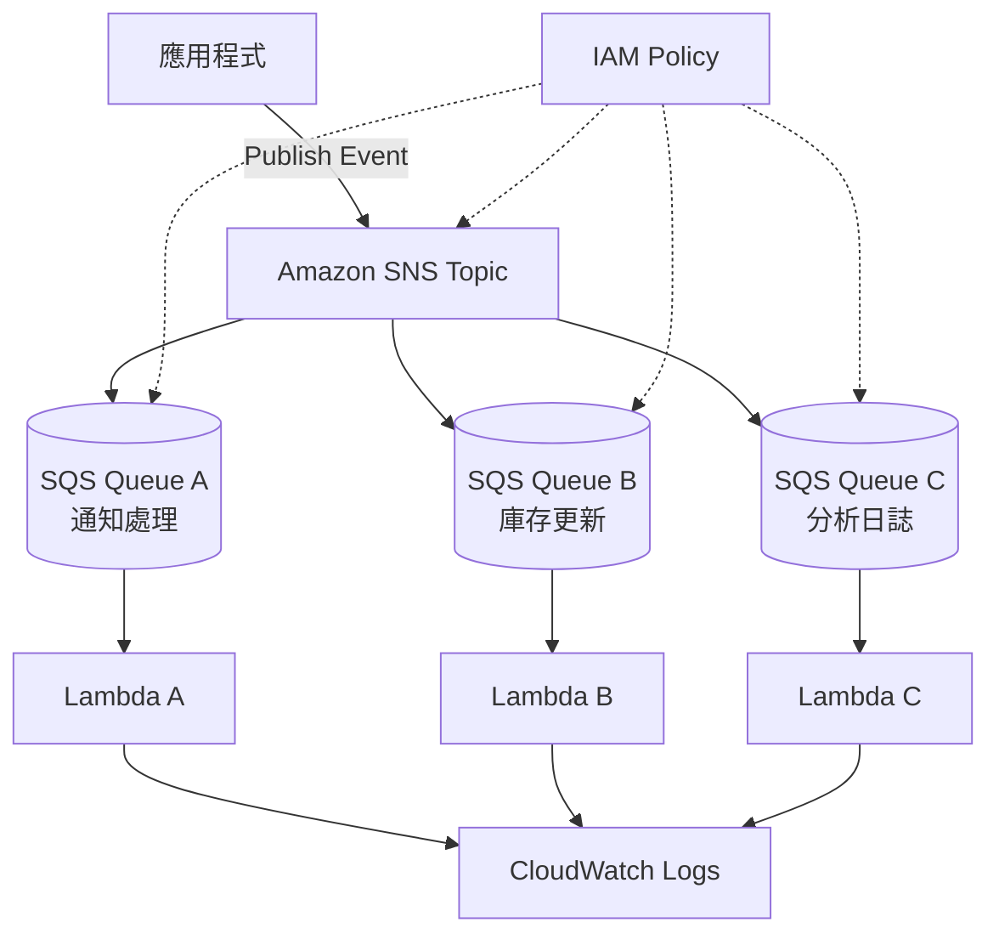

# SNS + SQS 扇出（Fan-out）架構

## 概要

此架構是一種事件驅動架構，透過 Amazon SNS 接收單一事件，並同時將該事件遞送到多個 Amazon SQS 佇列。

舉例來說，當訂單建立時，可能會希望同時觸發多個處理流程，例如「寄送通知郵件」「更新庫存」「儲存分析用日誌」等。

採用 SNS + SQS 的扇出架構後，事件發佈端只需向 SNS 發送通知，各個處理流程便可透過獨立的 SQS 佇列來執行。

## 架構圖

## 此架構能夠實現的目標

| 項目 | 內容 |
|---|---|
| 同時遞送至多個處理流程 | 可將單一事件分支到多個處理 |
| 鬆耦合 | 發佈端不需要了解各處理的細節 |
| 獨立擴展 | 可為每個處理分別配置 SQS 佇列與 Lambda |
| 故障隔離 | 即使某個處理失敗，也不易影響其他處理 |
| 易於擴充 | 容易新增新的訂閱端 |

## 使用的 AWS 服務

| 服務 | 角色 |
|---|---|
| Amazon SNS | 將事件遞送至多個訂閱端的 Pub/Sub 服務 |
| Amazon SQS | 作為各處理緩衝區的佇列 |
| AWS Lambda | 處理 SQS 訊息的函式 |
| Amazon CloudWatch Logs | 查看各 Lambda 的日誌 |
| IAM | 控制 SNS Publish、SQS ReceiveMessage 等權限 |

## 通訊流程

1. 應用程式向 SNS Topic 發佈（Publish）事件。
2. SNS 依據訂閱設定，將訊息遞送至多個 SQS 佇列。
3. 各 SQS 佇列保存待處理的訊息。
4. 各 Lambda 從自己負責的佇列接收訊息。
5. 各 Lambda 分別執行通知、庫存更新、分析日誌儲存等工作。
6. 各處理將日誌輸出到 CloudWatch Logs。

## 設計重點

### 可用性

由於各處理使用獨立的 SQS 佇列，即使某個處理塞住，其他處理仍可持續運作。

若為每個佇列設定 DLQ，便能以處理為單位調查失敗訊息。

### 安全性

透過 IAM 限制可對 SNS Topic 進行 Publish 的主體。

透過 SQS Queue Policy 限制只接受來自指定 SNS Topic 的訊息。

### 成本設計

SNS、SQS、Lambda 都採用按使用量計費。即使不準備常駐伺服器，也能構建事件處理流程。

不過，訂閱端越多，SQS 請求數與 Lambda 執行次數也會增加。應在設計上避免建立不必要的訂閱端。

### 效能

由於每個處理使用獨立的佇列，可針對各個處理單位調整 Lambda 的併發數與批次大小。

即使「通知處理較輕、分析處理較重」這類差異存在，也能分別進行設計。

## SAA 考試重點

- 當需要將同一個訊息遞送到多個處理時，SNS 是候選方案。
- 當希望在處理端保有緩衝時，組合使用 SNS + SQS。
- 作為鬆耦合的事件驅動設計，經常出現在試題中。
- 若希望隔離各處理的失敗，應為每個處理分配獨立的佇列。
- 透過 SQS Queue Policy 可只允許來自指定 SNS Topic 的遞送。

## 此架構的注意事項

- 僅使用 SNS 並無法在處理端產生緩衝效果。
- 加入 SQS 後，能對處理端的暫時性失敗提升韌性。
- 訊息可能會重複，需將 Lambda 處理設計為冪等（idempotent）。
- 訂閱端越多，執行次數與日誌量也會跟著增加。
- 應為每個佇列設定 DLQ，以便追蹤失敗原因。

## 相關術語

- [Amazon SNS](/zh/terms/sns)
- [Amazon SQS](/zh/terms/sqs)
- [AWS Lambda](/zh/terms/lambda)
- [Amazon CloudWatch](/zh/terms/cloudwatch)
- [IAM](/zh/terms/iam)

## 相關比較

- [SNS / SQS / EventBridge 的差異](/zh/comparisons/sns-vs-sqs-vs-eventbridge)

## 在本專案中的角色

SNS + SQS 的扇出架構，是將單一事件安全地分支到多個處理的代表性模式。

在 SAA 考試中，若題目出現「希望將同一個事件遞送到多個系統」「希望分別隔離各處理的失敗」等條件時，就可將此架構列為候選方案。
