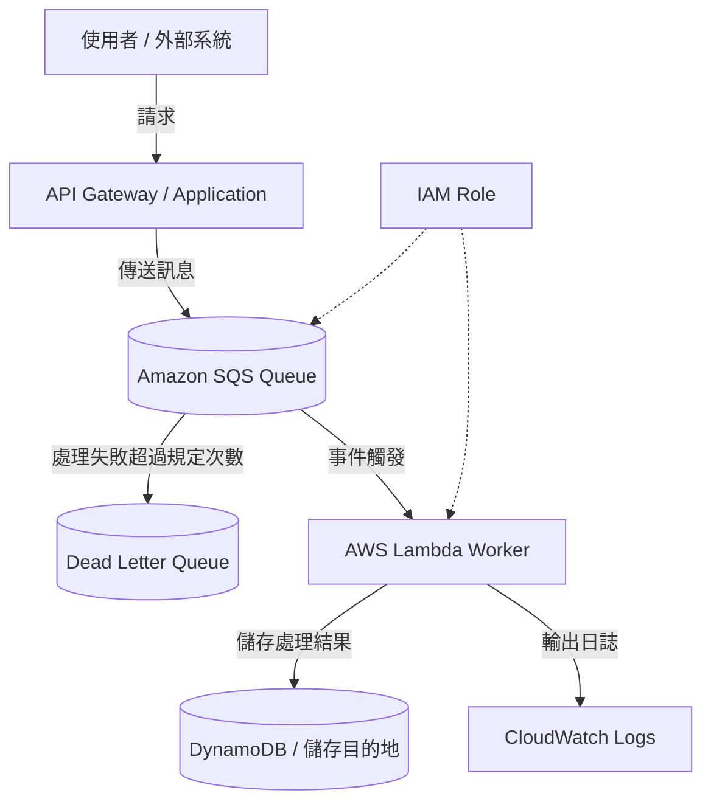

# SQS + Lambda 非同步處理架構

## 概要

此架構先將處理請求暫存於 Amazon SQS,再由 AWS Lambda 依序非同步處理。

若在收到使用者操作或外部系統請求時,就地完成繁重的處理,會造成回應變慢、處理失敗時使用者體驗變差等問題。

透過在中間放入 SQS,可以將接收處理與執行處理解耦。這在鬆耦合、可擴展性、容錯性等方面相當重要。

## 架構圖

## 此架構能實現的目標

| 項目 | 內容 |
|---|---|
| 非同步處理 | 將對使用者的回應與繁重處理分離 |
| 鬆耦合 | 接收側與處理側不直接相依 |
| 重試 | Lambda 處理失敗時 SQS 可重新派送 |
| 故障隔離 | 將處理失敗的訊息退避到 DLQ |
| 擴展 | Lambda 可依據佇列累積量進行處理 |

## 使用的 AWS 服務

| 服務 | 角色 |
|---|---|
| Amazon SQS | 儲存待處理訊息的佇列 |
| AWS Lambda | 處理 SQS 訊息的執行平台 |
| Dead Letter Queue | 失敗達規定次數的訊息退避目的地 |
| Amazon DynamoDB | 儲存處理結果與狀態的目的地 |
| Amazon CloudWatch Logs | 確認 Lambda 處理日誌 |
| IAM | Lambda 存取 SQS 與 DynamoDB 所需的權限 |

## 通訊流程

1. 使用者或外部系統向 API 發送請求
2. API 或應用程式向 SQS 傳送訊息
3. 訊息保存於 SQS
4. Lambda 接收 SQS 事件並進行處理
5. 將處理結果儲存至 DynamoDB 等
6. 將處理日誌輸出至 CloudWatch Logs
7. 失敗達規定次數的訊息被送至 DLQ

## 設計重點

### 可用性

由於 SQS 會保留處理請求,即使 Lambda 或後續處理暫時失敗,也不易遺失訊息。

設定 DLQ 後可以事後調查失敗的訊息。

### 安全性

Lambda 執行角色僅允許讀取目標 SQS 佇列、寫入目標 DynamoDB 資料表,以及輸出至 CloudWatch Logs。

可向 SQS 傳送訊息的主體也以 IAM 加以限制。

### 成本

SQS 與 Lambda 皆為用量計費,可以建構不需要常時運作伺服器的架構。

不過,若失敗處理造成同一訊息反覆重試,Lambda 執行次數會增加。請設定最大接收次數與 DLQ,避免近乎無限的重試。

### 效能

即使大量處理請求湧入,也可先在 SQS 中暫存並依序處理。

控制 Lambda 的並行執行數,即可設計出不會讓後續 DynamoDB 或外部 API 過載的架構。

## SAA 考試重點

- 鬆耦合架構可使用 SQS
- 非同步處理時 SQS + Lambda 是選項之一
- 失敗訊息的退避使用 DLQ
- 可使用 SQS 作為吸收請求暴增的緩衝
- 需要順序保證時,考慮 FIFO 佇列

## 此架構的注意事項

- 為訊息重複處理做好準備,實作冪等性
- 可見度逾時不可短於 Lambda 處理時間
- 未設定 DLQ 將難以調查失敗訊息
- Lambda 並行執行數無上限會使負載集中於後續服務
- FIFO 佇列與標準佇列的輸送量特性不同,僅在需要順序保證時使用

## 相關用語

- [Amazon SQS](/zh/terms/sqs)
- [AWS Lambda](/zh/terms/lambda)
- [Amazon DynamoDB](/zh/terms/dynamodb)
- [Amazon CloudWatch](/zh/terms/cloudwatch)
- [IAM](/zh/terms/iam)

## 相關比較

- [SNS / SQS / EventBridge 的差異](/zh/comparisons/sns-vs-sqs-vs-eventbridge)

## 結論

SQS + Lambda 是以無伺服器方式實作非同步處理的代表性架構。

在 SAA 中,若出現「想將處理延後」「想吸收請求暴增」「想讓元件之間鬆耦合」等條件,就要考慮使用 SQS 的架構。
