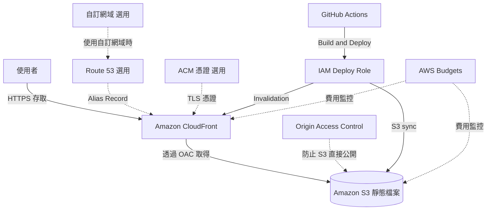

# S3 + CloudFront 靜態網站架構

## 概要

此架構將儲存於 Amazon S3 的 HTML、CSS、JavaScript 與圖片檔案,透過 Amazon CloudFront 配送給使用者。

此架構適合不需要在每次請求都進行伺服器端處理的靜態內容,例如部落格、學習網站、作品集網站與文件網站。

在本專案中,作為 AWS 證照學習網站的 MVP 公開架構使用。將 Next.js 的靜態輸出放置於 S3,並透過 CloudFront 以 HTTPS 配送。

## 架構圖

## 此架構能實現的事

| 項目 | 內容 |
|---|---|
| 靜態網站公開 | 可將 HTML、CSS、JavaScript、圖片以網站形式公開 |
| HTTPS 配送 | 透過 CloudFront 提供 HTTPS 存取 |
| 高速配送 | 利用邊緣節點快取加速顯示 |
| S3 非公開化 | 透過 OAC 不直接公開 S3 即可配送 |
| 低成本運作 | 不使用 EC2 或 RDS,容易壓低固定費用 |
| CI/CD 整合 | 可從 GitHub Actions 執行 S3 同步與 CloudFront Invalidation |

## 使用的 AWS 服務

| 服務 | 角色 |
|---|---|
| Amazon S3 | 靜態檔案的存放位置 |
| Amazon CloudFront | CDN、HTTPS 配送、快取配送 |
| Origin Access Control | 從 CloudFront 到 S3 的安全存取控制 |
| AWS Certificate Manager | 使用自訂網域時的 TLS 憑證管理 |
| Amazon Route 53 | 自訂網域的 DNS 管理 |
| IAM | GitHub Actions 與管理者的權限控制 |
| AWS Budgets | 為防止費用事故所做的預算通知 |

## 通訊流程

1. 使用者存取網站 URL
2. CloudFront 接收 HTTPS 請求
3. 若 CloudFront 有快取,則直接回傳給使用者
4. 若無快取,CloudFront 透過 OAC 從 S3 取得檔案
5. S3 僅允許來自 CloudFront Distribution 的存取
6. CloudFront 將 HTML、CSS、JavaScript、圖片回傳給使用者
7. 部署時,GitHub Actions 同步至 S3 並執行 CloudFront Invalidation

## 設計重點

### 可用性

S3 與 CloudFront 屬於受管服務,在靜態網站配送上容易確保高可用性。

不需要像 EC2 那樣考慮執行個體故障或作業系統的修補程式管理。

### 安全性

啟用 S3 儲存貯體的 Public Access Block,使其不直接對外公開。

使用 CloudFront OAC,並透過 Bucket Policy 僅允許 CloudFront Distribution 的讀取存取。

HTTP 存取由 CloudFront 重新導向至 HTTPS。

### 成本

由於不使用 EC2、RDS、ALB、NAT Gateway,在個人開發 MVP 中容易壓低固定費用。

不過,需注意 CloudFront 的資料傳輸量、請求次數、Invalidation 次數,以及 S3 的儲存容量。

### 效能

透過 CloudFront 的快取,可減少對 S3 的請求,並從靠近使用者的邊緣節點配送內容。

圖片或 JavaScript 過大會增加傳輸量,因此縮減檔案大小也很重要。

## SAA 考試重點

- 靜態網站配送的代表性架構為 S3 + CloudFront
- 不直接公開 S3,而透過 CloudFront OAC 限制存取
- 透過 CloudFront 進行 HTTPS 配送與快取配送
- 使用自訂網域時搭配 Route 53 與 ACM
- 與 CloudFront 搭配使用的 ACM 憑證須於 us-east-1 簽發
- 更新反映會牽涉到 CloudFront Invalidation

## 此架構的注意事項

- 使用一般的 S3 來源,而非 S3 Static website hosting 端點
- 不要停用 S3 Public Access Block
- 在 Bucket Policy 的 SourceArn 中正確填入 CloudFront Distribution ID
- 由於 CloudFront 快取,更新可能不會立即反映
- 每次都執行 `/*` 的 Invalidation 會導致費用增加
- 僅靠此架構無法實現 API 處理或使用者個別資料儲存

## 相關用語

- [Amazon S3](/zh/terms/s3)
- [Amazon CloudFront](/zh/terms/cloudfront)
- [AWS Certificate Manager](/zh/terms/acm)
- [Amazon Route 53](/zh/terms/route53)
- [IAM](/zh/terms/iam)
- [AWS Budgets](/zh/terms/aws-budgets)

## 相關比較

- [ALB / NLB / CloudFront 的差異](/zh/comparisons/alb-vs-nlb-vs-cloudfront)
- [S3 / EBS / EFS 的差異](/zh/comparisons/s3-vs-ebs-vs-efs)

## 在本專案中的角色

S3 + CloudFront 是以靜態內容為主的學習網站與作品集網站的最佳基本架構。

在本專案中,作為同時滿足低成本、HTTPS 配送、S3 非公開化、CI/CD 整合的 MVP 公開基礎平台採用。
