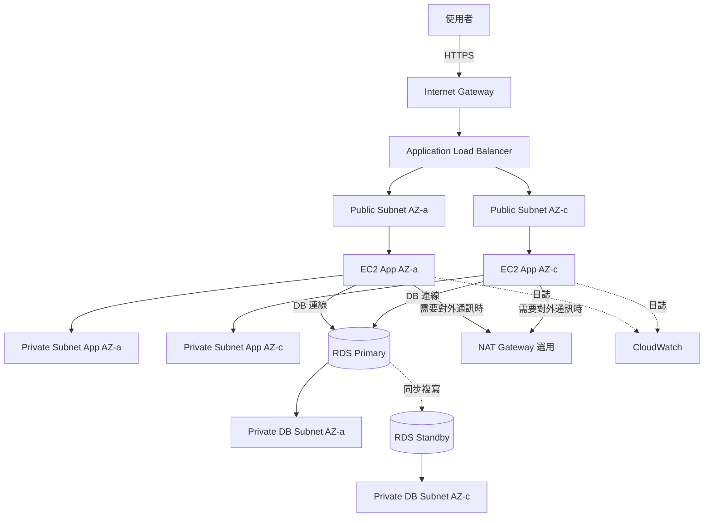

# VPC 內三層式 Web 應用程式架構

## 概要

這是將 Web 應用程式拆分成下列三層來部署的架構:

1. 展示層 (Presentation tier)
2. 應用層 (Application tier)
3. 資料庫層 (Database tier)

在 AWS 上,我們透過組合 VPC、Subnet、Route Table、Security Group、ALB、EC2、RDS 等服務來實現。

雖然本專案的 MVP 並未採用此架構,但它在 SAA 考試中是相當重要的基礎架構。

## 架構圖

## 此架構可達成的事項

| 項目 | 內容 |
|---|---|
| 層級分離 | 可在網路層面分離 Web 入口、應用程式與資料庫 |
| 安全性提升 | 不將資料庫放在 Public Subnet,避免直接對外公開 |
| 可用性提升 | 可將應用層與資料庫層部署於多個可用區域 (AZ) |
| 擴充性 | 應用層可輕鬆替換為 Auto Scaling 或 ECS |
| 實務設計理解 | 可學習 VPC、Subnet、Route Table、Security Group 之間的關係 |

## 使用的 AWS 服務

| 服務 | 角色 |
|---|---|
| Amazon VPC | 整個應用程式的網路邊界 |
| Public Subnet | 用於放置 ALB、NAT Gateway 等需要對外連線的資源 |
| Private Subnet | 用於放置應用程式伺服器 |
| Database Subnet | 用於放置 RDS 的非公開 Subnet |
| Application Load Balancer | 將 HTTPS 請求分散至應用層 |
| Amazon EC2 | 應用程式伺服器 |
| Amazon RDS | 關聯式資料庫 |
| Amazon CloudWatch | 指標與日誌的監控 |
| AWS IAM | EC2 及維運人員的存取權限控管 |

## 通訊流程

1. 使用者以 HTTPS 存取網站
2. ALB 透過 Internet Gateway 接收請求
3. ALB 將請求轉送至 Private Subnet 內的 EC2
4. EC2 應用程式連線至 RDS Primary
5. 若採用 RDS Multi-AZ 架構,Primary 會同步複寫至 Standby
6. 透過 CloudWatch 觀察 EC2 與 RDS 的指標
7. 僅當需要對外通訊 (例如取得外部套件) 時,Private Subnet 才會透過 NAT Gateway 對外連線

## 設計重點

### 可用性

在多個 AZ 上分別建立 Public Subnet、Private Subnet 與 Database Subnet。

ALB 可橫跨多個 AZ 將請求分散到不同節點。

RDS 採用 Multi-AZ 架構後,當資料庫主節點故障時可自動切換至 Standby。

### 安全性

僅允許 ALB 對網際網路公開。

EC2 放在 Private Subnet,Security Group 只允許來自 ALB 的流量。

RDS 放在 Database Subnet,Security Group 只允許來自應用層 EC2 的資料庫連接埠通訊。

### 成本

ALB、EC2、RDS、NAT Gateway 容易產生固定費或持續性費用。

本專案的 MVP 為了壓低成本而未採用此架構,僅將其作為學習用與 SAA 對策用的架構處理。

### 維運

透過 CloudWatch 觀察 EC2 的 CPU 使用率、ALB 的 5xx 錯誤數,以及 RDS 的連線數與 CPU 使用率。

使用 SSM Session Manager 可減少 SSH 跳板伺服器的需求。

## SAA 考試重點

- 理解 Public Subnet 與 Private Subnet 各自的角色
- ALB 放在 Public Subnet,應用程式放在 Private Subnet
- 資料庫放在 Private Subnet,不可直接對網際網路公開
- Security Group 為有狀態 (stateful),NACL 為無狀態 (stateless)
- RDS Multi-AZ 主要提升可用性,Read Replica 主要提升讀取效能
- 從 Private Subnet 對外連線到網際網路時需要 NAT Gateway
- 想要以閉域方式連線至 S3 或 DynamoDB 時,VPC Endpoint 也是選項之一

## 此架構的注意事項

- NAT Gateway 的固定費用容易拉高成本,個人 MVP 應謹慎使用
- RDS 即使忘記關閉、或在儲存與備份方面也會持續產生費用
- 不要將資料庫放在 Public Subnet
- 不可對 EC2 開放 0.0.0.0/0 的 SSH 連線
- 路由表的關聯設定錯誤,是造成通訊失敗的常見原因
- 不要混淆 Multi-AZ 與 Read Replica 的用途

## 相關用語

- [Amazon VPC](/zh/terms/vpc)
- [Amazon EC2](/zh/terms/ec2)
- [Elastic Load Balancing](/zh/terms/elb)
- [Amazon RDS](/zh/terms/rds)
- [Amazon CloudWatch](/zh/terms/cloudwatch)
- [AWS IAM](/zh/terms/iam)

## 相關比較

- [Security Group 與 NACL 的差異](/zh/comparisons/security-group-vs-nacl)
- [Multi-AZ 與 Read Replica 的差異](/zh/comparisons/multi-az-vs-read-replica)
- [ALB / NLB / CloudFront 的差異](/zh/comparisons/alb-vs-nlb-vs-cloudfront)

## 在本專案中的角色

VPC 內三層 Web 應用程式架構,是理解 AWS 網路設計的基本範式。

本專案主體因為成本考量而未採用,但在 SAA 考試對策與面試說明時,這是相當重要的基本架構。
